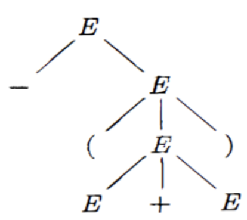
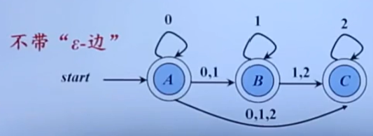

# 编译原理笔记

## 1. 基本概念

### 1.1 字母表

**字母表**$\Sigma$是一个有穷符号集合。比如：

* 二进制字母表：{0, 1}
* ASCII字符集
* Unicode字符集

字母表的运算

* 乘积：$\Sigma$~1~$\Sigma$~2~ = {ab | a $\in$ $\Sigma$~1~, b $\in$ $\Sigma$~2~}

  比如：{0, 1} {a, b} = {0a, 0b, 1a, 1b}

* n次幂：

  * $\Sigma$^0^ = { $\epsilon$ }
  * $\Sigma$^n^ = $\Sigma$^n-1^$\Sigma$, n $\geq$ 1

  比如：

  {0, 1}^3^ = {0, 1} {0, 1} {0, 1} = {000, 001, 010, 011, 100, 101, 110, 111}

  我们也能发现，几个字母表相乘，结果的每一项就是几个元素，比如这里三个相乘，结果中每一个元素比如000，001都是三个数

  **我们还能发现，字母表的n次幂，就是长度为n的符号串构成的集合。比如这里n = 3，那结果集合中每一个元素长度都是3。而0次幂就是长度为0的符号串，那就是空串，用$\epsilon$表示**

* 正闭包：$\Sigma$^+^ = $\Sigma$ $\cup$ $\Sigma$^2^ $\cup$ $\Sigma$^3^ $\cup$ ...

  比如{a, b, c, d}^+^ = {a, b, c, d, aa, ab, ac, ad, ba, bb, bc, bd, ... , aaa, aab, aac, aad, ...} 

* 克林闭包：$\Sigma$^*^ = $\Sigma$^+^ $\cup$ $\Sigma$^0^ = $\Sigma$^0^ $\cup$ $\Sigma$ $\cup$ $\Sigma$^2^ $\cup$ $\Sigma$^3^ $\cup$ ...

  比如{a, b, c, d}^*^ = {$\epsilon$, a, b, c, d, aa, ab, ac, ad, ba, bb, bc, bd, ... , aaa, aab, aac, aad, ...} 

  由此可见，克林闭包是任意符号串构成的集合，并且这个串的长度可以是0
  
  *由克林闭包，我们能推出**串**的概念：克林闭包中的任何一个元素都是字母表$\Sigma$上的一个**串***
  
  > 比如字母表$\Sigma$ = {a, b, c, d}，那么$\epsilon$, a, b, c, d, aa, ab, ac, ad, ba, bb, bc, bd等都是$\Sigma$的串，比如让串s = ab, 那么s的长度|s| = 2，**也就是串中符号的个数**。而**|$\epsilon$| = 0**

### 1.2 串的运算

**连接**

> x和y的连接运算记作**xy**
>
> x = dog, y = house, 那么xy = doghouse
>
> 空串是连接运算的**单位元**，相当于不动，对于任意串s有
>
> $\epsilon$s = s$\epsilon$ = s
>
> 设x, y, z是三个串，x = yz，则称y是x的**前缀**，z是x的**后缀**

**幂**

> 若s = ba，那么：
>
> s^2^ = baba, s^3^ = bababa, ...
>
> 特别地：s^0^ = $\epsilon$

## 2. 文法分析

### 2.1 Terminal Symbol

终结符：是文法所定义的语言的基本符号。有时也称为**Token**

比如：V~T~ = {apple, boy, cat, little}是一个终结符集，其中的元素是终结符，在这里是**单词**

理解终结的含义：单词在这里再继续推导没有意义，也就是字母它本身也不在里面，所以不用继续推导，达到终点

### 2.2 Nonterminal Symbol

非终结符：用来表示**语法成分**的符号，有时也称为**语法变量**

比如：V~N~ = {<句子>, <名词短语>, <动词短语>, <名词>, ...}是一个非终结符集

> *注意：对于同一个文法形式(文法形式是什么稍后再说)，终结符集和非终结符集是没有交集的，即：V~T~ $\cap$ V~N~ = $\Phi$*
>
> 另外，V~T~ $\cup$ V~N~ = <**文法符号集**>

非终结的意思就是能继续推导，也就是这个东西能够继续细分成更细的东西

### 2.3 Production

产生式：描述了将**Terminal**和**Nonterminal**组合成**串**的**方法**，也就是用来**产生串的式子**。一般形式：$\alpha$ -> $\beta$ ($\alpha$定义为$\beta$)

比如在上面的例子中，可以有以下产生式：

P = {<句子> $\rightarrow$ <名词短语><动词短语>, <名词短语> $\rightarrow$ <形容词><名词短语>, ...}

### 2.4 Start Symbol

开始符号：文法中最大的语法成分：比如上面的例子，最大的语法成分就是**S = <句子>**

### 2.5 文法

就是上面四项组成的集合：

G = (V~T~, V~N~, P, S)

> 例：G = ( { **id**, **+**, *****, **(**, **)** }, {**E**}, **P**, **E** )
>
> 那么:
>
> * V~T~ = {id, +, *, (, )}
> * V~N~ = {E}
> * P = P
> * S = E
>
> *注：其中E就是Expression表达式，非终结符只有表达式一种*
>
> 接下来讨论P到底是什么：因为V~N~只有E一个，所以，只需要定义E即可
>
> P = {E -> E + E, E -> E *  E, E -> (E), E -> id}
>
> 也就是：表达式和表达式加起来还是表达式；表达式和表达式乘起来还是表达式；把表达式用括号括起来还是表达式；每一个表达式都可以赋给它一个id
>
> 那既然有这么多种表达E的方法，太多了，简化以下：也就是说，**把表达式加起来，乘起来，括起来，给个id，得到的都是表达式**，那么可以用**或(|)**的方式来简写：
>
> E -> E + E | E * E | (E) | id
>
> 那么对于任意一个产生式P = {$\alpha$ -> $\beta$~1~, $\alpha$ -> $\beta$~2~, ... , $\alpha$ -> $\beta$~n~}，都可以简化为：
>
> P = $\alpha$ -> $\beta$~1~ | $\beta$~2~ | ... | $\beta$~n~

补充：

* $\alpha$ $\in$ (V~T~ $\cup$ V~N~)^+^，并且$\alpha$中至少得有一个V~N~的元素，称为产生式的**头部**或者**左部**
* $\beta$ $\in$ (V~T~ $\cup$ V~N~)^+^，称为产生式的**体**或者**右部**

### 2.6 符号约定

上面说了那么多Terminal和Nonterminal，怎么区分他们呢？

**以下是Terminal(终结符)：**

* 字母表中**排在前面的小写字母**，如a, b, c
* **运算符**，如+, *
* **标点符号**，如逗号，括号等
* **数字**，0, 1, ... 9
* 粗体字符串，如id, if等

**以下是Nonterminal(非终结符)：**

* 字母表中**排在前面的大写字母**，如A, B, C
* 字母S，因为它通常表示开始符号
* **小写，斜体的名字**，比如expr, stmt(statement)等
* **代表程序构造的大写字母**。比如E(表达式)、T(term，项)和F(factor，因子)

**其他的一些东西：**

* 字母表中排在**后面**的**大**写字母，比如X, Y, Z表示**文法符号**，既可以是Terminal也可以是Nonterminal
* 字母表中排在**后面**的**小**写字母，比如u, v, ... , z表示**终结符号串**(包括空串)
* 小写希腊字母，比如$\alpha$, $\beta$, $\gamma$，表示**文法符号串**(包括空串)
* **除非有特别说明，第一个产生式的左部就是开始符号**

### 2.7 语言

*给你一个句子：`little boy eats apple`，咋判断它符不符合语法？*

#### 2.7.1 Derivation & Reduction

比如一个**文法**中的**Production**是这样的(这里就不写成集合了)：

* <句子> $\rightarrow$ <名词短语><动词短语>
* <名词短语> $\rightarrow$ <形容词><名词短语>
* <名词短语> $\rightarrow$ <名词>
* <动词短语> $\rightarrow$ <动词><名词短语>
* <形容词> $\rightarrow$ little
* <名词> $\rightarrow$ boy | apple
* <动词> $\rightarrow$ eat

*问题：这里对于$\alpha$的概念：是不是$\alpha$表示的是左边所有东西构成的集合？还是任何一个比如<动词短语>都可以叫做$\alpha$变量？如果是前者的话，那为什么要用$\in$而不是$\subseteq$?*

> 那既然<句子>可以定义为<名词短语>和<动词短语>拼一起，那么就可以这么写：
>
> <句子> $\Rightarrow$ <名词短语><动词短语>
>
> 而<名词短语>又可以是<形容词>和名词短语拼一起，那么又可以这么写：
>
> <句子> $\Rightarrow$ <名词短语><动词短语>
>
> ​			$\Rightarrow$ <形容词><名词短语><动词短语>
>
> 对应上面"little boy eats apple"，一步步展开，就能得到：
>
> **<句子> $\Rightarrow$ <名词短语><动词短语>**
>
> ​			**$\Rightarrow$ <形容词><名词短语><动词短语>**
>
> ​			**$\Rightarrow$ <形容词><名词><动词><名词>**
>
> ​			**$\Rightarrow$ little boy eats apple**
>
> 以上过程，就是Derive(推导)的过程；而反着来，就是Reduce(规约)的过程

那么开头的问题就好办了，只要满足Derive或者Reduce的过程，那么就是一个符合语法的句子

补充：

* 如果$\alpha$~0~ $\Rightarrow$ $\alpha$~1~ $\Rightarrow$ $\alpha$~2~ $\Rightarrow$ ... $\Rightarrow$ $\alpha$~n~，则称串$\alpha$~0~经过n步推导出$\alpha$~n~，可以简记为：$\alpha$~0~ $\Rightarrow$^n^ $\alpha$~n~
* $\Rightarrow$^0^表示0步推导，也就是不推导
* $\Rightarrow$^+^表示经过正数步推导(>0)
* $\Rightarrow$^*^表示经过若干步推导($\geq$0)

#### 2.7.2 Sentential form & Sentence

在上面的例子中：

**<句子> $\Rightarrow$ <名词短语><动词短语>**

​			**$\Rightarrow$ <形容词><名词短语><动词短语>**

​			**$\Rightarrow$ <形容词><名词><动词><名词>**

​			**$\Rightarrow$ little boy eats apple**

或者这么写：

**<句子> $\Rightarrow$ <名词短语><动词短语>**

​			**$\Rightarrow$ <形容词><名词短语><动词短语>**

​			**$\Rightarrow$ little <名词短语><动词短语>**

​			**$\Rightarrow$ little <名词><动词短语>**

​			**$\Rightarrow$ little boy <动词短语>**

​			**$\Rightarrow$ little boy <动词><名词短语>**

​			**$\Rightarrow$ little boy eats <名词短语>**

​			**$\Rightarrow$ little boy eats <名词>**

​			**$\Rightarrow$ little boy eats apple**

整个所有的过程都叫做**Sentential form(句型)**，而只有最后一句`little boy eats apple`是**Sentence(句子)**

我们能从中发现一个特点：**句子中没有Nonterminal，全都是Terminal**

那么给出句型和句子的定义

* 如果S经过若干步推导得到了$\alpha$**(S $\Rightarrow$^*^ $\alpha$)**，并且$\alpha$ $\in$ (V~T~ $\cup$ V~N~)^*^，则称$\alpha$是G的一个**句型**。句型中包含Terminal Symbol和Nonterminal Symbol，还可能是空串$\epsilon$
* 如果S $\Rightarrow$^*^ $\omega$，并且$\omega$ $\in$ (V~T~ $\cup$ V~N~)^*^，则称$\omega$是G的一个句子。**句子**是不包含Nonterminal Symbol的句型

#### 2.7.3 Language

由文法G的Start Symbol**推导出的所有<u>句子</u>**构成的集合称为文法**G生成的语言**，记为L(G)

L(G) = {$\omega$ | S $\Rightarrow$^*^ $\omega$, $\omega$ $\in$ V~T~^*^} (*问题：这里V~T~是否加上星号存疑*)

> 例：文法G的Production如下：
>
> 1. S -> L | LT
> 2. T -> L | D | TL | TD
> 3. L -> a | b | c | ... | z
> 4. D -> 0 | 1 | ... | 9
>
> 该文法生成的语言是？
>
> 首先，通过观察可以得到：D表示的是数字Digit，L表示的是字母Letter。然后看S，因为**语言必须由S来推出**。S推出的东西必须由L也就是字母打头，然后后面是个T。而T可以是L, D, TL, TD中任何一种，那么就可以不断套娃进行代换：T $\Rightarrow$ TL $\Rightarrow$ TDL $\Rightarrow$ TDDL $\Rightarrow$ TLDDL $\Rightarrow$ ... $\Rightarrow$ DDDDD...LDDL(显然有超多代换方式，这里只是一种)。然后再和前面那个L拼一起。
>
> 那么可以得到结论：推出来的东西是**字母开头**，**后面有字母有数字**。很显然和变量名很像啊！
>
> 答案就是：标识符(identifier)

**语言上的运算**

| 运算                   | 定义和表示                                      |
| ---------------------- | ----------------------------------------------- |
| L和M的并(两种语言的并) | $L \cup M = \{s | s \in L || s \in M\}$         |
| L和M的连接             | LM = { st \| s $\in$ L && t $\in$ M }           |
| L的幂                  | L^0^ = {$\epsilon$}; L^n^ = L^n-1^L, n $\geq$ 1 |
| L的Kleene闭包          | L^*^ = $\cup^\infty_{i=0}L^i$                   |
| L的正闭包              | L^+^ = $\cup^\infty_{i=1}L^i$                   |

> 例：令L = {A, B, ..., Z, a, b, ..., z}，D = {0, 1, ..., 9}则L(L $\cup$ D)^*^表示的语言是？
>
> 语言也和串一样可以连接，**语言也是句子的集合**，因此**本题中默认A, B等都是句子**，D也是语言，0, ..., 9也都是句子。而L(L $\cup$ D)^*^表示一个字母开头，后面连接上L并上D的克林闭包，那么就是说是由字母和数字组成的一堆东西，然后还是字母开头，那表示的也是**标识符**

### 2.8 文法分类

#### 2.8.1 Type-0 Grammar: Unrestricted Grammar

比如前面说的那些Production，只要左边(左部)**至少有一个**Nonterminal，那就是0型文法

#### 2.8.2 Type-1 Grammar: Context-Sensitive Grammar(CSG)

Production的一般形式：$\alpha_1A\alpha_2\rightarrow\alpha_1\beta\alpha_2(\beta\neq\epsilon)$

从这里能看出定义的过程和上下文$\alpha_1, \alpha_2$有关

既然$\beta\neq\epsilon$，那么CSG中**不能**包含空产生式，也就是右部是空串。而之前说过，**左部至少要有一个Nonterminal**，那么左部的长度至少是1，那一个**长度是1或者以上的东西怎么可能由空串来定义呢**？显然右部的长度要$\geq$左部$\geq$1

#### 2.8.3 Type-2 Grammar: Context-Free Grammar(CFG)

现在定义：**A表示非终结符**

二型文法中规定：左部必须是一个Nonterminal。那很容易得到一般形式：$A\rightarrow\beta$。2型和0型的区别就是2型左部全是Nonterminal，0型有一个就行

比如之前的那个例子：

> 1. S -> L | LT
> 2. T -> L | D | TL | TD
> 3. L -> a | b | c | ... | z
> 4. D -> 0 | 1 | ... | 9

左边全是Nonterminal，那就是一个2型文法。**由上下文无关语法生成的语言叫做上下文无关语言**

#### 2.8.4 Type-3 Grammar: Regular Grammar(RG)

还是定义A为Nonterminal，现在B也是个Nonterminal，w是Terminal，RG分为两种：

##### 2.8.4.1 Right Linear

* $A \rightarrow wB$
* $A \rightarrow w$

也就是说，可以定义一步到位；也可以在右边挂个B，不停套娃

##### 2.8.4.2 Left Linear

* $A \rightarrow Bw$
* $A \rightarrow w$

显然差不多，就是在左边套娃

> 例：
>
> 1. S -> a | b | c | d
> 2. S -> aT | bT | cT | dT
> 3. T -> a | b | c | d | 0 | 1 | 2 | 3 | 4 | 5
> 4. T -> aT | bT | cT | dT | 0T | 1T | 2T | 3T | 4T | 5T
>
> 首先，**左部都是Nonterminal**，所以先是一个2型文法；然后右部中，要么是字母、数字这些Terminal，要么在Terminal的右边放个T，也就是Nonterminal，所以就是**Right Linear**
>
> 然后它生成的是什么语言呢？首先看T是啥：T要么是单纯的a ~ d, 0 ~ 5，要么是这些后面再套娃上T，所以T就是一个任意长度的字母和数字组成的串；然后再看S：S要么是单纯的abcd，要么是abcd打头，后面跟上个T，所以这个生成的还是**标识符**，只不过它只能由0 ~ 5和a ~ d构成

### 2.9 文法关系

**0型**包含**1型**包含**2型**包含**3型**

### 2.10 CFG分析树

首先CFG：就是一堆$A \rightarrow \beta$

那这个树就是用来分析CFG的。比如：

> G:												    
>1. E -> E + E
> 2. E -> E * E
> 3. E -> -E
> 4. E -> (E)
> 5. E -> id

* 这棵树的根节点就是Start Symbol
* 从根节点出发，是E。然后它的子节点是-和E，正好构成一个Production，父节点是左部，所有子节点从左到右构成右部
* 而这里叶节点中有E也有-+()，证明**叶节点既可以是Terminal也可以是Nonterminal**。从左到右排列叶节点得到的符号称为这棵树的产出(yield)或者边缘(frontier)

这树有啥用呢？我们来推导一下：

$E \Rightarrow -E \Rightarrow -(E) \Rightarrow -(E + E) \Rightarrow -(id + E) \Rightarrow -(id + id)$

那么根据分析的过程，我们能看到：

* 一开始只有一个E，然后推导第一步出来-E，那么树就是E连出一个-和一个E。到此为止，树的边缘是-E，**正好就是我们当前推出来的<u>句型</u>**
* 然后连出来的这个E又被代换称(E)，所以这个E又连出来三个：(, E, )，这时树的边缘是-(E)，**还是我们当前推出来的句型**
* ...

这样就能发现，推导的过程中，**每次得到的句型，都是在构造分析树的同时树的边缘**

#### 2.10.1 Phrase

在以下的分析树中，有这么几个短语：

* -(E + E) -> 这是整棵树的边缘
* (E + E) -> 这是拿掉根节点后的**子树**的边缘
* E + E -> 这是再拿掉子树的根节点后的子树的边缘

能发现：短语就是分析树中**每一棵子树的边缘**

而这里E + E比较特殊：它的树只有父子两代结点，因为除了E + E和他们仨的父节点E，剩下的都被拿掉了。所以这样的短语叫做**直接短语(immediate phrase)**

> 例：
>
> 
>
> 这个文法的分析树：
>
> 
>
> 直接短语：提高，人民，生活，水平
>
> 而短语可以是：水平，生活水平，生活，人民，人民生活水平..................
>
> 但是文法中还有这些：高人，民生，活水。它们是产生式的右部，但却不是当前分析树的直接短语。因此我们能发现：**直接短语一定是产生式的右部，但是产生式的右部不一定是分析树的直接短语**。因为这个文法用不同的推导方式还能生成其他分析树，这些右部可能是其他分析树的直接短语

#### 2.10.2 Ambiguous Grammar

在写面向对象编程的时候，隐式转换通常会导致**二义性**(<u>可以这么整，也可以那么整，那咋整更好呢？我编译器也不知道，给你报个错吧！</u>)问题。这里来解释一下：

现在有一个文法：

> **S** -> if **E** then **S**
>
> ​	  | if **E** then **S** else **S**
>
> ​	  | **other**

那么给下面一个句型来构造分析树：`if E1 then if E2 then S1 else S2`

* 首先识别一下这个句子符合S的定义中的那种：
* `if E1 then ...`正好符合if **E** then **S**的格式，那就这么来！
* 那这个套娃下来的S就是`if E2 then S1 else S2`
* 而`if E2 then S1 else S2`正好符合if **E** then **S** else **S**的格式，那就构造完了！

但是，还有另一种构造的方式：

* `if E1 then ... else ...`正好符合if **E** then **S** else **S**
* 那E就是E1，第一个S是`if E2 then S1`，第二个S是`S2`
* `if E2 then S1`正好符合if **E** then **S**，这样也能正确构造！

注：这里的**other**就是E1, E2, S1, S2等其他语句，没有if else这些的非条件东西

分析一下产生二义性的原因：`if E1 then if E2 then S1 else S2`

因为后面的else既可以和第一个if匹配，也可以和第二个if匹配，所以会产生二义性。而如果**规定else只能和最近的前一个if匹配**，就能够让第二种构造方法无效了。

## 3. 词法分析

### 3.1 Regular Expression

有如下一个句子：

$L=\{a\}\{a,b\}^*(\{\epsilon\}\cup(\{.,\_\}\{a,b\}\{a,b\}^*))$

注：这里要结合一下2.7.3中语言的并的运算

这个L可以解释为：a开头，然后连上任意长度的由a、b组成的串(可以是空串，因为是克林闭包)；然后再连上一个并集：要么是$\epsilon$空串，要么是连接上这个：点或者下划线、a或者b、a和b组成的任意长度串

那么这么写起来比较复杂，怎么简化呢？用的就是**正则表达式**(Regular Expression)：

$r=a(a|b)^*(\epsilon|(.|\_)(a|b)(a|b)^*)$

**每个正则表达式r可以表示一个语言，记为L(r)**

那么正则表达式怎么写呢？**由小到大！**，也就是由一个很小很小很简单的正则表达式，不断扩大变成大的正则表达式，最后变大到我们需要的为止

* 最小的当然是空串，如果$\epsilon$是一个RE，那么$L(\epsilon)=\{\epsilon\}$
* 然后是一个字母的，如果$a\in\Sigma$，则a是一个RE，$L(a)=\{a\}$
* 如果是俩呢？假设r和s都是RE，表示的语言分别是L(r)和L(s)，那么
  * r|s是一个RE，$L(r|s)=L(r)\cup L(s)$
  * rs是一个RE，$L(rs)=L(r)L(s)$ **(注意：这里不是交集！是连接！！！)**
  * r^*^是一个RE，L(r^*^) = (L(r))^*^
  * (r)是一个RE，L((r)) = L(r)

> 运算的优先级：克林闭包(^*^) > 连接 > 或(|)，括号还是最牛b

> 例：
>
> 1. 令$\Sigma = \{a,b\}$，求L(a|b)，L((a|b)(a|b))，L(a^*^)，L((a|b)^*^)，L(a|a^*^b)
>
>    因为a和b都是字母，那a和b自然都是一个正则表达式，表示的语言分别是L(a) = {a}，L(b) = {b}
>
>    接下来由小变大，就可以由这些规则开始了
>
>    * $L(a|b) = L(a) \cup L(b) = \{a\} \cup \{b\} = \{a,b\}$
>
>    * $L((a|b)(a|b)) = L(a|b)L(a|b) = \{a,b\}\{a,b\} = \{aa,ab,ba,bb\}$
>
>      *注意：这里是用的上面第三条中的第二条连接的规则*
>
>    * $L(a^*) = (L(a))^* = \{a\}^* = \{\epsilon,a,aa,aaa,...\}$
>
>    * $L((a|b)^*) = (L(a|b))^* = \{a,b\}^* = \{\epsilon,a,b,aa,ab,ba,bb,aaa,...\}$
>
>    * $L(a|a^*b) = L(a) \cup L(a^*b) = L(a) \cup L(a^*)L(b) = \{a\} \cup \{\epsilon,a,aa,aaa,...\}\{b\} = \{a,b,ab,aab,...\}$
>
> 2. 十进制整数的RE
>
>    (1|...|9)(0|...|9)^*^|0
>
>    *这里最后的0是表示整个就是个0*
>
> 3. 八进制整数的RE(C语言)
>
>    0(1|2|3|...|7)(0|1|2|...|7)^*^
>
> 4. 十六进制整数的RE(C语言)
>
>    0x(1|2|...|f)(0|1|...|f)^*^
>
>    *大写字母这里不写了先*

**正则表达式的运算定律**

| 定律                         | 描述 |
| ---------------------------- | ---- |
| $r|s=s|r$                    | 交换律 |
| $r|(s|t)=(r|s)|t$            | 或结合律 |
| $r(s|t)=rs|rt; (s|t)r=sr|tr$ | 分配律 |
| $\epsilon r=r\epsilon=r$     | 乘1 |
| $r^*=(r|\epsilon)^*$         	| 闭包中一定含$\epsilon$(没啥用) |
| $r^{**}=r^*$ | 呃呃 |
| $r(st)=(rs)t$ | 连接结合律 |

### 3.2 Regular Definition

给一些常用的正则表达式起个名字，比如：

* digit -> 0|1|2|...|9
* letter_ -> A|B|...|Z|a|b|...|z|_

那么这样起个名字，就很容易表示标识符了：

identifier -> letter_(letter\_|digit)^*^

> 例：
>
> * digit -> 0|1|2|...|9
>
> * digits -> digit digit^*^
>
> * optionalFraction(可选小数部分) -> .digits|$\epsilon$
>
> * optionalExponent(可选指数部分) -> (E(+|-|$\epsilon$)digits)|$\epsilon$
>
> * number -> digits optionalFraction optionalExponent
>
>   比如2.15E+3，2就是digits；.15是optionalF；E+3是optionalE
>
> *之所以是可选的，是因为最后的那个|$\epsilon$，最后这个number表达的就是所有整形或者浮点型的无符号整数*

### 3.3 Finite Automata

* start表示开始，它指向的东西代表**初始状态**，也就是0
* 0，1，2，3每一个**结点**都表示FA的一个**状态**
* 最后3上有两个圈，表示3是**终止状态**，也叫**接收状态**
* **初始状态只有一个，但是终止状态可以有多个**
* 比如状态0，有**输入**a，可以变成状态0和状态1；输入b，可以变成状态0

那对于这个有穷自动机，如果给定串`abbaabb`的话：

它的状态可以是：

菱形之前的过程一直在自旋，之后遇到`abb`才向下走。用这种走法正好能**从初始状态达到终止状态**。那么能满足这样条件的一个串就叫做**能被该FA接收**的串

那么这个FA肯定不会只能接收这一个串，还有好多串。看一下就能明白：**只要是以`abb`结尾，并且只由a和b构成的串**，就能被这个FA接收。那么这些串构成的集合也是一个语言。记作L(M)，M表示该FA

接下来看另一个FA：

如果我输入的串是：`<=`，那么会发生什么？

* 首先，从0开始，检测到`<`，到达状态1
* 然后，**发现状态1是一个终止状态，那么还继续匹配吗？这个串是不是就直接被接收了？**
* 不会的，还会继续进行检测，`=`也匹配，到达状态2，这时候才是终止状态

也就是说，`<`和`<=`都是串`<=`的**前缀**，而这两个前缀都能匹配上这个FA的模式，那么我们**总是选择最长的这个前缀进行匹配**，这也叫做**Longest String Matching Principle**。在到达某个终止状态之后，只要输入带上还有符号，FA就会继续前进，以便寻找**尽可能长**的匹配

### 3.4 DFA & NFA

#### 3.4.1 Deterministic Finite Automata

看一个确定的有穷自动机：

* 这里面一共有四个状态：0, 1, 2, 3，它们构成了**状态集合S**

* 能输入的符号有a, b，它们构成了**字母表集合$\Sigma$**

* 然后我们画一张表格：

  | 状态\输入   | a    | b    |
  | ----------- | ---- | ---- |
  | 0           | 1    | 0    |
  | 1           | 1    | 2    |
  | 2           | 1    | 3    |
  | **3(终态)** | 1    | 0    |

  这个表格表示：状态0经过输入a会变成状态1，经过输入b会变成状态0；状态1经过输入a会变成状态1，经过输入b会变成状态2.........

  我们能发现：**即使不给图，只根据这个表，我们也能把转换图画出来。**也就是说，这个表格和转换图是等价的，这个表(**转换表**)也描述了一个**函数**，参数是当前状态和输入，返回值是下一个状态。这个函数记为$\delta$

* 这个DFA的开始状态是0，记为s~0~，s~0~$\in$S

* 这个DFA只有一个终止状态(接收状态)，记为F，F$\subseteq$S(能相等是因为有可能所有状态都是终止状态)

由以上我们可以总结：**一个DFA记为M，可以表示成：$M=(S,\Sigma,\delta,s_0,F)$**

#### 3.4.2 Nondeterministic Finite Automata

看一个NFA，其实和DFA就一点区别

比如状态0，此时检测到输入a后，**既能到状态0，也能到状态1**，因此是**不确定**的。

那么和上面的区别就是转换表的画法有不同：

| 状态\输入 | a      | b    |
| --------- | ------ | ---- |
| 0         | {0, 1} | {0}  |
| 1         | $\O$   | {2}  |
| 2         | $\O$   | {3}  |
| **3**     | $\O$   | $\O$ |

注意里面的大括号：因为这是NFA，不像DFA一样到达的状态就确定是一个。因此哪怕NFA到达的状态真就一个，也得加上大括号表示一个集合，只不过集合里就一种状态罢了

#### 3.4.3 Their Relation

对于这俩DFA和NFA：

|

NFA在3.3中分析过一模一样的，我们来分析一下DFA，对于任意一个由a，b构成的串，**只要不是以`abb`结尾，那就不能被这个DFA接收。**由此我们能发现，这两个东西是**等价的**。其实，对于任何一个NFA，都存在能和它识别同一个语言的DFA；对于任何一个DFA，也存在和它识别同一个语言的NFA。

补充：对于这个DFA，

* 状态1：串以a结尾
* 状态2：串以ab结尾
* 状态3：串以abb结尾

配合转换表来看会更加清晰

那么，以`abb`结尾的串的正则表达式是什么？来构建一下：

$\{a,b\}^*$是任意长度的ab串，也包括空串，那也就是说是(a|b)^*^，然后再拼上结尾abb，就是**(a|b)^*^abb**

其实，**正则表达式和正则文法还有FA都是等价的，可以互相构建**：正则文法$\Leftrightarrow$正则表达式$\Leftrightarrow$FA

#### 3.4.4 Other Things

**带有$\epsilon$边的NFA**

也就是说，状态A不需要任何输入就能到达状态B，但是由接收0改为接收1

那么它接收的串的正则表达式？是由若干个0连接上若干个1连接上若干个2，即：$r=0^*1^*2^*$

那么，用不带空边的NFA是否也能表示这个RE呢？能！

这里要注意：**三个状态都是终态**，如果在状态A结束表示若干个0；在状态B结束表示若干个0加上若干个1，因为一但跳到状态B，就不再接收0了；在状态C结束表示若干个0连上若干个1连上若干个2

*问题：线上写的是0,1；1,2；0,1,2，为啥要写3个数呢？只写上1；2；2不是也可以吗？可能是因为这里要构造NFA，所以硬加上去的？*

来看一下
