# 计组笔记

## 存储系统

### 层次结构

> * CPU内部，Registers最快，Cache慢一点
> * Main memory再慢一点

### 存储类型

* 半导体
  * 寄存器，Cache，内存，闪存，SSD，EEPROM
* 磁性
  * 硬盘，软盘，磁带
* 光学
  * CD-ROM, DVD-ROM, BD-ROM
  * CD+R/RAM/RW, DVD-R/RAM/RW
* 已有的系统的深度整合优化
  * RAID(冗余磁盘阵列)
  * SSD
  * Cache + Harddisk
  * Cache + SSD
  * Cache + SSD + Harddisk <- Fusion Drive
* 纸，屏幕
  * 纸袋，条形码，答题卡，二维码
  * 打印机/显示 + 相机 = 纸存储的I/O

### 常见容量

* CPU Register: < 10KB
* CPU Cache(L1, L2, L3): < 30MB
* 内存: < 1TB
* 外存(SSD + HD): < 1PB

### 性能：啥叫快？

#### 存取时间

> 任何一个存储器，访问一个单元(R/W)的时间

#### 存取周期

> T = 存取时间 + 预热时间(CD) + 结束时间

比如磁盘，要想访问一个地方，磁头要转到那儿，但SSD就不用

#### 存取带宽

> 单位时间存储器能读出的字节数

比如一个纸带，顺序访问，挺快；乱着来，巨慢！

#### 随机访问速度

> 对"任意目标数据块"的存取时间

比如上面那个纸带的随机访问速度

#### 读写速率比

比如SSD，读很快，但是写很慢(要先来个擦除)

#### 存取粒度

> 能R/W的最小单元尺寸

是Byte?还是Bit?

### 可靠性

#### MTBF(Mean Time Between Failures)

> 在两次故障间的平均时间

可以修，还有救！

#### MTTF(Mean Time to Failure)

> 在完蛋之前的平均时间

修不了，用到死！

#### Days in Use for SSD

SSD老擦除，把预留的Cache写挂了，就废了，比如500GB的可能写几十个T就废了

#### TBW(Terabytes Written for SSD)

* QLC, TLC, MLC, SLC

> 在SLC闪存中，每个存储单元仅存储一位信息，这使得读取单元格更快捷，因为磨损的影响小这也增加了单元的耐久性，进而增加了寿命，但其单元成本较高；MLC闪存每个存储器单元存储两位信息，读取速度和寿命都低于SLC，但价格也便宜2到4倍；MLC闪存的低可靠性和耐用性使它们不适合企业应用，创建了一种优化级别的MLC闪存，具有更高的可靠性和耐用性，称为eMLC；TLC Flash每个存储器单元存储3位信息，优势在于成本与SLC或MLC闪存相比要低得多，较适合于消费类应用，而到QLC Flash则是每个存储器单元能够存储4位信息以存储更多的信息，寿命也会相应低于TLC。

寿命：OLC < TLC < MLC < SLC

### 功耗

功耗小，对电源友好，可靠性高

排名(单位容量下): Cache > Memory > SSD > HD

Cache虽然不大，但功耗还是最高的

### 主存储器

Random Access Memory - RAM, Read-Only Memory - ROM

#### SRAM(Static RAM)

* 用于CPU Cache(一般只是1级Cache)
* 主流：基于MOSFET

> * VGS高电平：压G，DS导通
> * 低电平：断开(图里就这样)

**SRAM核心**

* 没外力驱动，就不会变 -> Static
* 这一个Cell，给个规定：A高是1，A低是0 -> 存一个bit

**SRAM结构**

* 字线决定位线工不工作(选不选中这个cell)
* 位线决定A，B谁高

#### DRAM(Dynamic RAM)

核心：一个电容，有电1，没电0

为什么Dynamic：会漏电啊！时变

**SRAM大，贵，费电**……

**DRAM结构**

> 3T-DRAM

**额外操作：维持**

* 因为C漏电，所以要维持
* 咋维持？先读再写

**DRAM小，便宜，可以容量大**

ddr2, ddr3……频率提高，充电时间降低

#### 阵列怎么搞？

一个单元

拼一起

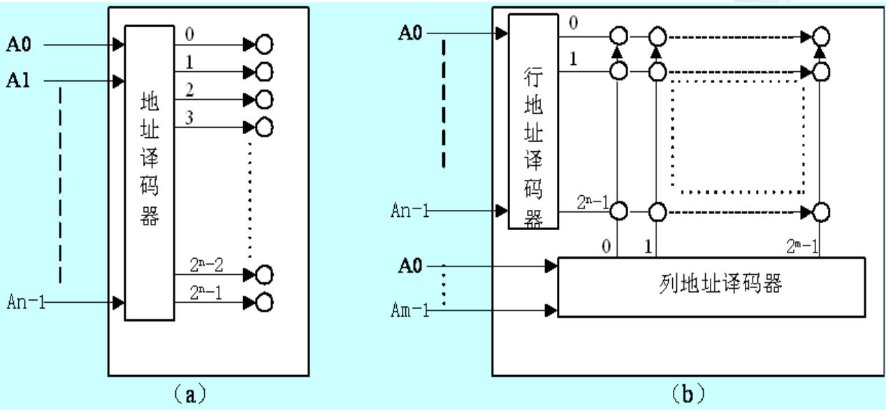

* (a)：线性，一个巨型38译码器，地址一编，看选中哪个字线

  问题：左边地址10bit，右边要2^10 = 1024根线，太多了

* (b)：堆成一个块，一边长为根号下2^10 = 2^5，则行，列确定即可，线一共2^5 + 2^5 = 64根，少多了！

* 三维更牛逼！

#### 存储器组成

* AB: Address Bus，地址总线
* 存储阵列：前面那个(b)
* DB: Data Bus，数据总线

* Register作用：比如读出来一个值，但还没到TikTok，不能放到总线上，因此先放到Register里

#### 6264SRAM

* D0~D7: 8bit表示每个6264的一个cell里存8bit = 1byte

* A0~A12: 13bit，决定读8KB个地址中的哪一个

  > 8K = 2^13Byte = 1 00...0(13个0)
  >
  > 因此从00...0到11...1共2^13种状态

这玩意儿才8K，得拼一拼，弄大点儿

> 8K * 8bit
>
> * 前面变大：字扩展
> * 后面变大：位扩展
> * 都变大：字位同时扩展

#### 字扩展

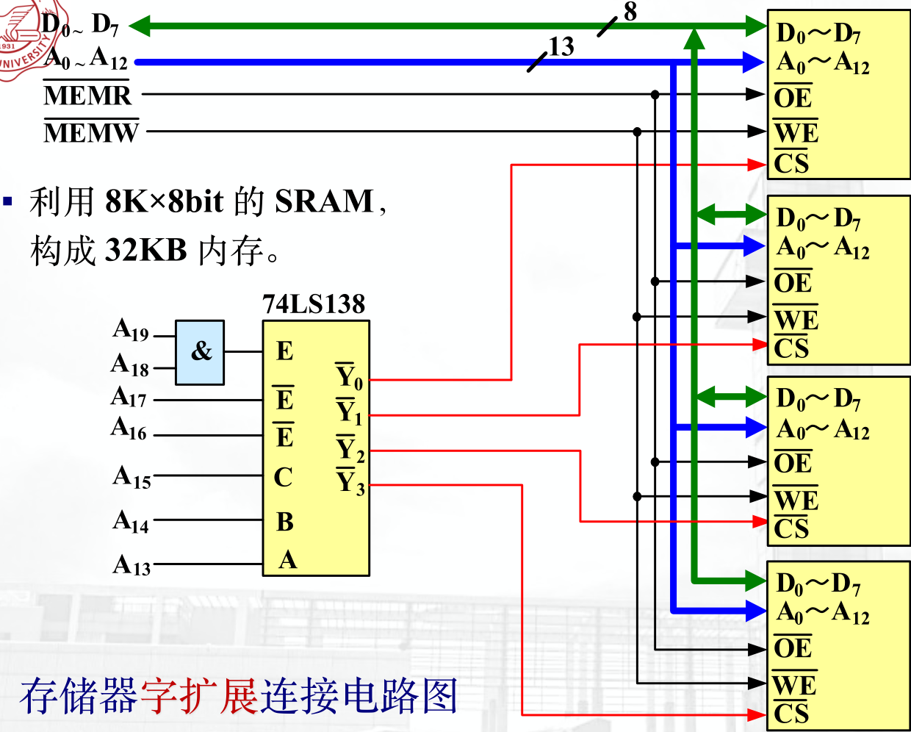

* 138决定选中哪些6264工作

#### 位扩展

#### 8086CPU

* 16bit，数据D0~D15
* 避免数据连续存在一个寄存器：奇偶分体

> 有个20bit的数
>
> |      |      |      | ................................................................... |      |      |
> | ---- | ---- | ---- | ------------------------------------------------------------ | ---- | ---- |
> | A19  | A18  | A17  | ................................................................... | A1   | A0   |
>
> 74-138一共6个输入，3个使能，3个控制
>
> 则从上到下对应A19, A18 ... A14
>
> 而A16, A15, A14决定哪个6264工作
>
> 图中把~Y4连出去，代表当A16, A15, A14为100时，~Y4为0，其余时刻~Y4为1，若工作，~Y4始终为0
>
> 0111 00**xx xxxx xxxx xxx**A0
>
> A0从0开始涨
>
> A0 = 0时，~Y4 = 0,0 + 0 = 0，则上面的6264工作，<u>**将16位中的低八位存起来或者读出去**</u>
>
> **但此时~BHE为1，因此下面不工作**
>
> 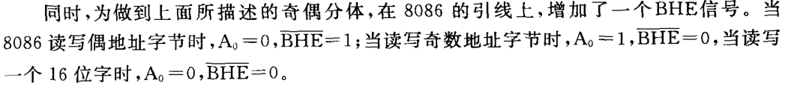
>
> 涨一位，A0 = 1，~Y4 = 0，上面不工作，下面~BHE = 0，工作
>
> 再涨一位，A0 = 0，**但是它前面的x变成了1**，这样，上面工作，同时这个x是地址位的最后一个x，**表示上面那片的00 0000 0000 001号地址**(由此可见，上面讨论的即分别是上下两片的00 0000 0000 000号地址)
>
> 由此，不断进行下去的过程中，**每一个地址都分别会轮到上下两片6264**
>
> **当A0和~BHE都是0的时候，表示这两个6264都工作，而此时两个6264接的地址都是A13~A1，那么会同时取出这两个6264中的D7~D0，那么，如果规定好高8位和低8位，就能够拼成一个16位的数据了，这也就符合了8086的要求**

一个练习题：将4片6264连接到**8086**系统，要求其内存范围70000H~77FFFH

> * 注意：4片，但还是8086，而2个6264就是16位，因此这里是字位同时扩展
>
> 这里还是20bit的数
>
> |      |      |      | ................................................................... |      |      |
> | ---- | ---- | ---- | ------------------------------------------------------------ | ---- | ---- |
> | A19  | A18  | A17  | ................................................................... | A1   | A0   |
>
> 由于第一个数一直是7，则A19~A16是固定的：
>
> 0111
>
> 而6264的A12~A0连接的是地址总线的A13~A1，则A15和A14目前待定
>
> 地址总线的A0和~BHE用于控制这4个6264
>
> **我们一般用A16, A15, A14控制这几个6264的选中**
>
> 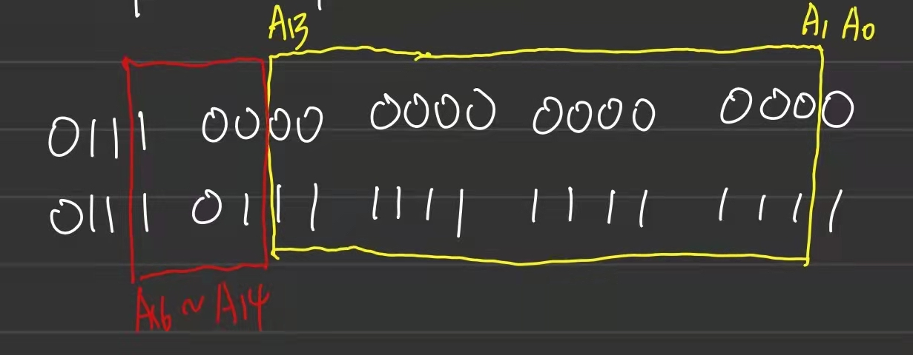
>
> 观察到，A16~A14会从100变化到101，即只有A14会变，**而在变的过程中，必然伴随了：**
>
> * A14为0，剩下的从全0-全1
> * A14为1，剩下的从全0-全1
>
> 也就是说，**会有两个8KB被串起来，而每个8KB又通过奇偶分体实现了16bit**，因此，本题扩展完后是一个16KB * 16bit的内存
>
> 接着看138连出去的部分，由于用A16~A14作为控制端，而他们的状态只有100、101两种，因此用~Y4，~Y5来控制这4个6264，因为**只有他们有变成0的机会！**
>
> 然后，利用之前偶数(**A0 = 0**)存低八位，奇数(**A0 = 1**)存高八位的思想，很容易画出整个的连接图
>
> 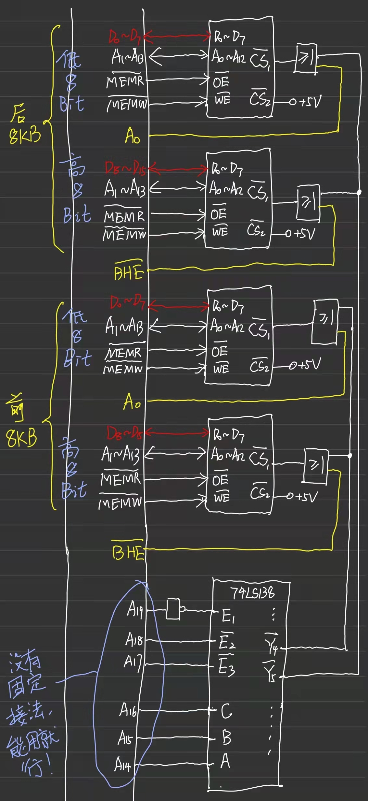

#### 80386/80486处理器

#### Pentium处理器(奔腾)

#### 2164DRAM

> * 虽然是一个16位的，但是只有8根地址线，因此分为行地址和列地址
> * 把双向的数据线改成两根单向的

**由于分为了行地址和列地址，不是一次性都能进行交换的，所以要有一个时序的问题**

|   读数据   | 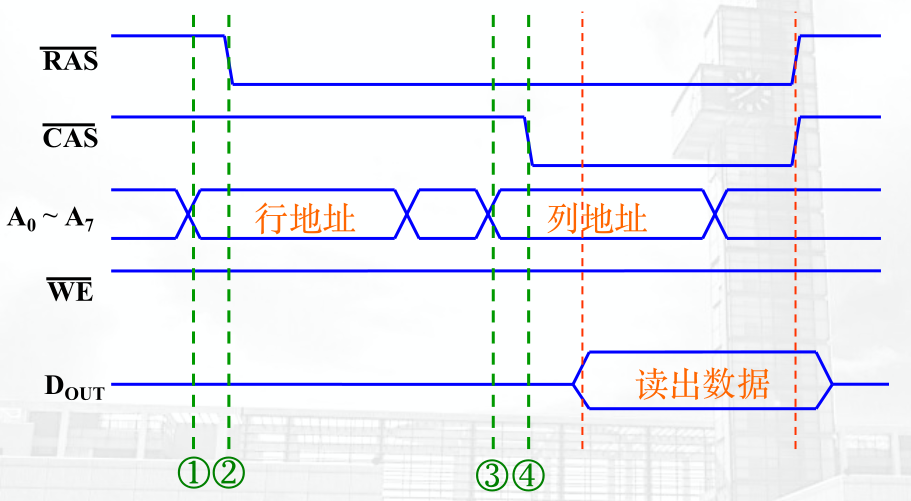 |
| :--------: | ----------------------------------------------------- |
| **写数据** |  |
|  **刷新**  |   |

> 由此，可以感受到，DRAM相比于SRAM，最大的问题就是慢

#### SDRAM(Synchronized DRAM)

* 重要指标：**CAS Latency**

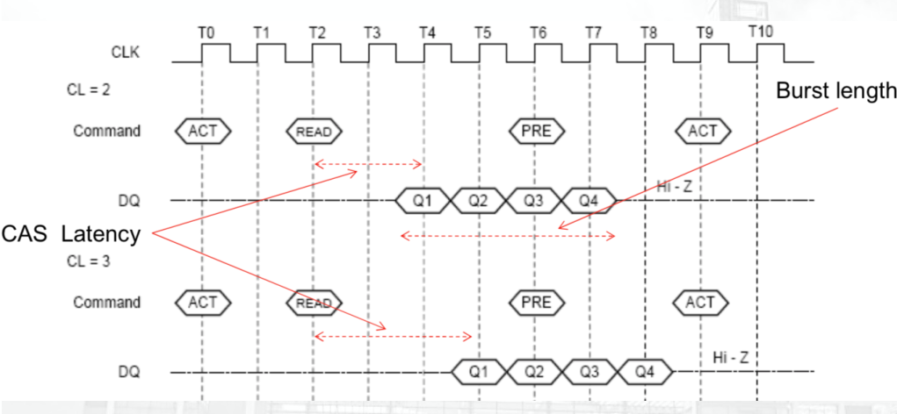

> *前面表格里，读数据的那一栏，从列地址给出的时候就开始发出了READ的命令了，那么，**从发出命令后到真正开始读数据要多久？这就是CAS Latency***

#### 其他RAM

#### SRAM, DRAM总结

* SRAM
  * 用稳态电路存信息，不需要刷新
  * 相对于DRAM，速度快、集成度低、功耗大、成本高
* DRAM
  * 用暂态电路(电容)存信息，需要刷新
  * 地址采用复用技术，分行列两次加载，~RAS、~CAS
  * 相对于SRAM，速度慢、集成度高、功耗小、成本低
  * 刷新(再生)方法：集中式、分散式、异步式
  * 刷新控制电路：刷新计数器、刷新/访存裁决、刷新控制逻辑，是CPU和DRAM的接口

#### ROM

* 特点：存储信息的非易失性
* 分类
  * Mask ROM
  * 可编程ROM
    * OTP-ROM(一次可编程)
    * 可擦可编程ROM
      * EPROM
      * EEPROM：并行、串行
    * 闪存(Flash)
      * NOR(或非型阵列)
      * NAND(与非型阵列)

**Mask ROM**

> 出厂直接刻好，有三极管0，没三极管1

**OPT-ROM**

**EPROM**

**Flash Memory**

* 是EEPROM(电可擦除)的扩展

  * 相同的floating gate结构
  * 相同的读写持久性

* 主要改进

  * 快速擦除(块擦除)

* 分Negate-OR和Negate-AND两种类型

  * NOR读取快，擦除慢，容量小

  * NAND容量大，读写速度小(SSD大量采用)

    

* **适合作文件系统**

**持久性VS可写性**

> 日常用的存储设备，存的信息不会维持很久的。硬盘10年8年没啥问题；SSD，U盘如果长时间不用不通电，里面的数据就会废掉，时间长了，温度高了，电会跑，数据的持久性会有问题；还有光盘，如果保护很好，没问题，但自己光刻机刻出来的就有问题：空气氧化啥的

### 其他存储器

#### 多端口存储器

> 存储器是一个各个设备都要抢占的东西，CPU在用的时候IO就不能用，反之亦然，这样使用多端口，就能有好几套输入输出

读/写操作的一些规范

* 允许
  * 对于不同存储单元
    * 同时读
    * 同时写
  * 对于同一存储单元
    * 同时读
    * 一个写一个读(有时行有时不行)
* 不允许
  * 多个端口同时访问一个单元(Race Condition)

消除竞争，和哲学家就餐问题很类似

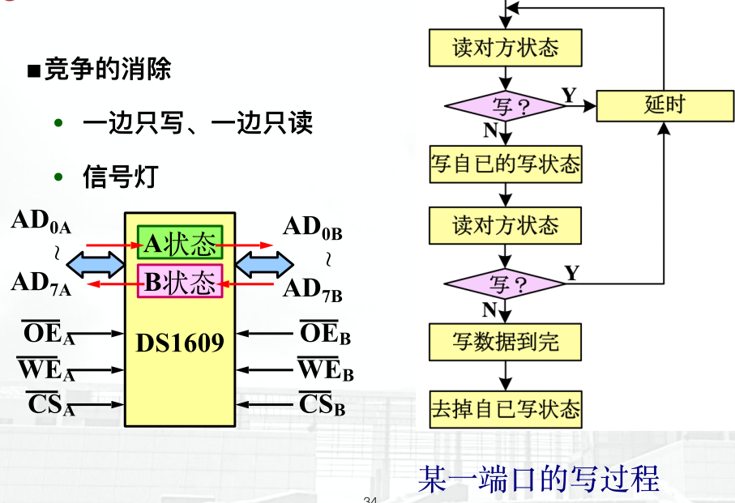

多端口应用场合

#### 多体交叉存储

> 之前8086的奇偶分体就是一种多体交叉

使用多体交叉后，速度会有不错的提高

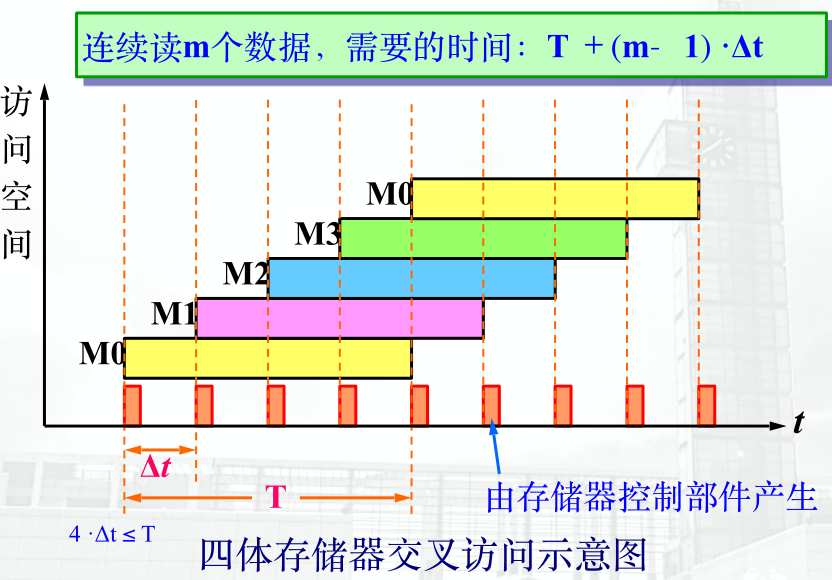

#### 相联存储

* 具备查询能力的存储器

**构成**

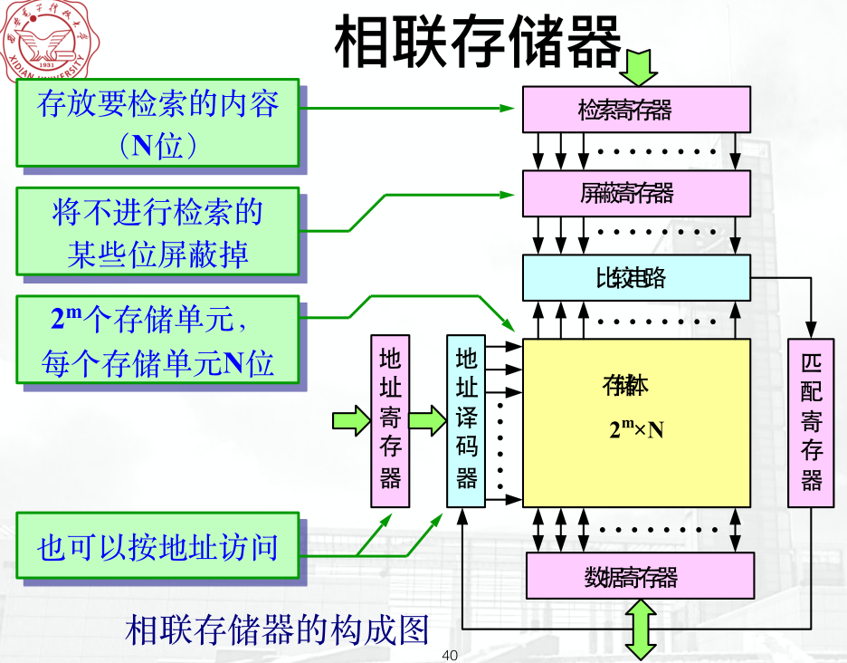|

**用处**

* 快速查找，地址变换
* Cache: Cache目录表
* 虚地址翻译，TLB

### Cache

> A cache memory is a **small, temporary, but fast memory** that the processer uses for **information it is likely to need again in the very near future**.

#### Why Cache?

* CPU性能远超内存，因此CPU直接访问内存的话，内存会拖后腿，让Cache来！
* CPU和I/O抢占内存(尽可能不要让CPU直接访问内存，让Cache来！)
* 在同一个程序中
  * **如果一块内存刚被访问过，那不久的将来也很可能被访问**
  * **如果一块内存刚被访问过，则它旁边紧挨着它的也很可能被访问(Working Set)**

#### 存储系统

> * 把快的慢的弄一块搭配起来就是存储系统
> * 要让快的看起来没那么快；慢的看起来没那么慢
>   * Cache给内存加速，内存给硬盘加速

**一般计算机中主要有两种存储系统**

* Cache存储系统 = Cache + Main Memory，**为了提高存储器速度**
  * Cache给内存加速，让这俩合起来看着挺快的
* 虚拟存储系统 = Main Memory + Disk，**为了扩大存储器容量**
  * 硬盘分一点用作虚拟内存，让内存看起来变大了，慢归慢，但还能用

**存储系统层次结构**

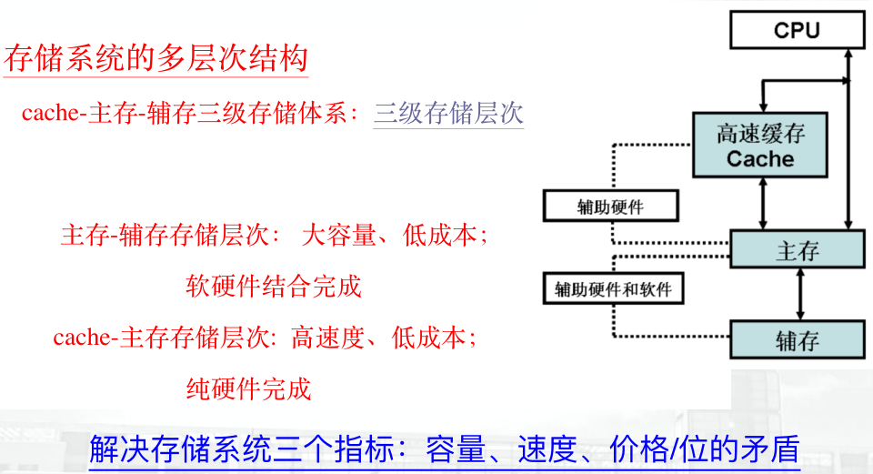

* 程序员**不知道程序其实几乎都是在Cache中运行的**，只知道在内存中
* 程序员**不知道在加载一个非常大的程序的时候，如果MM不够了，OS会把硬盘腾出一块来用作虚拟内存**，只知道内存还够

#### How Cache Works?

* CPU几乎都是通过Cache访问内存，很少会直接访问内存
* CPU和Cache之间字传送，即传的单位是按byte，因为如果是块的话，CPU的Register没那么多地方来放这些块，再者CPU和Cache之间可以很精确的访问
* Cache和MM之间用块传送，因为他们要传是要走总线的，很慢，所以一次多传点儿，从这里也可以看出，Cache中存的东西是按块存的，只不过和CPU沟通的时候是按字节

1. 从CPU来了一个12345678号地址
2. 将地址切成两部分：块号和块内地址
3. 把块号放到TLB中，查看是否存在呢？如果存在，命中
4. 把TLB翻译后的块地址和块内地址拼起来，是真正Cache中的地址，用这个地址访问Cache
5. 从Cache中访问到数据，取出来，送回给CPU
6. 如果第3部没有命中，则看一下Cache有没有满，如果已经满了，就要使用Cache替换策略(比如LRU)，从MM中把这个块加载进来，并替换掉那个改滚蛋的；如果没满，直接加载进来就行了(和Page Replacement Algorithm其实是一回事)

**那类比OS中的虚拟内存和物理内存的映射关系，这里Cache和MM之间也要存在某种映射关系，才能将MM中的块加载到Cache中**

##### 全相联映射

* MM中随便一块，都能映射到Cache中的随便一块

**首先看看TLB**

* 1010表示MM中的第10个块
* 10表示Cache中的第2个块(都是从0开始的哦)
* 1表示存在这个映射关系(MM的10号存在Cache的2号)，好使！

**Cache和MM的情况是这样的**

|

那么，现在CPU给一个地址，如果切完之后块地址就是1010，那经过TLB一查，发现是2号Cache，并且好使！那么再拼上块内地址，就能直接访问Cache了

**全相联的特点**

* 块冲突的概率低(**类比Page Fault数少**)，Cache利用率高
* TLB太大，成本高，查找慢(元素多慢，同时查的时候要一个一个比看是不是1010)

##### 直接映射

* MM中每一块都只能映射到Cache中**特定**一块

**MM给分了个区**

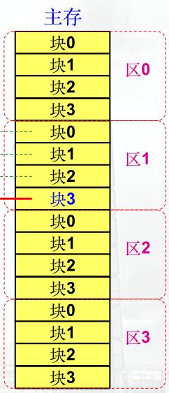

**那咋分区呢？看看Cache就知道了**

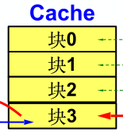

* Cache有4块，则MM中每4块一个区

那有啥用呢？MM中，**每个区的第3块只能映射到Cache中第3块**，其他同理

这样，我要访问，首先要说访问那个区，比如说1区，那区号就是01

**然后，TLB也变了**

* 目录表的数组下标，正好和Cache对应，**也就和MM中每个区中的块的编号对应**，那TLB中的每一个元素，**相当于MM中所有区的对应块的位置**，比如3号表示我要访问MM中某一个区的第三号块，也正好是Cache中的第3号块。那究竟是哪个区呢？前面的区号啊！

如果地址是`01 + 11 + 块内地址`，那直接按着11去访问TLB，取出其中的主存区号，看相不相等，如果相等，代表存在这里的正好是1区的，那就直接`11 + 块内地址`访问了；如果不相等，那存在这里的就不是1区的第三号，可能是0区，2区啥的，那就替换！

**直接映射特点**

* TLB变小了，变成原来的Entry数 / Cache的Entry数
* 查表变快了，直接用下标访问，比较一次01和区号相不相等就行了，不用像之前似的每次都得比较
* MM的地址是`区号 + 块号 + offset`，Cache的地址是`块号 + offset`，发现除了区号，他俩的地位地址完全一样(在一次访问中有关的地址)，而全相联Cache和MM的块号是不一样的
* 硬件简单，不需要相联存储器，只要
  * 容量较小的按地址访问的区号标志表存储器
  * 少量外比较电路
* Cache块冲突概率高(不同区的同一个块会抢Cache中的同一个块)
* Cache空间利用率低(这图里的是整除了，如果没整除，Cache有些块用不到)

##### 组相联映射

* 组 = 全 + 直

**MM分区在直接映射上加了个组**

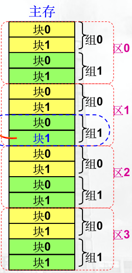

**MM分组了，Cache也分个组吧**

* MM中任何一个区的1组只能映射到Cache中的1组 - **组间直接映射**
* MM中任何一个区的1组的任何一个块可以映射到Cache中1组的任何一个块 - **组内全相联映射**

**这个TLB稍微麻烦一点**

* 数组下标是组号，那1代表我要访问的是某个区的第1组的某一块，那是那个区呢？我给区号，哪个块呢？我给块号
* 我给区号是01，那1组里的区号是01吗？是；我给块号是1，那1组里的块号是1吗？是，**但是，这个块号是全相联映射，需要TLB查一下，查出来1号块在Cache中映射的是0号块**，这样，通过`组号 + Cache中块号 + 块内地址`来访问Cache

**组相联特点**

* 冲突少
* 利用率高
* 块的失效率低
* 实现难度大

**一个组里有几个块，那就是几路组相联**、

##### 映射例题

1. Cache容量为2KB，以128B分块，MM1MB，求

   * 1）Cache分多少块？

   * 2）地址分配

   * 3）MM中129块映射到Cache的哪一块？

   * 4）在上一步的基础上，访问`328CBH`是否命中？

     > 1）Cache共2KB，128B一块，一共
     >
     > `2KB / 128B = 16`块
     >
     > 2）128B一块，则每一块的块内偏移量共128 = 2^7种状态，因此块内地址7bit
     >
     > Cache一共16 = 2^4块，则一共2^4种状态，块号(MM和Cache都是)地址为4bit
     >
     > MM一共1MB，`1MB / 128B = 2^13`块，**而这些块一共又有`2^13 / 16 = 2^9`个区**，因此MM的区号地址为9bit
     >
     > | 区号    | 块号   | 块内偏移量 |
     > | ------- | ------ | ---------- |
     > | A19~A11 | A10~A7 | A6~A0      |
     >
     > 3）`129 / 16 = 8...1`因此访问的是第8区的第1个块，对应Cache中的第1个块
     >
     > 4）328CBH为
     >
     > <u>0011 0010 1</u>000 1<u>100 1011</u>
     >
     > 按照2）的方法，拆分一下就有
     >
     > * 区号001100101 != 8
     > * 块号0001 == 1
     > * 块内偏移量1001011
     >
     > 发现块号是1没错，但区号不是8，在8老往后头呢，所以不命中

2. 某计算机的内存4GB，Cache容量256KB，均采用字节编址。Cache与内存采用8路组相联映射，Cache每块为4KB

   * 1）内存和Cache地址的各字段分别有多少位？

   * 2）每次地址变换时，参与组相联比较的位数是多少？

   * 3）若当前地址变换表的部分有效内容如下(有效为为1，表示Cache块有效)。当CPU访问内存地址分别为01234567H和FEDCBA98H时，请问是否能够命中，若命中则给出相应的Cache地址

     | 地址    | 内存区号 | 组内块号 | 有效位 |
     | ------- | -------- | -------- | ------ |
     | 000 000 | 0009 H   | 000 B    | 1      |
     | 001 011 | 3FD7 H   | 010 B    | 1      |
     | 001 110 | 2440 H   | 101 B    | 1      |
     | 011 001 | 3FD7 H   | 011 B    | 1      |
     | 011 110 | 076E H   | 111 B    | 1      |
     | 110 000 | 0048 H   | 100 B    | 1      |
     | 110 100 | 0009 H   | 000 B    | 1      |
     | 111 111 | 0048 H   | 100 B    | 1      |

     > 1）
     >
     > * 每块4KB共2^12种状态，因此块内偏移共12bit
     > * Cache256KB，每块4KB，则Cache一共`256KB / 4KB = 64`块，~~即块号从0~63共2^6种状态，块号共6bit~~
     >
     > * MM4GB，每块4KB，则一共`4GB / 4KB = 2^20`块，而每个区有64块，则一共`2^20 / 64 = 2^14`个区，即区号14bit
     > * **8路组相联，则每个区要分8 = 2^3个组，组号3bit**
     > * **每个区有64个块，要分成8组，则每个组里有`64 / 8 = 8`个块，块号也是3bit**
     >
     > 也就是，内存：
     >
     > | 区号14bit | 组号3bit | 块号3bit | 块内偏移12bit |
     > | --------- | -------- | -------- | ------------- |
     > | A31~A18   | A17~A15  | A14~A12  | A11~A0        |
     >
     > Cache
     >
     > | 组号3bit | 块号3bit | 块内偏移12bit |
     > | -------- | -------- | ------------- |
     > | A17~A15  | A14~A12  | A11~A0        |
     >
     > 2）
     >
     > 将组号取出来到TLB中查表，之后找到这个组了，在每个组内看**每个块中是否存的是当前我要找的内存中的块**，这个过程叫做相联比较。因此，参与相联比较的是组内的**块号**3bit，则答案是3
     >
     > 3)
     >
     > *首先有个问题：那个表中为啥地址不是连续的？因为这个表只是整个表的一部分，你没看最后一列有效位全是1吗，那那么多0的哪儿去了？没画呗！而且这表里的也不是一个组里的，明显是不同组的东西，**更重要的是，组号明明只有3bit，为啥这里的地址是6bit呢？原因是，这里的地址其实就是数组下标，那你要是分组的话，为了能够让一个组的不同块访问同一个组，还能让这些下标都一样？肯定不是，因此，这里6bit前3bit是组号，后3bit是组内偏移，啥叫组内偏移呢？一个组里不是有8个块吗，那8正好是3bit表示，这样合起来才是6bit***
     >
     > * 01234567H为：
     >
     > 	0000 0001 0010 0011 0100 0101 0110 0111
     >
     > 	由于不用管块内偏移，把后12bit去掉就行，只留下
     >
     > 	0000 0001 0010 00**11 0**100
     >
     > 	按着1）的结果拆分，有
     >
     > 	* 区号00 0000 0100 1000 -> 第0048H区
     > 	* 组号110 -> 第110B组
     > 	* 块号100 -> 第100B块
     >
     > 	因此，去表格里地址的前3位是110的查，发现了0048区里映射的正好是100B，代表我访问的这个地址就在Cache里，不用替换喽！命中
     >
     > * FEDCBA98H为：
     >
     >   1111 1110 1101 1100 1011 1010 1001 1000
     >
     >   也是去掉后12bit
     >
     >   1111 1110 1101 1100 1011
     >
     >   拆分
     >
     >   * 区号11 1111 1011 0111 -> 第3FB7H区
     >   * 组号001 -> 第001B组
     >   * 块号011 -> 第011B块
     >
     >   去表格里地址前3位是001的查，发现没有3FB7，不命中

#### 替换策略

* RAND - 随机
* FIFO
* NFU
* LRU
* OPT

**FIFO**

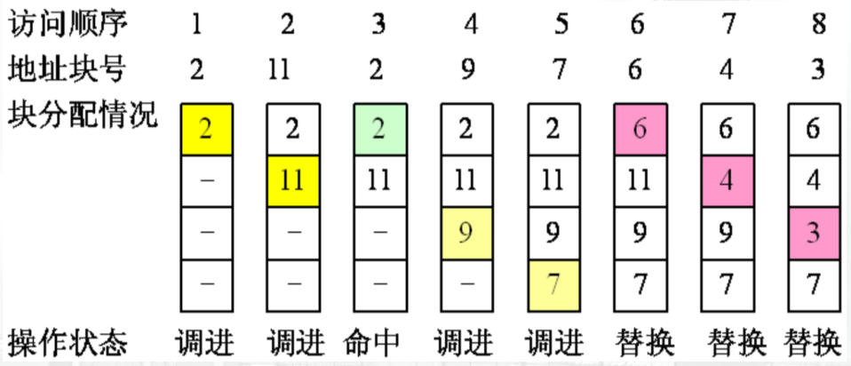

* 替换栈底元素

**FIFO的颠簸**

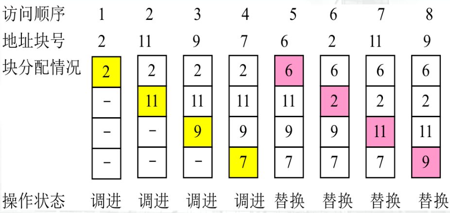

**LRU和FIFO的区别：FIFO命中后不会把栈底元素移到栈顶，LRU会**

命中情况，参见OS中Page Fault即可

#### Cache/内存一致性

> 现在，知道了CPU通过Cache访问内存，那么读写过程中是不是会存在问题？读应该没啥问题，因为读Cache和读内存，东西几乎必定是一样的；但是写的过程中，CPU要通过Cache来修改内存，还是直接修改内存呢？这样就会有几种可能，CPU要么改了内存没改Cache、改了Cache没改内存、内存Cache都改了

**读：只读Cache，不读内存！**

**Write Back(写回法)：能写Cache，坚决不写内存**

* 如果我要修改的内存的地址，正好在Cache中有映射，那我就直接修改Cache，不动内存，等这个Cache在替换算法中要被踢出去时，才把Cache中的东西打到内存里
* 如果我要修改的内存的地址，在Cache中没有映射时，我要先将内存中对应的块替换到Cache中，然后像上面那个一样写，在这个新Cache变成要滚蛋的Cache时打回去
* CPU改完Cache后，要在这个块上打一个Dirty Bit，表示不干净哩，变成新形状了捏

**Write Through(全写法)：优先写内存**

* 如果我要修改的内存的地址，正好在Cache中有映射，那我就内存Cache同时写

* 如果我要修改的内存的地址，在Cache中没有映射时，那我就不写Cache，直接写内存

  > 如果是Cache内存一起写，那速度不一样，Cache蹭一下写完了，内存还没开始捏，咋办？
  >
  > 速度不够，Buffer来凑！
  >
  > 
  >
  > * 写内存的时候专门用一个Buffer来提高速度
  >
  > *但还有问题，谁把Buffer里的东西搬到内存中呢？*
  >
  > * 在内存上整一个控制器，把Buffer里的东西吸出来
  >
  > *但是，还有问题，我要是一下写太多，Buffer就爆了！*
  >
  > * 2级Cache就这么来的！
  >
  >   
  >
  >   但是2级Cache也要有个写策略：还是写回法！

#### Cache性能分析与优化

**为啥Cache会没命中呢？4C**

* Compulsory - 老天
  * 冷启动、过程转移、首次引用……不可避免的
* Capacity - 硬件
  * 容量不够
* Conflict - 算法
  * Cache块间冲突，解决：加容量、提升相联度
* Coherence(相关)
  * 其它操作带来的(比如I/O)

* 多路组相联能够明显降低Miss rate，1路的话需要把Cache size扩大2倍才能达到2路的水平

**加速比**

* CPU访问Cache一次的时间：Tc
* Cache访问MM一次的时间：Tm
* 产生缺块中断时，从MM中把数据替换到Cache中的时间：Tb
* Cache命中率：H

则，若命中了，需要的时间就是Tc；若没命中，需要替换回来再访问Cache，就是Tb + Tc

**由概率论公式，Cache的平均访问周期：**

> T = H * Tc + (1 - H) * (Tb + Tc) = **Tc + (1 - H) * Tb**

加速比(参考Amd定律)

> Sp = Told / Tnew(这里的T都是访问Cache的时间，Tnew也就是Tc)

例：设Cache的速度是主存的5倍，命中率为 95%，则采⽤Cache后性能提升多少?

> 设Cache的访问时间是t，则MM的访问时间5t
>
> 也就是
>
> * Tc = t
> * Tb = 5t = Told
> * Tm = 5t
>
> H = 0.95
>
> 则若Cache命中，访问时间为t
>
> 若Cache没命中，访问时间为t + 5t = 6t
>
> 则平均访问时间
>
> T = 0.95 * t + (1 - 0.95) * 6t = **t + 0.05 * 5t** = 1.25t
>
> Sp = Told / T = 5t / 1.25t = 4

**优化方案**

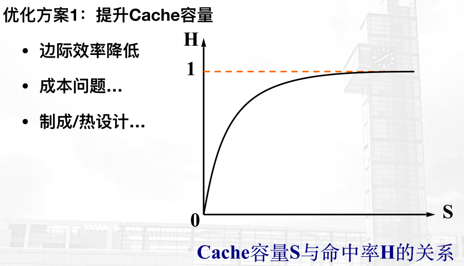

---

* 块大了，块数就少了，缺块中断更多了

---

---

**优化方案4：多级Cache**

总失效率 = 第一级失效率 * 第二级失效率 * ……

例：访问内存需50ns, L1 1ns 10%失效率，L2 5ns 1%失效率，L3 10ns 0.2%失效率，求L1， L1+L2, L1+L2+L3构架下的平均访问时间

> 利用上面的公式算：
>
> * L1
>
>   T = 1 + 10% * 50 = 6(ns)
>
>   ***问题：`90% * 1 + 10% * (1 + 50)`为啥不是`90% * 1 + 10% * (1 + 50 + 1)呢？应该是1级Cache没命中，但也访问了，用了1，然后从MM中搬数据，用了50，最后访问1级Cache，用了1`***
>
> * L1 + L2
>
>   T = 90% * 1 + (10% * 99%) * (1 + 5) + (10% * 1%) * (**50 + 5 + 1**) = 1.55(ns)
>
>   ~~***这里，CPU不能直接访问二级Cache，所以这个50+5+1代表：如果一二级Cache都没命中，要先从MM里搬到2级Cache是50，然后从二级Cache搬到一级Cache是5，CPU再访问一级Cache是1***~~
>
> * L1 + L2 + L3
>
>   T = 90% * 1 + (10% * 99%) * (1 + 5) + (10% * 1% * 99.8%) * (1 + 5 + 10) + (10% * 1% * 0.2%) * (50 + 10 + 5 + 1) = 1.5101

