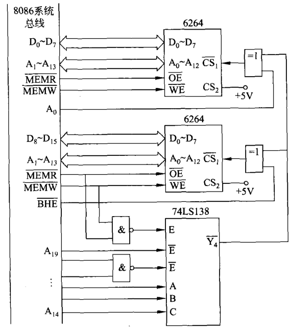

# 计组笔记

## 存储系统

### 层次结构

> * CPU内部，Registers最快，Cache慢一点
> * Main memory再慢一点

### 存储类型

* 半导体
  * 寄存器，Cache，内存，闪存，SSD，EEPROM
* 磁性
  * 硬盘，软盘，磁带
* 光学
  * CD-ROM, DVD-ROM, BD-ROM
  * CD+R/RAM/RW, DVD-R/RAM/RW
* 已有的系统的深度整合优化
  * RAID(冗余磁盘阵列)
  * SSD
  * Cache + Harddisk
  * Cache + SSD
  * Cache + SSD + Harddisk <- Fusion Drive
* 纸，屏幕
  * 纸袋，条形码，答题卡，二维码
  * 打印机/显示 + 相机 = 纸存储的I/O

### 常见容量

* CPU Register: < 10KB
* CPU Cache(L1, L2, L3): < 30MB
* 内存: < 1TB
* 外存(SSD + HD): < 1PB

### 性能：啥叫快？

#### 存取时间

> 任何一个存储器，访问一个单元(R/W)的时间

#### 存取周期

> T = 存取时间 + 预热时间(CD) + 结束时间

比如磁盘，要想访问一个地方，磁头要转到那儿，但SSD就不用

#### 存取带宽

> 单位时间存储器能读出的字节数

比如一个纸带，顺序访问，挺快；乱着来，巨慢！

#### 随机访问速度

> 对"任意目标数据块"的存取时间

比如上面那个纸带的随机访问速度

#### 读写速率比

比如SSD，读很快，但是写很慢(要先来个擦除)

#### 存取粒度

> 能R/W的最小单元尺寸

是Byte?还是Bit?

### 可靠性

#### MTBF(Mean Time Between Failures)

> 在两次故障间的平均时间

可以修，还有救！

#### MTTF(Mean Time to Failure)

> 在完蛋之前的平均时间

修不了，用到死！

#### Days in Use for SSD

SSD老擦除，把预留的Cache写挂了，就废了，比如500GB的可能写几十个T就废了

#### TBW(Terabytes Written for SSD)

* QLC, TLC, MLC, SLC

> 在SLC闪存中，每个存储单元仅存储一位信息，这使得读取单元格更快捷，因为磨损的影响小这也增加了单元的耐久性，进而增加了寿命，但其单元成本较高；MLC闪存每个存储器单元存储两位信息，读取速度和寿命都低于SLC，但价格也便宜2到4倍；MLC闪存的低可靠性和耐用性使它们不适合企业应用，创建了一种优化级别的MLC闪存，具有更高的可靠性和耐用性，称为eMLC；TLC Flash每个存储器单元存储3位信息，优势在于成本与SLC或MLC闪存相比要低得多，较适合于消费类应用，而到QLC Flash则是每个存储器单元能够存储4位信息以存储更多的信息，寿命也会相应低于TLC。

寿命：OLC < TLC < MLC < SLC

### 功耗

功耗小，对电源友好，可靠性高

排名(单位容量下): Cache > Memory > SSD > HD

Cache虽然不大，但功耗还是最高的

### 主存储器

Random Access Memory - RAM

#### SRAM(Static RAM)

* 用于CPU Cache
* 主流：基于MOSFET

> * VGS高电平：压G，DS导通
> * 低电平：断开(图里就这样)

**SRAM核心**

* 没外力驱动，就不会变 -> Static
* 这一个Cell，给个规定：A高是1，A低是0 -> 存一个bit

**SRAM结构**

* 字线决定位线工不工作(选不选中这个cell)
* 位线决定A，B谁高

#### DRAM(Dynamic RAM)

核心：一个电容，有电1，没电0

为什么Dynamic：会漏电啊！时变

**SRAM大，贵，费电**……

**DRAM结构**

> 3T-DRAM

**额外操作：维持**

* 因为C漏电，所以要维持
* 咋维持？先读再写

**DRAM小，便宜，可以容量大**

ddr2, ddr3……频率提高，充电时间降低

#### 阵列怎么搞？

一个单元

拼一起

* (a)：线性，一个巨型38译码器，地址一编，看选中哪个字线

  问题：左边地址10bit，右边要2^10 = 1024根线，太多了

* (b)：堆成一个块，一边长为根号下2^10 = 2^5，则行，列确定即可，线一共2^5 + 2^5 = 64根，少多了！

* 三维更牛逼！

#### 存储器组成

* AB: Address Bus，地址总线
* 存储阵列：前面那个(b)
* DB: Data Bus，数据总线

* Register作用：比如读出来一个值，但还没到TikTok，不能放到总线上，因此先放到Register里

#### 6264SRAM

* D0~D7: 8bit表示一个地址

* A0~A12: 13bit，决定读8KB中哪一个

  > 8K = 2^13Byte = 1 00...0(13个0)
  >
  > 因此从00...0到11...1共2^13种状态

这玩意儿才8K，得拼一拼，弄大点儿

> 8K * 8bit
>
> * 前面变大：字扩展
> * 后面变大：位扩展
> * 都变大：字位同时扩展

#### 字扩展

* 138决定选中哪些6264工作

#### 位扩展

#### 8086CPU

* 16bit，数据D0~D15
* 避免数据连续存在一个寄存器：奇偶分体

> 有个20bit的数
>
> |      |      |      | ................................................................... |      |      |
> | ---- | ---- | ---- | ------------------------------------------------------------ | ---- | ---- |
> | A19  | A18  | A17  | ................................................................... | A1   | A0   |
>
> 74-138一共6个输入，3个使能，3个控制
>
> 则从上到下对应A19, A18 ... A14
>
> 而A16, A15, A14决定哪个6264工作
>
> 图中把~Y4连出去，代表当A16, A15, A14为100时，~Y4为0，其余时刻~Y4为1，若工作，~Y4始终为0
>
> 0111 00**xx xxxx xxxx xxx**A0
>
> A0从0开始涨
>
> A0 = 0时，~Y4 = 0,0 + 0 = 0，则上面的6264工作
>
> **但此时~BHE为1，因此下面不工作**
>
> 
>
> 涨一位，A0 = 1，~Y4 = 0，上面不工作，下面~BHE = 0，工作

