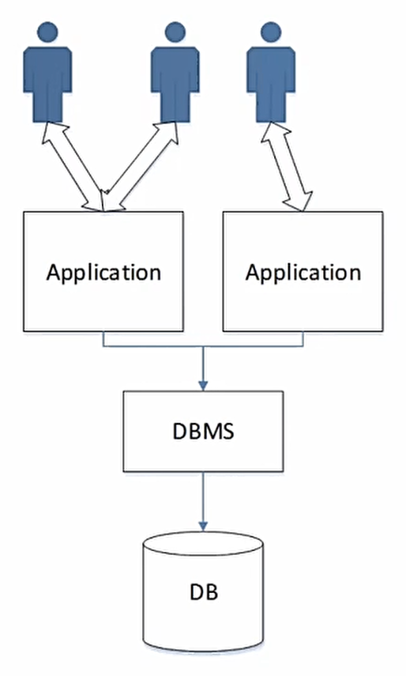
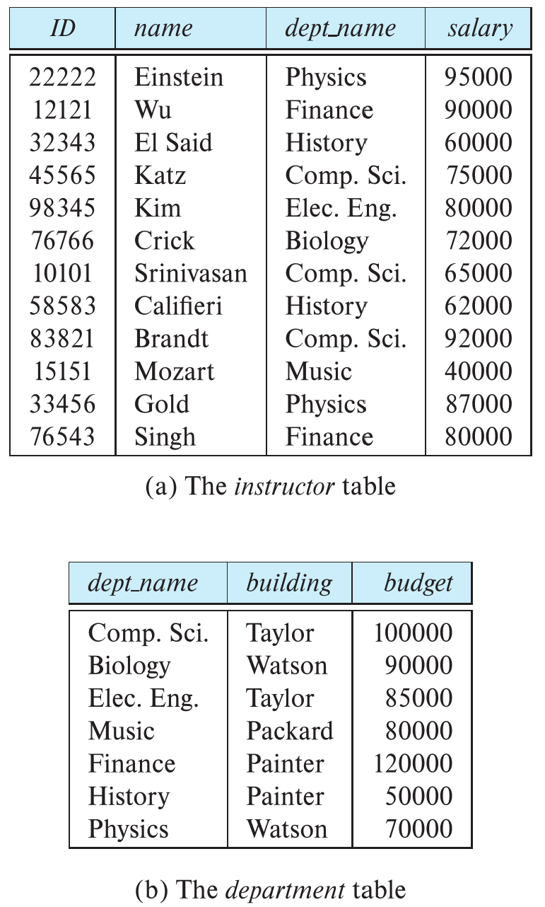

# 数据库笔记

## 1. Introduction

Database-management system(DBMS): a collection of interrelated data and a set of programs to access the data.

Database: a collection of data, contains information relevant to an enterprise.

数据库管理的数据通常是这样的：

* 非常重要
* 非常多
* 经常被很多用户或者进程同时访问

### 1.1 File-processing System

以前用的老数据库通常都是一个文件，叫file-processing system。这样的方式有很多缺点：

* Data redundancy and inconsistency

  比如一个学生的主修课有数学和音乐，而其他的信息比如学号年龄啥的都是一样的。即使这样这个学生的信息也要被复制成两份文件。这样就会显得很冗余；另外如果想要修改数据，很有可能只改了一份，这样还会产生不一致的问题。

* Difficulty in accessing data

  如果辅导员想要调出所有学计算机学生的名单，这样的结构是办不到的。除非程序员预先写好了一个按着这种方式筛学生的程序，不然只能手工来弄。所以这种不能按既定要求查询的数据库也很麻烦。

* Data isolation(隔离)

  数据都是分散在不同文件里的，也就是都是隔离开的，这样找起来很麻烦。

* Integrity problems

  比如我的银行账户的余额永远不可能降到低于0，所以程序员写的时候就要单独为这个限制增加代码；后来又有了新的限制，如果要再加代码，这些刚才加的代码反而被破坏了，导致余额又会变到0以下了。这样**限制和限制之间起冲突**的问题也很难解决。万恶之源就是这个**consistency constraints**。

* Atomicity problems

  转账的时候，先从A那儿扣钱然后再加到B上面。要是在刚扣完钱的时候程序出错了，那钱呢？**所以要么做完，要么不做**。所以如果是上面的情况，一定要退回到转账还没发生，也就是还没扣钱的状态。在这种文本数据库里实现这个很困难。

* Concurrent-access anomalies

  俩人一起打怪，假设怪1000血。A读一下发现是1000血，打出2点伤害，变成998传回去；B在A还没打的时候也读了一下怪，发现还是1000血，打出3点伤害，变成997传回去。那这怪到底剩多少血？998还是997？显然都不对，所以解决这个问题也很重要。

* Security problems

  如果你是银行用户，你能随便查别人的余额吗？显然不能。但是**我也在这个数据库里**，我也要存钱取钱啊，如果不让我看别人的信息，**只给我看他们想让我看的**，这种文件格式也很难办到。

> 我们看到，在DBMS的帮助下，应用程序能更好地使用数据库，同时还保证了数据库的安全性。这里**不同的应用通过DBMS后，看到的DB就是不一样的**。

### 1.2 Data

#### 1.2.1 Data Model

数据库里很重要的一个概念。说的就是这数据到底怎么去表述它，怎么去处理它们之间的关系，怎么解决consistency constraints的问题。这里有4种主流的模型：

* Relation Model
* Entity-Relationship Model
* Semi-structured Data Model
* Object-Based Data Model

这些模型之后都会详细讨论。

#### 1.2.2 Relational Data Model

