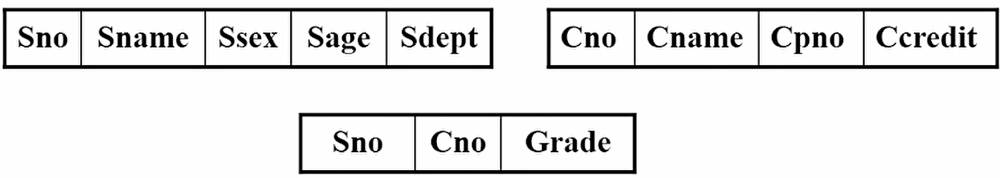

# 数据库笔记

## 1. Introduction

Database-management system(DBMS): a collection of interrelated data and a set of programs to access the data.

Database: a collection of data, contains information relevant to an enterprise.

数据库管理的数据通常是这样的：

* 非常重要
* 非常多
* 经常被很多用户或者进程同时访问

### 1.1 File-processing System

以前用的老数据库通常都是一个文件，叫file-processing system。这样的方式有很多缺点：

* Data redundancy and inconsistency

  比如一个学生的主修课有数学和音乐，而其他的信息比如学号年龄啥的都是一样的。即使这样这个学生的信息也要被复制成两份文件。这样就会显得很冗余；另外如果想要修改数据，很有可能只改了一份，这样还会产生不一致的问题。

* Difficulty in accessing data

  如果辅导员想要调出所有学计算机学生的名单，这样的结构是办不到的。除非程序员预先写好了一个按着这种方式筛学生的程序，不然只能手工来弄。所以这种不能按既定要求查询的数据库也很麻烦。

* Data isolation(隔离)

  数据都是分散在不同文件里的，也就是都是隔离开的，这样找起来很麻烦。

* Integrity problems

  比如我的银行账户的余额永远不可能降到低于0，所以程序员写的时候就要单独为这个限制增加代码；后来又有了新的限制，如果要再加代码，这些刚才加的代码反而被破坏了，导致余额又会变到0以下了。这样**限制和限制之间起冲突**的问题也很难解决。万恶之源就是这个**consistency constraints**。

* Atomicity problems

  转账的时候，先从A那儿扣钱然后再加到B上面。要是在刚扣完钱的时候程序出错了，那钱呢？**所以要么做完，要么不做**。所以如果是上面的情况，一定要退回到转账还没发生，也就是还没扣钱的状态。在这种文本数据库里实现这个很困难。

* Concurrent-access anomalies

  俩人一起打怪，假设怪1000血。A读一下发现是1000血，打出2点伤害，变成998传回去；B在A还没打的时候也读了一下怪，发现还是1000血，打出3点伤害，变成997传回去。那这怪到底剩多少血？998还是997？显然都不对，所以解决这个问题也很重要。

* Security problems

  如果你是银行用户，你能随便查别人的余额吗？显然不能。但是**我也在这个数据库里**，我也要存钱取钱啊，如果不让我看别人的信息，**只给我看他们想让我看的**，这种文件格式也很难办到。


> 我们看到，在DBMS的帮助下，应用程序能更好地使用数据库，同时还保证了数据库的安全性。这里**不同的应用通过DBMS后，看到的DB就是不一样的**。

### 1.2 Data

#### 1.2.1 Data Model

数据库里很重要的一个概念。说的就是这数据到底怎么去表述它，怎么去处理它们之间的关系，怎么解决consistency constraints的问题。这里有4种主流的模型：

* Relation Model
* Entity-Relationship Model
* Semi-structured Data Model
* Object-Based Data Model

这些模型之后都会详细讨论。

#### 1.2.2 Relational Data Model


#### 1.2.3 Data Abstraction

为了普通用户使用，需要多次封装来让数据库看起来变得简单一些。

* Physical level

  存储的具体细节。是存在磁盘上还是存在云上；是用树形图存还是用其他的数据结构存等等

* Logical level

  我存的到底是个什么玩意儿。比如如果我要存一个instructor(大学导师)，可以用下面的方式：

  ```sql
  type instructor = record
  					ID: char(5);
  					name: char(20);
  					dept_name: char(20);
  					salary: numeric(8, 2);
                    end
  ```

* View level

  比如一个学校里的食堂大妈也在这个数据库里。它为什么要看到这个老师的工资呢？视图层的作用就是隐藏不需要的数据和不想让它看到的数据。这样也简化了数据库的使用。同样的数据库经过不同的试图层，就会在不同的人面前呈现出不同的样子。

这三层的关系就是这样的。


#### 1.2.4 DBMS Architecture

DBMS在内部做的事情其实是很复杂的，尽管我们看起来很简单。比如下面有三张表：



第一张是学生的学号，姓名，性别，年龄和专业；第二张是课程号，课程名等等；第三张是学生的学号，课程号和课程的成绩。那么如果我们在**物理层**把课程信息和成绩单信息存到一起，学生的信息单独存起来。


我们会发现，如果我们要打印一个这样的成绩单：


我们需要他同时具有这三个表的信息才可以。因为成绩单那张表只有课程号和成绩，并没有课程名，需要调用课程信息的表才可以。从外面看，我们只能看到这个成绩单；但是**在DBMS内部需要转化成对三张表的查询和对两个物理存储介质的增删改查**，因此DBMS的内部逻辑是很复杂的。

因此，我们将逻辑层的模式叫做Logical Schema，将外部暴露给用户的模式叫做External Schema，将物理层最裸露的处理模式叫做Physical Schema。**Logical Schema其实就对应着上面的Logical level，是用来表示我存的到底是个什么，整个数据拆开揉碎了都是怎么样的**。


#### 1.2.5 Instances and Schemas

这俩的关系有点像实例和类型之间的关系。比如在C++里定义了一个Animal类，实例化出一个dog对象，那么dog就是Instance，而Animal就是Schema。

* Instance: the collection of information stored in the database **at a particular moment**.
* Database schema: the **overall** design of the database.

### 1.3 Database Language

#### 1.3.1 DDL

Data-definition language(DDL): 定义数据库的schema。比如：

```sql
create table department
(
    dept_name	char(20),
    building	char(15),
    budget		numeric(12,2)
);
```

这里面还有很多其他的功能，比如把`dept_name`定义成**主键**等等。

#### 1.3.2 DML

Data-manipulation language(DML): 数据操作语言，就是对数据库进行**增删改查**的语言。

这部分更多是上机练习。

### 1.4 Database Design

先来看一个例子。


这个数据库有什么问题吗？我们来想想：如果我们想把物理学改成应用物理，那么我们就要搜索整个表，把所有能找到的物理学都改成应用物理，否则就会出现不一致的问题。这种问题叫做**更新异常**；另外，这个表里现在只有一个音乐学院的老师。如果这个老师被调离了，我们当然要从数据库中删除它。而造成的问题就是：这个表里所有关于音乐学院的信息都丢失了。这种问题叫做**删除异常**；如果我们在删除了这个音乐老师之后，又来了一个新音乐老师，这时候插入也会产生**插入异常**。这些情况，都是由与我们的**数据冗余**导致的，也就是**一样的信息我们在表中存储了多份**，或者说**我们把本应该存在多张表里的东西都堆在了一起**。解决这个问题的办法也很显而易见，就是将这个表拆成多张表。具体怎么拆之后再说。

## 2. Relational Model

Relation表示关系，关系的模型其实就是一个表格。比如下面的这个


每一列都代表着一个**属性(attribute)**，每一行都是一个**元组(tuple)**，其实就是一个对象。这里列其实描述的就是之前说的Schema，而每一行其实就在描述这个数据库的Instance。

对于每一个属性，都会有它的约束。比如ID必须是一个定长为5的字符串；name是一个最大长度为20的变长字符串等等，这些约束叫做属性的**值域(domain)**。

属性的值域需要满足一个要求，叫做**原子性(atomic)**。比如某个数据库里存了人的电话号。那么如果说这个电话号可以存很多个号，比如一个人有几张卡这种情况。这样存的话，这个数据库就不满足原子性。因为这个电话号属性是可以拆开的。如果一定要这么存的话，我们只能把所有电话号拆开，比如拆成个人手机、固定电话、亲属电话等等。**总之一个属性里必须只能存一个数据**。

如果要是来了一个新老师，还没确定他是什么学院的，也不确定工资是多少，只知道ID和姓名，那么这个时候我们怎么赋值呢？我们允许属性有一个特殊的值叫做**null**。

### 2.1 Relational Algebra

#### 2.1.1 Relation Schema and Instance

现在有一个学院的关系，叫做department relation。


那么我们观察可得，这表里有三个属性：dept_name, building, budget。我们记作$A_1,\ A_2,\ A_3$，那么我们就可以写出这个relation的schema了：
$$
department(dept\_name,\ building,\ budget)
$$
这个schema就叫做**Relation Schema，记作R**。我们能发现，R其实就是所有的属性构成的集合而已。那么，我们就让属性中的一部分叫做**键(Key)，记作K**。也就是说$K \subseteq R$。

上面例子中的`dept_name`，我们能发现，在这个relation中，只要`dept_name`确定了，我们就能确定唯一的一行。像这样的Key，我们叫它**superkey**。又或者上面老师的例子中，`ID`就可以是一个superkey，而{`ID`, `name`}也可以是一个superkey。但是`name`自己就不是一个superkey了，因为老师可能有重名。这里要注意的是，**Key是一个集合而不是单独的属性**，只不过我们日常生活中Key总是单元素的集合罢了。

那么在这些superkey中，我们总要选合适的。所以我们选择**元素个数最少的集合**(基本上都是只有1个元素的)，将它叫做**candidate key**。比如各种网络游戏，会有千千万万玩家。在刚进入游戏的时候，会要求每个玩家起名字，并且不能重名。那么很显然这个`name`就可以成为candidate key；另外，我们还给每个玩家定义了一个`user_id`(因为玩家起的名字通常千奇百怪，尽管没有重名但是管理起来依然很复杂)，也要求所有的`user_id`不能重复。很显然`user_id`也可以成为candidate key。

在上面游戏的例子中，`user_id`比起`name`显然更加适合搜索，因为`user_id`是程序有秩序的赋予而`name`是玩家起的各种千奇百怪的名字。所以我们将`user_id`作为**primary key**。

现在那之前说的两张表来：

|

在右边的relation中，`dept_name`显然是primary key；而在左边的表中也出现了`dept_name`。如果这俩表是在同一个数据库系统中的，那么我们就说左边的这个`dept_name`是一个**foreign key**，它来自右边的表。这玩意儿有什么用呢？我们来想想：假设我们要插入一个老师，但是惊讶的发现它是电竞学院的，那对不起，肯定是插入失败，因为我们学校根本没有电竞学院。那么我们是怎么有底气说出这话的呢？靠的就是foreign key。我们`dept_name`的**取值**都是来自于其它relation中的primary key，是一定真实存在的。所以我们`dept_name`的值域已经被限制的死死的了，因此**我们只能插入学院是右边那张表里存在的东西**。这种方式也是给我们的值域增加了一种约束。因此我们有时候也把外键称为foreign key constraint。

**对于一个学校的教务系统，我们就可以画出这样一张表。**


> 这里的箭头表示被引用的关系。比如takes中的ID指向了student里的ID，表示了takes中的ID是一个foreign key，它来自student。
