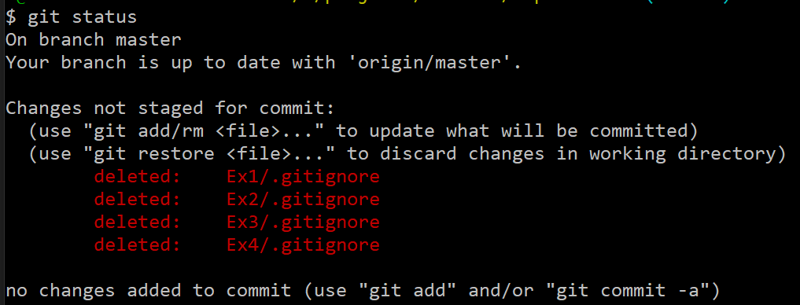

# git使用技巧

## 已经推送过的文件，但是本地发现他不用提交(比如clion的cmake-build-debug)

* 可使用如下代码来操作：

  ```git
  git rm --cached <files>
  ```

* 如果删除的文件不在当前目录下，而在子目录下，需要递归操作：

  ```git
  git rm -r --cached <d1/d2/files>
  ```
  
* 如果不想直接删，只想列出删了什么，就加一个-n

  ```git
  git rm -r -n --cached <d1/d2/files>
  ```

* 然后还需要提交这次修改

  ```git
  git commit -m "deleted files"
  ```

* 最后push

  ```git
  git push
  ```

  

## 本地的文件删掉了，我在远程仓库也不要了，怎么把这个删除后的状态同步到远程仓库

* 如果目录中包含中文，使用如下命令配置

  ```git
  git config --global core.quotepath false
  ```

* 删除了本地文件，查看状态

  ```git
  git status
  ```

* 这时候会看到这样的情况

  

* 然后，提交这次改动

  ```git
  git add -A
  ```

* 然后正常commit+push即可删除，这里-A表示删除mode