<h1>计网笔记</h1>

# Part 1: Basic

## 1. Introduction

### 1.1 Protocol

我们之间说的话，就叫做**协议**。我说的话你能听懂，我说的话牛听不懂。**两者之间的规约要相同，他们之间才能通信**。这个规约就叫做protocol

### 1.2 Telecommunication

远程通信就叫做Telecommunication，传的就是以任何格式表示的信息，也就是Data

### 1.3 Data Communications

两个设备之间的数据交换，需要通过一个媒介(比如电线)。然后这些所有的设备会组成一个Communication System。这个系统就是由一系列硬件(physical equipment)和软件(programs)组成的。这个系统想要有效，需要以下4个东西

* Delivery: 系统必须得把数据**传到对的目的地**。必须由那个期望收到信息的一方收到，并且只能是它
* Accuracy: 你传的Data不能损坏，损坏了就不能用了
* Timeliness: 传数据有时候要**及时(in a timely manner)**。比如视频聊天，你一拍到图像，录到声音就得赶紧传过去了，并且还得按顺序传，不然变成说的道理了。并且传的时候还不能有太大的延迟。这种传输就叫做**real-time transmission**。
* Jitter(抖动): 比如接收视频，每过30ms来一个视频包，那如果一些包有30-40ms的延迟，那这视频质量就会受影响，比如哪一块突然花一下。

### 1.4 Five components of data communication

既然是俩设备之间的通信，那除了他俩，还有啥呢?


* Transmission medium: 就是上面说的发送方和接收方之间的物理媒介。
* Protocol: 发送方要按照规范去发数据，比如Rule1, Rule2等，这些规范双方都是相同的，叫协议，也就是**规则的集合**
* Message: 发送的时候，把数据按照规则打包，打成的包就叫Message

### 1.5 Data flow

#### 1.5.1 Simplex


数据只能单向流动。意思就是说，这俩人一个只能发，另一个只能收。比如显示器，键盘就是这样。显示器只能接收图像信息，而键盘只能发送输入的字符。

#### 1.5.2 Duplex

##### 1.5.2.1 Half-Duplex

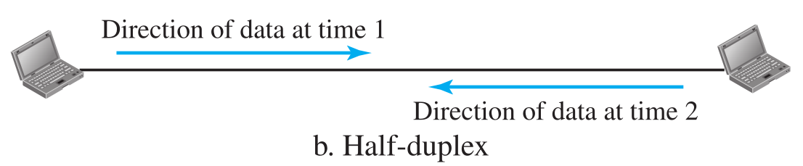

能双向流，但是却不能完全双向流。也就是说在一个时刻只能有一个方向。不能有一个时刻又往左又往右。比如对讲机。你说话的时候就不能听别人说；听别人说的时候你也不能说话。

##### 1.5.2.2 Full-Duplex


可以理解为把两个Half-Duplex的线捆起来(只是理解，真实情况还不一定是这样)。这样就随时想往哪儿就往哪儿。比如电话，就既能说话也能听见别人说话。

### 1.6 Network

什么是网络？数据结构里就学过！带权的有向图就是网。那这里的网络其实就是这个。只不过，其中的边在这里是Link，其中的结点在这里还是Node。它们的集合就是网络。Node可以是计算机，或者host, router；Link就是wired or wireless transmission media，比如cable或者空气。

### 1.7 Types of connections

#### 1.7.1 Point-to-Point

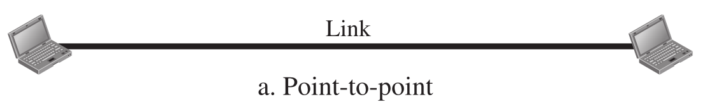

也就是经常见到的p2p。这个Link是被两个Node独享的

#### 1.7.2 Multipoint


很多个Node挂在一个Link上，这样能做到一个发，多个收。有一种广播的性质。这个Link也非常像Bus，由多个结点共享

### 1.8 Physical Topology

由上面两种连接方式，可以分出下面4种网络的拓扑结构

The term **physical topology** refers to <u>the way in which a network is laid out physically</u>. Two or more devices connect to a link; two or more links form a topology. The topology of a network is the geometric representation of the relationship of all the links and linking devices (usually called nodes) to one another. There are four basic topologies possible: mesh, star, bus, and ring.

#### 1.8.1 Mesh Topology


你看这里的每一个结点。除了它自己，它和其他所有的结点都有Link，并且每个Link都只有这俩独享，也就是p2p。简单的数学可以算出，如果有n个结点，那么Link的个数就是$\frac{n(n-1)}{2}$。当然，一切的前提是这里的Link是Duplex而不是Simplex。

Mesh的优缺点：

> A mesh offers several advantages over other network topologies.
>
> * First, the use of dedicated links guarantees that each connection can carry its own data load, thus eliminating the traffic problems that can occur when links must be **shared** by multiple devices. 
> * Second, a mesh topology is robust. **If one link becomes unusable, it does not incapacitate the entire system.** 
> * Third, there is the advantage of privacy or security. **When every message travels along a dedicated line, only the intended recipient sees it.** Physical boundaries prevent other users from gaining access to messages.
> *  Finally, point-to-point links make fault identification and fault isolation easy. Traffic can be routed to avoid links with suspected problems. This facility enables the network manager to discover the precise location of the fault and aids in finding its cause and solution.
>
> The main disadvantages of a mesh are related to the amount of cabling and the number of I/O ports required. 
>
> * First, because every device must be connected to every other device, installation and reconnection are difficult. 
> * Second, the sheer bulk of the wiring can be greater than the available space (in walls, ceilings, or floors) can accommodate. 
> * Finally, the hardware required to connect each link (I/O ports and cable) can be prohibitively expensive. For these reasons a mesh topology is usually implemented in a limited fashion, for example, as a backbone connecting the main computers of a hybrid network that can include several other topologies.

#### 1.8.2 Star Topology


这个Hub就像GitHub里的Hub，就是一个Central Controller。每一个结点都只和Hub有一个p2p连接。那么如果一个设备想和另一个设备通信，就不能像mesh一样直接来了，只能通过Hub来。

Star的优缺点

> Advantage:
>
> * A star topology is less expensive than a mesh topology. In a star, each device needs only one link and one I/O port to connect it to any number of others. This factor also makes it easy to install and reconfigure. Far less cabling needs to be housed, and additions, moves, and deletions involve only one connection: between that device and the hub.
> * Other advantages include robustness. If one link fails, only that link is affected. All other links remain active. This factor also lends itself to easy fault identification and fault isolation. As long as the hub is working, it can be used to monitor link problems and bypass defective links.
>
> Disadvantage:
>
> * One big disadvantage of a star topology is the dependency of the whole topology
>   on one single point, the hub. If the hub goes down, the whole system is dead. 
> * Although a star requires far less cable than a mesh, each node must be linked to a central hub. For this reason, often more cabling is required in a star than in some other topologies (such as ring or bus).

#### 1.8.3 Bus Topology

之前的都是p2p，现在来一个Multipoint，这也正对应了名字里的Bus。这里要注意的就是，因为是一个发，多个收，所以这种方式一定是Half-Duplex，而之前的Mesh和Star既可以是Half，也可以是Full。比如Star种的Hub如果也是个Bus，那就是Half；如果是Switch(交换机)，那就是Full。

*问题：那既然Star的Hub可以是Bus，那这不就和Bus Topology一模一样了吗？*


#### 1.8.4 Ring Topology

如果把这根线变成一个圈，就能用Simplex去模拟Duplex了。因为就算不能往另一边走，转一圈回来也能到。


### 1.9 Network Types

#### 1.9.1 Local Area Network

后面的三种: Star, Bus 和 Ring有一个共同的特点：结点和结点之间离得很近。Star的Hub可以放在一个公司里；Bus中的总线也能放在一个固定的地方；而Ring一个环也是一个有限大小的环。所以这三种统称为LAN(Local Area Network)。


过去的这种LAN，如果一个结点发包，其他所有结点都能收到。那怎么办呢？那个发包的目标就把包留下，其他不想要的就扔掉；**而现在普遍用交换机的这种方式**。先把包发到交换机里，由交换机来把包再传到目的地。这样可以减轻cable的使用率(之前所有人都用一根，那几乎这跟cable时时刻刻都在使用中)，并且可以让**很多个数据传送同时发生**，只要他们之间别犯冲就行。

#### 1.9.2 Wide Area Network

LAN连接的都是host，而WAN连接的都是像switch, router, modem(调制解调器)这样的设备。主要分为p2p类型和Switched类型。

##### 1.9.2.1 Point-to-Point WAN

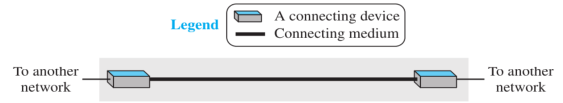

像是之前的Mesh类型，它们每两个结点之间就是这种方式连接的。要注意的是，因为是WAN，所以这里Mesh中的结点就不能是电脑啥的了，要是交换机这种设备才行。

##### 1.9.2.2 Switched WAN


多个p2p类型的WAN结合起来，就变成了Switch类型的WAN，而这里的结点也要是交换机才可以(连名字都是交换机)。这种就是我们现在最常用的网络的类型。

Switched WAN的另一种表示:


ABC三个End System就可以是我们平常使用的手机，电脑之类的。而它们因为距离很远，如果需要通信的话，就需要一个很大的共享的网络，所以这些黄色的连起来就组成了Switched WAN。

End Node具有数据计算功能，能处理收到的信息，也能存储和发送信息。但是它不能自己去建立很远的连接，比如A就不可能不通过Switched WAN直接把信息发送给B。这些End Node组成的网络能产生和处理数据，我们叫它**资源子网(Resource Subnet)**。

中间的黄色结点叫做Relay Node / Middle Node。它们不能处理数据，但是可以接力，把我收到的数据传给下一个，那么这样一直传，知道目的地，就达到了远距离传送的目的。一般路由器，交换机之类的就是这种结点。那么这些Link和Node组成的专门用来接力和传送数据的网络我们叫它**通信子网(Communication Subnet)**。

而资源子网和通信子网就组成了我们的WAN。

##### 1.9.2.3 Internetwork

LAN和WAN其实现在根本看不到单独的，现在能看到的全是它们一个一个连接起来的形式。如果是两个或以上的LAN或者WAN连接起来，就形成了**互联网(Internetwork, or Internet)**。

接下来是2个Internet的例子。首先是两个办公室，每个办公室内部都有LAN，为了处理本办公室内部的通信，然后这俩办公室由要互相连接，所以用了一个p2p的WAN。


然后是一个很复杂的Internet，由4个WAN和3个LAN组成。


#### 1.9.3 The Internet

注意internet和Internet的区别。小写字母是上面讨论的；而大写字母是全世界最大的，将所有的小internet连接起来组成的唯一的Internet。下面就来分析以下这个全世界最大的网络。

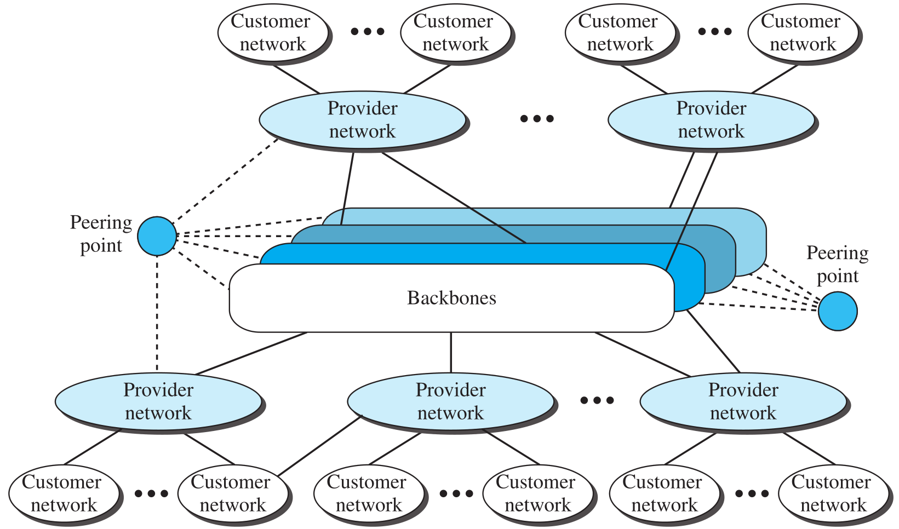

* 首先最大的是**Backbones**，也就是整个互联网的骨架。它们是一些超大公司(比如Sprint, Verizon, AT&T, NTT)的网络，由Peering point来连接。
* 然后是**Provider network**。这些也是大公司，只不过它们只是转接来的，比如像移动，联通，微软，谷歌等。它们有的能直接从Backbones那边来货，也可能互相撺掇。
* 最后就是我们这些用户了，其实就是一级一级传下来的，最终这个网络服务的也是这些数量最多的终端用户。
* 另外，Backbones和Provider networks都是提供服务的，真正享受这些服务的并不是它们。所以这些也叫做**Internet Service Providers(ISP)**。而最大的Backbones叫**International ISPs**；小一点的地方的这些Provider networks叫做**National or regional ISPs**。

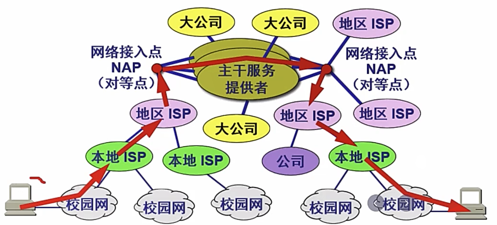

> network access point(NAP): A complex switching station that connects backbone networks.

## 2. Network Models

### 2.1 Protocol Layering

为什么要给协议分层？如果只有俩设备，那当然很简单，俩人遵守一套规则就可以了。但是如今的计算机实在是太多了，手机电脑平板机器人还有各种服务器和嵌入式计算机。如此多的设备想要管理它们之间的通信，就像要管理世界上这么多的人一样，需要分层的结构来进行管理。

首先说一个需要分层管理的例子。有两个人：Maria, Ann。她们离得很远，要用邮件来通信。并且在信传输的时候，万一被拦截了咋办？所以她俩想了个招：给它加密。在传输的过程中传的都是密文，谁也看不懂，然后拿到手之后再解密，就变成了明文。那么对于每个人来说，就很容易地分成了3层结构：收发信、加密和解密、传输信。


下面是书上给的Maria给Ann发信息的例子，很好看懂。

> ​		Let us assume that Maria sends the first letter to Ann. Maria talks to the machine at the third layer as though the machine is Ann and is listening to her. The third layer machine listens to what Maria says and creates the plaintext (a letter in English), which is passed to the second layer machine. The second layer machine takes the plaintext, encrypts it, and creates the ciphertext, which is passed to the first layer machine. The first layer machine, presumably a robot, takes the ciphertext, puts it in an envelope, adds the sender and receiver addresses, and mails it.
> ​		At Ann’s side, the first layer machine picks up the letter from Ann’s mail box, recognizing the letter from Maria by the sender address. The machine takes out the ciphertext from the envelope and delivers it to the second layer machine. The second layer machine decrypts the message, creates the plaintext, and passes the plaintext to the third-layer machine. The third layer machine takes the plaintext and reads it as though Maria is speaking.

由此，我们能总结出分层结构的好处:

* **Separate** the services from the implementation.

  > 各层之间独立，互不相干，我不用关心其他层是咋实现的，做好自己层的事儿就行(写MVVM架构的时候确实深有体会)。

* Another advantage of protocol layering, which cannot be seen in our simple examples but reveals itself when we discuss protocol layering in the Internet, is that communication does not always use only two end systems; there are intermediate systems that need only some layers, but not all layers. If we did not use protocol layering, we would have to make each intermediate system as complex as the end systems, which makes the whole system more expensive.

  > 如果你不分层的话，那么一些系统(比如中间的系统)就会变得非常臃肿，而分层的话就会让这个逻辑尽可能清晰一些。

### 2.2 TCP/IP

全称：Transmission Control Protocol / Internet Protocol。从名字就能看出来，它就是个协议。那么既然是协议，就是一套规则罢了。只不过这套规则是一个"采用上面所说的分层结构"的协议。每一层都能提供服务，也享受服务，享受的就是它下面那一层提供的。


> 左边是老版本，右边是新版本，这里只讨论新版的。

每一个设备都会包括几层这些协议。比如下面的例子中，电脑ABC会包括整个5层；而LAN中的交换机只包括物理层和Data Link层；路由器包括下三层。


那么A如果想要给B发消息，就是这样的：A要在**应用层**产生一个消息，然后一路向下传到A的物理层，再从物理层传到交换机中，经过一路传递到达B的**物理层**，再从B的物理层一路向上最终到达B的应用层，被使用B的用户所接收。


接下来讨论一下为什么它们分别要包括这些层。首先这几个电脑，是要被用户使用的，所以一定需要包括最上层的数据，那么自然需要到达应用层才行。那既然有了应用层，上面的层必定都要有，因为**有了儿子，父亲必定存在(过)**。

然后是比较特殊的路由器。从上面的图能看出来，它只有一层网络层，但是却有两组数据链路层和物理层。这里之所以是两组是因为这里我们画的是A和B通信，所以只是包含这两个交换机的Protocol。实际上，**路由器和几个其他种类的<u>Link</u>连接起来，就应该有几组数据链路层和物理层**。我们就拿上面的例子来说。A那个交换机给路由器发消息需要一组Protocol；而路由器拿到消息之后发送给B的那个交换机有需要另外一组Protocol。很显然**这俩交换机的Protocol是不太可能完全一样的**，所以路由器在这种情况下就需要包含两组Protocol。另外，如果再加上C的通信的话，显然路由器就要包含3组了。

最后是交换机，它们都在LAN中。和路由器不一样，它们虽然也连了两个设备(电脑和路由器)，但是它们之间通信的Protocol都是相同的，也就是说，不需要多组数据链路层和物理层。之所以路由器连接的Link不同，是因为这俩交换机处在不同的LAN中，就像上一段说的，这俩交换机的Protocol是不太可能完全一样的。

**Logical Connection**

这个概念其实不太好理解。我们先拿之前写信的例子来说。


对于Maria和Ann这俩人，我们可以说，她俩虽然距离得很远，但是借助下面这一大坨“工具”，他俩也能够通信。而如果我们往下扒一层，也就是只看Layer3这两个东西，它俩是俩机器，本来也是不能通信的，但是**它俩借助它俩下面的这一小坨“工具”，也能够实现通信**。这个通信，实际上就是传递信息。对于Maria和Ann来说，她俩借助下面的工具，传递的就是信，也就是Plaintext；而对于Layer3这俩机器，它俩也是传递信，那么还是Plaintext；而如果再往下扒一层，到了Layer2，就能发现，Layer2这俩机器也是在借助下面的工具传递数据，只不过这时传递的就不是Plaintext了，而是Chiphertext。由此我们能发现，在**Protocol Layering**的结构下，**每层的发出者和接收者都可以看作是一个假象的“用户”**，它们之间也存在Maria和Ann之间这样的联系——能发送和接受“**对应当前层的、相同的**”数据。这样的联系，就是Logical Connection。

接下来，我们来分析一下这个TCP/IP例子中的Logical Connection。


~~对于上面三层，它们之间传递的数据不会有任何改变~~；而下面的两层在传递的过程中，会被路由器改变，而不会被交换机改变。比如Data link层，Source host的数据从这里传出后，经过一系列工具，到达了Destination host的Data link层。但是这过程中在Router的Data link层断了一下。

然后是书上介绍的两个概念：end-to-end / hop-to-hop。上面三层是end-to-end的，而下面两层是hop-to-hop的。我们首先要明确一个概念：中间所有的这些连接，其实都是为了两个电脑能互相通信，所以两个电脑是最边缘的设备，叫做end，而hop可以是中间的设备。所以，上面三层从发出的end到接收的end之间数据都没有变过，所以是end-to-end；而下面两层end-to-end不好使了，因为在路由器那儿数据发生了改变，所以我们引入一个hop-to-hop。只不过这里的hop不能是交换机，因为它不改变数据，所以直接穿过去了。

*问题：这里Source host和Destination host拿到的是一样的object吗？不是经过了路由器的改变吗(为了适应不同的LAN，采用了不同的Protocol)？或者换一个问法，数据从Source host传下来，当到达网络层的时候，确实这时候数据是没变过的，但是当到达Data link层的时候，之后的传递过程中在路由器那儿发生了改变，也就是**从Source host的Data link层发出的数据和Destination host的Data link层接收的数据是不一样的**，那么又怎么保证这个接收的数据再向上传递的时候，和Source host那边又变回一致了？*

> 数据在两个网络层其实是一样的，没有改变，只不过这里路由器采用了两套不同的协议，真正要传的东西其实是一样的，只是额外附加传的东西会有不同(因为协议不同)。


> Identical objects in the TCP/IP protocol suite

虽然我们说两个host的网络层之间存在Logical Connection，但是**它们传递的数据是不一样的(对应上面的删除线)！**从上面的图也能看出来，这个Identical objects在网络层不是一段而是两段，因为路由器接到数据后会把传来的包切成很多片，但是在发送的时候，会发送更多片(为什么之后再说哦)。因此传递的数据确实是不一样的，只不过**真正要传的东西其实还是没有改变**。

接下来是**重点中的重点！**为什么这里是断开的？


是因为：**这俩玩意儿根本就不能通信！！！**协议不一样那咋通信？所以我们才需要断开。

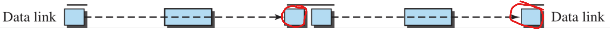

**说完了TCP/IP协议，下面来看一看这个协议中的每一层具体都是干什么的。**

#### 2.2.1 Physical Layer

这是TCP/IP的最底层，但是这层其实还不是最底层的东西，它下面还藏着一层，叫Transmission media。这是为什么呢？我们从上面的图也能看出来，**物理层传递的信息就是bit**，而bit其实还是个人为抽象的东西，它还要在Transmission media继续被拆成电信号，才能真正传递。所以虽然是TCP/IP的最底层，它们之间的通信还是Logical上的通信。**而Transmission media就是连接两个物理层之间的东西**。


#### 2.2.2 Data-link Layer

简单记，**数据链路层就是通过link传递packet**。如今的网络连接非常复杂，所以信息的传递会有很多条道路。之前说过，这个道路其实就是Link，而**路由器的职责就是在这些道路中选择最好的最快的**。而选好了道路后，接下来的传递工作就是数据链路层做的。也就是之前说的hop-to-hop，这样的传递就是帧(frame)传递，就是**将数据打包成一帧一帧**。另外，数据链路层还会有一些其他的功能，比如数据检错和纠错功能，实现方式就是在数据**末尾**打上纠错码。如果给两个hop直接上物理的连接，就很有可能出现错误，所以**数据链路层让这个不可靠的连接变得可靠了**。同时，如果是像1.8.3中的Bus的那种形态，数据链路层还能处理冲突的问题。**总的来说，数据链路层的传递其实和物理层差不多，就是包装了一下而已**。


#### 2.2.3 Network Layer

首先，之前说过网络层的传递是end-to-end。更加详细点儿来说，是**host-to-host**。也就是从一个计算机传递到另一个计算机。那么在这个传递的过程中，可能会经过路由器，所以这些路由器也要包含网络层。而就像上面说的，**路由器的职责就是给每个包选择最好的路线**。网络层的职责就是**完成这种host-to-host的信息传递和根据可能的路径去运输这些packet**。所以网络层中传递的信息就是包(packet)或者数据报(datagram)，而传递的这个路径就叫做Path。

*问题：数据链路层和网络层都提到了路由器的职责，那么这个功能到底是包括在网络层还是包括在数据链路层？或者是这俩其实是不相同的功能，只不过有些类似而已？*


> 这里展示的就是从A到F，中间有三个Link，它们组成的就是一个Path。

网络层非常重要，其中一个原因是它包括了非常有名的协议——IP(Internet Protocol)。在这个协议中，数据被进一步包装成新的格式——**datagram**，也就是packet的进一步包装。IP地址也是在这一层中被创建和使用的，主要目的就是为了将数据从source传递到destination。比如一个路由器A想要把数据传给下一个路由器B，A就要拿到B的IP地址，然后按着地址去传递这个数据。IP其实很多功能都是没有的，比如不能控制流速(flow control)，不能纠错(error control)，不能处理服务冲突。所以如果软件需要这些功能，就只能依靠上面的Transport layer中的协议才行了。

网络层中还有另一种协议，叫做routing protocol。这东西其实还是和之前说的路由器的职责有关。为啥路由器能决定到底那条路线才是最佳的呢？靠的就是这个协议。这个协议能够创建出一个表格叫做**forwarding table**，它能帮助路由器来判断到底那条路线是最好的。routing protocol也分为两种，unicast和multicast，也就是一对一和一对多的两种。另外网络层中还有一些辅助协议，这些协议之后再说。

> **数据链路层和网络层的区别**
>
> * 作用不同：数据链路层实现具体的传输~（仅仅高于物理层而已）而网络层是实现网络功能。
> * 传输单元不同：（明显的不同）网络层是大名鼎鼎的IP包，DL层则是数据FRAME。
> * 协议不同：网络层就是IP协议，数据链路层协议则很多。HDLC和PPP等等。　网络中程序员多数考虑的是网络层。

#### 2.2.4 Transport Layer

首先，这里面有TCP。没错，就是**Transmission Control Protocol**!那既然这东西本身都在这层了，那这层就毫无疑问非常重要了(另外的IP在下面的网络层，所以这俩都挺重要)。到了传输层，思路就显得非常清晰了，其实就是**将数据从source host的应用层拿过来，然后传输层会使用它下面的"工具"来将数据发送到对方的应用层**。这个工具其实就是它下面的层给他提供的service，而由于传送使得双方的传输层也建立了一个Logical Connection。根据下面的定义我们也能看出来，**传输层完成的也是进程和进程之间的通信**。

TCP的作用：在**传输数据之前**，在双方的传输层之间建立一个Logical Connection。TCP中当然包括了之前说的网络层没有的那些东西，比如

* **flow control**: matching the **sending data rate** of the source host with the **receiving data rate** of the destination host to prevent overwhelming the destination.

  别发的那边一个劲儿发，收的那边根本来不及收，到时候直接给对面干崩溃了。

* **error control**: to guarantee that the segments arrive at the destination without error and resending the corrupted ones.

  这里的segment是指：发送方从source host的应用层拿到消息后，会给它包装成一个符合传输层的包，叫做segment或者user datagram(由不同的传输层协议决定，也就是TCP或者后面的UDP)

* **congestion control**: to reduce the loss of segments due to congestion in the network.

除了有TCP，还有另一个协议，叫做**UDP(User Datagram Protocol)**。它和TCP最大的区别，就是它是connectionless的，也就是它**不会**在数据传输之间在双方传输层间建立Logical Connection。它非常简单，传输的时候每一个user datagram都是独立的，比如一个视频，拆成无数小段，每一段都是个独立的user datagram，如果**前一个在传的过程中挂壁了，那我这个也照样传**。如果只有一个两个的这种情况，其实根本不会对视频画质有啥影响，但是多了的话，就会出现卡顿，花屏，音画不同步这些问题。

另外，还有一种新的协议叫**SCTP(Stream Control Transmission Protocol)**，这个之后再说。

#### 2.2.5 Application Layer

我们感知最强的其实就是这一层了。拿B站来举例子，我们手机上的B站其实是个客户端，那么客户端一定是一个**程序**(Program)，也一定是操作系统中的一个**进程**(Process)(Program和Process的区别见操作系统的笔记)。而在B站总部那边也一定有一个相应的程序，叫做服务端。我们从客户端发送请求，然后传递到服务端，服务端收到后把指定的视频拆成一小份一小份再传递回来，这就是我们点击了一个视频后所发生的事情中的一部分。**应用层的职责就是处理进程和进程之间的远距离通信**。

这里面的协议可都是耳熟能详。**HTTP**(Hypertext Transfer Protocol)用来接触互联网(Wide Web, or WWW)、还有收发电子邮件的SMTP(Simple Mail Transfer Protocol)、用来传文件的FTP(File Transfer Protocol)、用来远程连接的TELNET(Terminal Network)和**SSH**(Secure Shell)、用来管理互联网的SNMP(Simple Network Management Protocol)、还有将域名和IP地址映射成数据库以便获取对方网络IP的**DNS系统**(Domain Name System, 注意，DNS不是协议是系统，只不过它经常被其他协议使用)，还有IGMP(Internet Group Management Protocol)等等。

---

以上就是各个层的作用和它们之间的联系。接下来介绍两个在这些层次中穿插的概念，我们不止一次提到了"打包"和"拆包"这样的概念，那么数据究竟是怎么在传输过程中一次次被打包成对应层级的对象，又是怎么被接收方逐步提取出来，最终到达目的地的应用层的呢？靠的就是**Encapsulation**和**Decapsulation**。

先来回顾一下之前的那个例子。


在这个过程中，打包和解包的过程就是这样的。


> 注意：没有展示出交换机，因为交换机不会打包和解包数据。

**先来介绍source一方打包的过程**

1. 在应用层，数据就是原来的数据，这里记作Message，直接往下传就好。
2. 当传输层拿到Message后，因为要处理flow control, error control等东西，所以要在前面加上个东西，叫做**header**，用来管理这些东西。打好的包就像之前说的一样，叫做**segment(TCP)**或者**user datagram(UDP)**。
3. 网络层拿到后，自然是要加上和IP有关的东西了。首先就是source host和destination host的地址，然后还有一些进一步纠错的乱七八糟的东西。总之打完的包就叫做**datagram**，继续往下传。
4. 数据链路层会处理更加细节的东西。既然是hop-to-hop的，那么就自然要往上面添加host或者下一个hop(比如路由器)的数据链路层地址。然后打好的包就叫做**frame**，继续传到物理层。

**然后是路由器的解包和打包过程，因为路由器连了两个设备，所以要先解包再打包。**

1. 从source的物理层传到路由器的物理层，再传到路由器的数据链路层。首先，把这个frame解包，也就是把它添加的东西扒掉就行了，把剩下的发送给网络层。
2. 在网络层中，它会检查在datagram header中的source host和destination host的地址(之前说打包过程中放进去的就是这些)，然后创建forwarding table来选择最佳路线(也就是选择下一个hop，这个表格之前也 说过了)。这层中数据不会有任何增减，除非我发的时候发现太大了，需要裁成小块才行。然后这个datagram通常会原封不动返回给数据链路层。
3. 到了数据链路层，和之前一样，还是打包成frame传递给物理层

**最后是destination的解包过程。**

其实就是打包反过来，一层层扒。只不过**在解包的过程中要进行错误检查**，不然那些纠错码又是干啥用的呢!

**Addressing**

要传数据，就肯定要地址。在每一层之间都有地址，source address和destination address。这里物理层是个例外，因为物理层传的是bit，根本没法往里放地址，而精确的传递由数据链路层来搞定。


在应用层，地址就是名字，比如www.baidu.com或者spreadzhao@163.com等等。而到了传输层，地址就是**端口号**，不同的程序有不同的端口号，这样就能区分是哪个程序发出的请求。在网络层的地址其实就是**ip地址**，每一个设备都有独一无二的地址，根据这个地址就能精准确定是哪一个设备了。在数据链路层的地址有时候也叫做**MAC**地址，这是为了在LAN或者WAN中精准定位这个设备。这些地址之后都会涉及到。

### 2.3 The OSI Model

OSI: Open Systems Interconnection，是一个模型，由International Organization for Standardization(ISO)建立，一共7层。


和TCP对比一下就能看出来，它俩唯一的区别就是：把TCP的应用层拆成3个就变成了OSI层。

# Part 2: Physical Layer

## 3. Introduction to Physical Layer

### 3.1 Data and Signals

2.2.1就说过了，物理层传的是bit，而真实的传递要靠**电磁波**才可以。所以我们先来看一下这个传的东西到底是什么。

#### 3.1.1 Analog and Digital Data

* **Analog data**: 比如我们的声波，还有实数，这些都是**连续**的数据。所以我们要用**模拟**的方式去将这些数据变成电磁波，也就是连续的波形。
* Digital data: 比如人为规定的离散的数据，比如电脑里随便存的一个文件、游戏等。这些都是0和1组成的离散数据，所以用离散的波形就能传递。

#### 3.1.2 Analog and Digital Signals

数据还是没法传的，但是信号却可以传。所以**我们可以用这两种信号来传这两种数据**。


### 3.2 Periodic Analog Signals

#### 3.2.1 Sine Wave


* peak amplitude(A): 波峰
* frequency: 频率，$f = \frac{1}{T}$。
* phase: 相位，初始的value。

#### 3.2.2 f and T

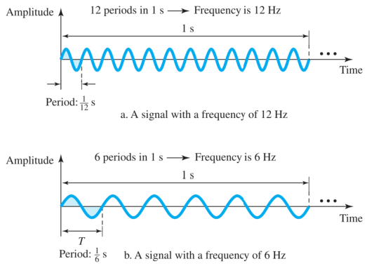

**==频率就是1秒钟扑腾的次数。==**

**常用的频率和周期单位：**


接下来我们玩点儿极限的：如果频率变成0会咋样？也就是周期无穷大，那么这个波就是从头到尾永远是一个值。那我们就称这个为**直流信号**。它在数据传递的时候鸟用没有。如果频率是无穷大的话，周期就是0，也就代表它只要一瞬间就有很大的变化。

#### 3.2.3 Phase


#### 3.2.4 Wavelength

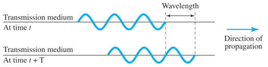

这里波长用$\lambda$来表示。很显然，波速是c，周期是T，那么：
$$
\lambda=cT=\frac{c}{f}
$$

#### 3.2.5 Time and Frequency Domains

之前画的波形都是**时域(time-domain)**的。比如下面一个时域的正弦波形：


但是这个时候如果再加上一个波形，看着就会很混乱。而一个牛人傅里叶就搞定了这个东西，引入了**频域(frequency-domain)**图。看下面的图就能看出来，它不关心取值随时间的变化，而只关心它的**峰值是多少，频率是多少**。


那么这个图要是想加一个波就很简单了：只需要知道它的频率和峰值，画根线就搞定，而且只要频率不相等，就不会有重叠，看着清爽舒服。

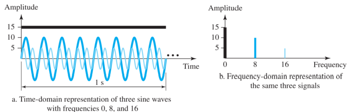

#### 3.2.6 Composite Signals

如果我们只传正弦波的话，收到的就是"哔"一声，所以我们必须要用很复杂的波形才能传递连续的信息。那么怎么传复杂的波？还是靠傅里叶。按他老人家说，有两条结论：

* 任何复杂的波形其实都是简单的正弦波的组合。只不过这些正弦波的频率，峰值和相位不一样罢了。

* 如果复杂的波形是周期性的，那么组成它的正弦波的**频率是离散**的；如果不是周期的，那么分解后的各位的**频率就是连续**的。

  > ***这里的离散和连续指的是==频率==而不是分解完的波本身！<u>波就是正弦波</u>。***

比如，下面是一个复杂的周期波形，它的频率是f：


那么我们可以将它分解，分解的结果如下：

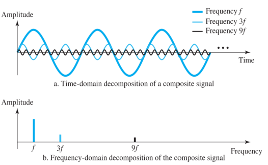

**我们能看到，组成这个复杂波的正弦波的频率就三种，所以是离散的**。

另外，如果是一个非周期的复杂波的话：


**那么组成它的正弦波的频率就是连续的，有无数个频率**。

#### 3.2.7 Bandwidth

**带宽：复合信号的最高频率和最低频率的差值。**


### 3.3 Digital Signals

变化是离散的，就是**数字信号**。


a图中有2个电平，能表示1bit；b图中有4个电平，能表示2个比特。以此类推，如果要表示3个bit的话，就需要有2^3^ = 8个不同的状态。**表示n个bit的话，就需要2^n^个level**。

#### 3.3.1 Bit Rate

**bit rate: bits per seconds**(**bps**)。也就是每秒钟发送多少个bit。

假设一个字有1byte，也就是8bit，一行有80个字，一页有24行。如果我们要求速度是一秒钟100页的话，我们的bit rate就要达到：
$$
100 \times 24 \times 80 \times 8 = 1536000\ bps = 1.536\ Mbps
$$

#### 3.3.2 Bit Length

位长对应的其实是analog signal中的波长。
$$
位长 = 波速 \times 位持续时间
$$
位持续时间就是横轴上1跨了多少，0跨了多少的那个时间。

#### 3.3.3 Digital Signal as a Composite Analog Signal

**数字信号其实就是复杂的模拟信号**。那么我们来讨论一下怎么去分解。首先是它的频率。数字信号包括横着不动的线和竖着的线。在3.2.3中也说过，竖着的表示一下就变过去了，那么频率就是无穷大；横着的表示一直不变，频率就是0。那么**数字信号的频率一定是有无穷多个的，带宽也一定是无穷大**。

数字信号也分为周期和非周期，那么按照3.2.6所说也能分为连续的频率和离散的频率。


#### 3.3.4 Transmission of Digital Signals

##### 3.3.4.1 Baseband Transmission

对于上面的这个频域图，我们人需要的其实只是前半部分，靠近0的，峰值高的部分。


怎么掐掉后面那一咕噜呢？用的就是**low-pass channel**。字面意思，只允许低频的信号通过，并且**一定要是从0开始才行**。这样的传输就叫做**基带传输**。下面是两种带宽的low-pass channel。


那么有没有可能有一种low-pass channel，它最高支持的频率是无穷大？现实生活中没有，但是我们在努力往上整。

low-pass channel的带宽会影响什么呢？就是bit rate。频率其实就是变化的幅度，那么频率越高的话，变化的就越快，那么**相同时间内状态就会越多**。因此也能传更多的bit，bit rate更高。

经过实验可以知道，我们真正在传数字信号的时候，其实一定是有亏损的，那么我们要尽可能去做到**保留好数字信号的波形**。起码你传过去后得能认得出是个数字信号吧！如果整的跟狗啃的似的那就白扯了。又经过实验可以知道，**只有非常宽的带宽，或者无限宽的带宽的low-pass channel才能完整保留数字信号的波形。**

那么我们怎么能尽可能保留呢？首先来看一下bit rate。如果一个**channel的带宽是B**，bit rate是N，那么经过数学计算能得到：
$$
B_{min}=\frac{N}{2}\ or \ N=2B_{min}
$$
**这里说的带宽是channel的带宽而不是信号的带宽，指的是容量而不是实际含量，在3.6.2中有更详细的说明。**

我们大概蒙一下：如果我们传的信号是`010101...`或者`101010...`这种一直在变化的，那么我们先画一下它的波形：


那么我们就能计算出来它在一个周期内能传2个bit，那么bit rate $N=\frac{2}{T}$。因此能计算出频率
$$
f=\frac{1}{T}=\frac{N}{2}
$$
另外更重要的一点是，我们以上讨论的是**周期最短的情况**。可以想象一下：只要序列不是这样的，周期一定会比这个长。因此它的频率一定会比$\frac{N}{2}$要小。所以这个就是最大的频率了。**而最小的频率，因为是基带传输，所以一定是0**。那么带宽自然就是$\frac{N}{2}$了。

因此我们能得出结论：**要想比较好得保存数字信号的波形，带宽最小也得是$\frac{N}{2}$才行。**

那么我们先来看一看，$\frac{N}{2}$到底能保存成个啥样子。还是上面那个波，如果用$\frac{N}{2}$的波来模拟，是这样：


可见，确实形状挺像。但是你要说很像还远远谈不上。所以我们看看带宽变大是个啥样子：

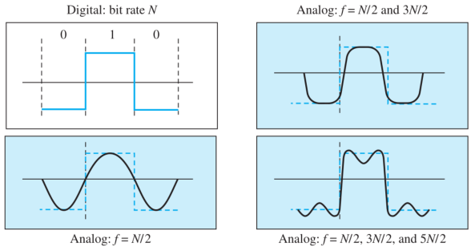

很明显更加像这个方波了。因此我们的带宽越大，保存效果就越好。另外需要注意的是，这里是带宽而不是频率，*带宽其实是隐含有多个频率，但又不是多个频率的和的一个概念*。所以这里的图才是三个频率、两个频率在一起，而不是分开的。

另外我们还能映照之前的结论：**带宽越宽，bit rate越高**。下面是常见的带宽需求：


带宽的单位是Hz，而bit rate的单位是bps。因此我们能近似认为：**带宽和bit rate是等价的。带宽越宽，网速越快！！！**

##### 3.3.4.2 Broadband Transmission

和之前相对的，起始频率不是0，就是带通信号了。首先，**因为频率中不含有0，一定不是数字信号**。因为数字信号中一定有不变的，频率为0的段。

那么问题就来了：我这个通道既然都不支持数字信号，那咋传数字信号？别忘了我们3.3.4就是在讲怎么传数字信号！解决方法是：将数字信号先变成模拟信号来传。怎么变？靠的就是大名鼎鼎的**调制解调器(modem)**。详细的讲解在后面。


### 3.4 Transmission Impairment

#### 3.4.1 Attenuation


因为电子的布朗运动或者啥啥的原因，波会向外发散，整体会变小。因此我们使用**放大器**可以变回来。

信号衰减了多少，我们可以用**分贝**计算出来。分贝的本质就是信号的相对强度，可以是两个信号比较，也可以是一个信号在两个位置的比较。

如果一个信号的功率下降了一半，那么这个过程中衰减的能量：
$$
10log_{10}\frac{P_2}{P_1}=10log_{10}\frac{0.5P_1}{P_1}=-3\ dB
$$
如果一个信号的功率提升了10倍，那么这个过程中增加的能量：
$$
10log_{10}\frac{P_2}{P_1}=10log_{10}\frac{10P_1}{P_1}=10\ dB
$$
有了分贝的概念，我们用加减法就能描述信号的衰减和放大了：


#### 3.4.2 Distortion

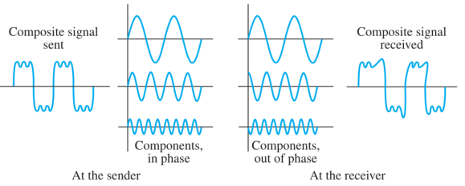

失真就是因为收发**双方相位不一致**导致接收的波形发生扭曲。我们用**均衡器**能修正这种错误。

#### 3.4.3 Noise

噪声分为白噪声和冲激噪声。白噪声对信号不会产生影响，但是冲激噪声会。


为了研究这种噪声，产生了一种概念：**Signal-to-Noise Ratio(SNR)**。也就是信号强度和噪声强度的比值(**这里的强度可以是功率也可以是电压**)。为了方便计算，这里也引入了分贝。

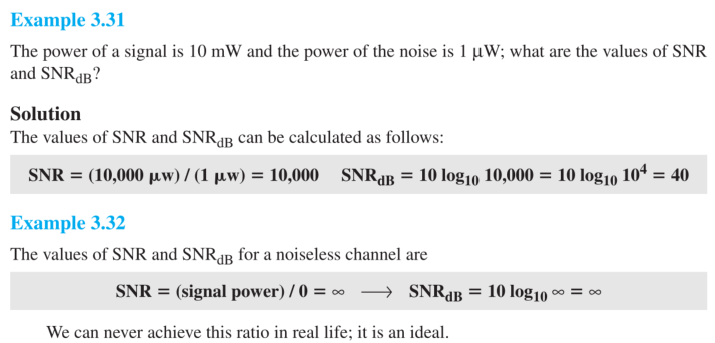

由SNR的定义也能看出来：SNR越大，证明信号越厉害，那么想**解调**出来也越容易；SNR越小，则噪声越厉害，想**解调**出来就难了。

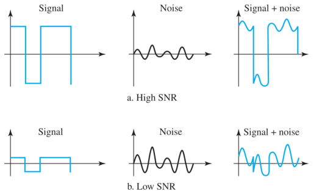

### 3.5 Data Rate Limits

根据上面所讲，我们能知道bit rate受下面的因素影响：

* **Bandwidth**：带宽越大，频率越高，变化越快，相同时间内能传的数就越多。
* **Level of signals**：3.3一开始就提到了，电平数越多，能表示的bit就越多。
* **Quality of channel**：通道质量越好，当然传的也快，还要看降噪能力。

#### 3.5.1 Nyquist Bit Rate

如果是**无噪声的通道**，那么根据Nyquist定律可以得出**最大的bit rate**：
$$
N_{max}=2 \times B \times log_2L
$$
其中N是bit rate，B是带宽，L是电平个数。你可能会问：*之前在3.3.4.1中不是推出来$B \geq \frac{N}{2}$吗？为什么这里又多乘了一个$log_2L$？*这是因为，**上面那个只是电平个数为2的特殊情况**，把L=2带进去就行了。

另外，我们不禁会想到：既然L越大N就越大，那我一个劲儿加电平个数，网速不就能呼呼涨了吗？当然没你想得那么美。因为**电平个数的增加会影响信号的质量，让SNR变小，从而更加脆弱**。

#### 3.5.2 Shannon Capacity

显然，无噪声的通道根本不存在。所以我们的**香农定理**更加重要。Shannon capacity也是bit rate，一个在有噪声环境下的通道的最大的bit rate。
$$
Capacity_{max} = bandwidth \times log_2(1+SNR)
$$
这里并没有电平个数。表明不管你有多少电平数，都不可能比Capacity~max~更大了。

如果有一个极其垃圾的通道，它的SNR是0，表示信号在这里几乎被噪声完全碾压了，它的容量就是这样的：
$$
C=Blog_2(1+SNR)=Blog_2(1+0)=0
$$
代表这个通道啥也传不了，**不管你带宽有多宽都不好使**。

### 3.6 Performance

网络怎么才叫快？来介绍几个术语。

#### 3.6.1 Bandwidth

之前就已经提过了，带宽就是最大的频率和最小的频率之差，是由赫兹来表示的。另外，也介绍了带宽和比特率的关系。带宽越宽，比特率通常也会更高。**这也就是我们说的谁谁家里是1000M带宽的由来**。

#### 3.6.2 Throughput

带宽越宽，网速越快。但是有时候我们家里明明是千兆甚至万兆带宽，有时候网也会卡的要死。这是为什么呢？其实带宽根本不是衡量**实时**网速的东西。我们的吞吐量才能衡量真实情况下网络的速度。

比如一个10Mbps的带宽，每分钟能传12000帧，每帧平均有10000bit。那么这个网的吞吐量是多少？
$$
Throughput=(12000 \times 10000)/60 = 2\ Mbps
$$

#### 3.6.3 Latency(Delay)

比如直播的时候，从真正的主播那儿开始，到观众收到直播，中间肯定会有延迟。而这个延迟其实是由4部分组成的。

* **Propagation time**

传播时间，就是一个bit从起点到终点经过的时间。
$$
Propagation\ time=\frac{Distance(m)}{Propagation\ Speed(m/s)}
$$
通常速度是小于真空中光速3 * 10^8^ m/s。

* **Transmission time**

比如第一个bit，它到达目的地后，所用的时间就是上面的Propagation time。但是，这时候信息传完了吗？显然没有！后面还有一串等着呢。所以等最后一个bit到达之后才算结束。那么我们想想，在第一个bit到达目的地时开始计时，在最后一个bit到达目的地后结束计时。这一段时间就是整个消息流过的时间，也就是Transmission time。很显然，计算这个就看**整个消息有多少bit**和我**每秒能传多少bit**，然后再一除。
$$
Transmission\ time = \frac{Message\ size}{Bit\ Rate} = \frac{Message\ size(bit)}{Bandwidth(bit/s)}
$$

* **Queuing time**

比如传到一些交换机或者路由器结点了，同时有好多人一下进来。这个时候肯定要排好队一个一个出，所以有些信息需要排一会儿队。这个时间就叫Queuing time。

* **Processing delay**

还是传到中间结点那儿，就算只有你一个，你也不能马上就走，也要经过一些处理。这部分时间就是Processing delay。

最后，整个的延时就是这几部分的和：
$$
Latency=propagation\ time+transmission\ time+queuing\ time+processing\ delay
$$

#### 3.6.4 Bandwidth-Delay Product

将带宽和时延结合起来才是数据通信中比较重要的概念。带宽是表示一秒能传多少个bit，而时延表示的是我这个管子在传数据的时候的大概的时间。因此**将它俩乘起来就表示我们的这个管子最大能装多少bit**。

*这里我们将中间的交换机、路由器之类的都抽象成了这个管子的一部分。*


## 4. Digital Transmission

### 4.1 Digital-to-Digital Conversion

之前说了，数据和信号都可以是模拟的或者数字的。现在就来说说怎么用数字信号去发送数字数据。

#### 4.1.1 Line Coding

既然要用信号表示数据肯定要从小入手。首先看它们最小的元素：**signal element**和**data element**。它们分别表示信号和数据最小能表示的东西。而**我们用数据和信号的比值r来表示信号承载数据的能力**。通常，data element指的就是1bit。


然后要衡量传的有多快，我们之前也介绍过，就是bit rate。显然，**bit rate是用来衡量data传的速度的**；而如何去衡量signal传的速度(**signal rate**)呢？用的就是**pulse rate**(也可以叫**modulation rate**或者**baud rate**)。

如果信息要想传的快，归根结底就是**用更少量的信号去传递更多的数据**，这样我们才能最高效地传输。之前说过$\frac{data\ element}{signal\ element}=r$，也就是一个信号能承载r个数据。那么**假设在$t$时间内传输了$x$个信号，我们就能知道，这x个信号承载了$xr$个数据**。我们分别计算一下数据和信号的速度：
$$
data\ rate=\frac{xr}{t},\ signal\ rate=\frac{x}{t}
$$
因此，我们令$data\ rate=N,\ signal\ rate=S$，会发现N和S有如下关系：
$$
\frac{N}{S}=r
$$
我们发现，影响它们的因素似乎只有r，也就是一个信号承载几个数据。但是事实却不是如此，在3.3.4.1中就说过，带宽会影响bit rate，而这里并没有和带宽、频率等有关的变量。因此我们这个等式只是一个特殊情况。实际上，平均下来，signal rate和data rate的关系是这样的：
$$
S=c \times N \times \frac{1}{r}\ \ \ \ or\ \ \ \ S=\frac{cN}{r}
$$
其中c是case factor，会根据情况改变。通常取值为$[\frac{1}{2},\ 1]$。==**这个公式背下来！**==

带宽实际上就是频率，而频率就是信号的改变。那么信号的改变和signal rate之间有没有什么关系呢？经过实验可以得到，**最小的带宽就是signal rate**。因此我们把这个发现带入上式，可以得到：
$$
B_{min}=c \times N \times \frac{1}{r}
$$
所以实际上，我们使用的网线、家用宽带的带宽可以是大于等于B~min~的任意一个值。而一旦我们选定了一套配置，这个带宽也就定下来了。这个时候，r和c就会影响N，也就是bit rate的大小。

现在回想一下之前说的电平。3.3.1的时候我们说，如果有两个电平，那么我们**每个电平**能表示1个bit；如果有L个电平，每个电平能表示$log_2L$个bit。将这个结论结合上我们上面的式子，我们能发现：好像这玩意儿就是在说我们式子里的r啊！因为r就是一个信号能携带几个bit。那么我们取一般的情况，也就是1个bit就是一个data element。**那么每个电平能表示$log_2L$个bit，就代表一个信号能携带$log_2L$个data element**：
$$
r=log_2L
$$
我们将这个结果带回到上式，能惊讶地发现：
$$
N=\frac{1}{c} \times B \times log_2L
$$
这与我们3.5.1的Nyquist Bit Rate一模一样。因此我们不难发现，其实本式就是Nyquist的一般形式：
$$
N_{max}=\frac{1}{c} \times B \times r
$$
**基线、基线偏移、直流分量和自同步**

> **Baseline Wandering**
> In decoding a digital signal, the receiver calculates a running average of the received signal power. This average is called the **baseline**. The incoming signal power is evaluated against this baseline to determine the value of the data element. **A long string of 0s or 1s can cause a drift in the baseline (baseline wandering) and make it difficult for the receiver to decode correctly**. A good line coding scheme needs to prevent baseline wandering.
> **DC Components**
> When the voltage level in a digital signal is constant for a while, the spectrum creates **very low frequencies** (results of Fourier analysis). These frequencies around zero, called **DC (direct-current) components**, present problems for a system that cannot pass low frequencies or a system that uses electrical coupling (via a transformer). We can say that DC component means 0/1 parity that can cause base-line wondering. For example, a telephone line cannot pass frequencies below 200 Hz. Also a long-distance link may use one or more transformers to isolate different parts of the line electrically. For these systems, we need a scheme with no DC component.
> **Self-synchronization(把时钟绑在信号上)**
> To correctly interpret the signals received from the sender, **the receiver’s bit intervals must correspond exactly to the sender’s bit intervals**. If the receiver clock is faster or slower, the bit intervals are not matched and the receiver might misinterpret the signals. Figure 4.3 shows a situation in which the receiver has a shorter bit duration. The sender sends 10110001, while the receiver receives 110111000011.
> A **self-synchronizing** digital signal includes timing information in the data being transmitted. This can be achieved if there are transitions in the signal that alert the receiver to the beginning, middle, or end of the pulse. If the receiver’s clock is out of synchronization, these points can reset the clock.
>
> 

#### 4.1.2 Line Coding Schemes

现在就是要讲到底我怎么给电平赋予意义，让啥是1，啥是0？下图是总体的策略：

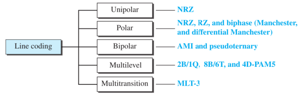

##### 4.1.2.1 Unipolar Scheme

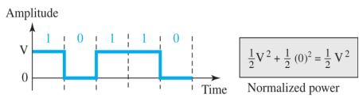

这种方式功率非常高，所以现在几乎不用了。

##### 4.1.2.2 Polar Schemes


在上图中，r=1，带入4.1.1中的式子：$S=c \times N \times \frac{1}{r}$，能计算出S~ave~ = N / 2。

首先来看上面的NRZ-L(Non-Return-to-Zero-**Level**)，这表示这种电平不会回到0电平。低的表示1，高的表示0。这种方式在01交替的时候挺好用，但是如果出现连续的0和1，会产生没有同步信号的情况，如果长时间没有改变的话，会有时钟和信号对不齐的情况。

然后是下面的NRZ-I(Non-Return-to-Zero-**Invert**)，首先不管第一个是啥，都编上0。走到第一个时钟的时候，开始看这个信号是否发生变化：如果变了，下一个bit就是1；如果没变就是0。这种方式，如果是很多个1的话，这个码就会一直变来变去，时钟也很好同步；而如果是长连0的话，其实和NRZ-L的问题一样。

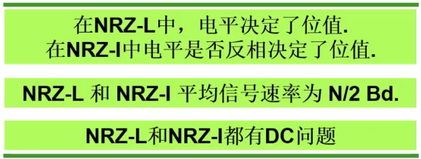

例：使用NRZ-I传输10 Mbps的数据，问平均信号速率和最小带宽是多少?

还是带到$S=c \times N \times \frac{1}{r}$中，c取$\frac{1}{2}$，r取1，能算出来平均信号速率是$\frac{N}{2}$，也就是$\frac{10^7}{2}\ baud = 5\ Mbaud$，而最小的带宽其实就是平均信号速率(见前文)，所以B~min~ = S = 5 MHz。

*问题：书上给的是500 kbaud和500 kHz，我强烈怀疑书上错了？*

---

为了解决上面的时钟同步问题，我们发明了一种归零码(**Return-to-Zero, RZ**)：


可以看到：不管是0还是1，在每一个信号最后都要回到0。**如果从负电平回到0就是0；如果从正电平回到0就是1**。使用了这种编码方式后，我们能发现采用了3个电平。相比较于两个电平，它的抗噪声能力就会变弱，也就是**SNR会变小**(在3.5.1中也提到过)。我们好像从来没提到过为什么会这样，现在来解释一下。其实就是因为噪声会影响信号原来的波形。**电平越少，那么原来的波形就更简单**。这样即使你使劲儿霍霍对它造成的扭曲也是比较小的；而如果电平数很多的话，波形肯定会更加精细，这样在受到破坏的时候就很难知道它原来是什么样子了。

使用抗噪能力变弱换来的好处就是**自同步**功能。在每一个信号处，不管是1还是0都会发生跳变，也就能给时钟传达信息，也就能更好地和时钟贴合。

再来看一下RZ之中的参数。首先是r，因为每个data element要用两个信号去表示，所以r = $\frac{1}{2}$。然后带入式子$S_{ave}=B_{min}=c \times N \times \frac{1}{r}$，算出数据率平均信号速率S = N。通过对比我们也能发现，为了增加时钟同步的功能，我们把带宽也提高了一倍。

---

然后是双相码(biphase)，也叫Manchester编码。它分为差分(**Differential Manchester**)和不差分(**Manchester**)的。


首先看不差分的Manchester编码。很容易就能发现，从高电平跳到低电平是0；反之就是1。这种编码结合了NRZ-L和RZ的思想。而如果我们把NRZ-I和RZ结合一下，就得到了下面的Differential Manchester。走到第一个时钟的末尾的时候开始看：**此时此刻**有没有发生突变。如果变了，下一位就是0；如果没变，下一位就是1。注意这和NRZ-I的规则是正好相反的。在NRZ-I中，如果没变下一位才是0。那么第一个比特是什么怎么看呢？就看最开始有没有跳变。上图中有，所以是0。**不管是差分还是不差分，在每个信号的中间都一定要发生一次跳变。**

这种编码也是1个bit用两个信号来表示，所以$r=\frac{1}{2}$，因此它的平均信号速率和最小带宽都是N。**而它相比较于RZ的好处就是只使用了2个电平，所以SNR会比它更加高**。

##### 4.1.2.3 Bipolar Schemes

相比较于Polar，就是使用了3个电平：正，负，零。

首先来看AMI和Pseudoternary，它们互为相反的关系。

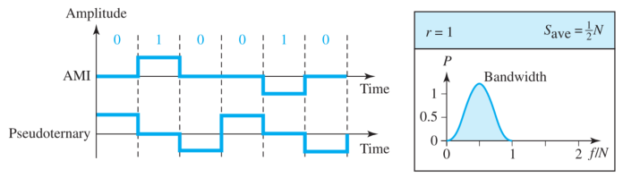

对于AMI，如果是长连1的话，会产生正负正负的交替。这样就也能产生时钟；另外如果是长连0的话，因为它的**峰值**也是0，所以也不会有直流分量。因此AMI没有DC component。而且长连0的问题可以用后面的**扰码**来修复。Pseudoternary的正好相反。

这两个波的S~ave~和B~min~都是$\frac{1}{2}$，这样也减小了带宽，对比RZ能看到很多优点。

---

在介绍多电平编码之前，回想一下之前说的r < 1的情况：r表示一个信号元素能携带几个数据元素(bit)。而如果r < 1的话，就是说多个信号元素只能携带1个bit。也就是下面的情况。


而我们似乎很少讨论诸如：3个信号元素携带4个bit的情况。


现在就讨论讨论这种多个信号合在一起去表示多个数据bit合在一起的情况。假设我们有m个bit，那么很容易就能算出有$2^m$种组合。

那么如果我们有L个电平的话，在每一个**数据组合的笼罩**下，我们能组出多少种信号的组合呢？那要看我们能**把这个笼罩切成多少段**。那么这个段数是什么？其实就是**信号元素的个数**。

> 如果我们现在有2个电平，每个笼罩切成1段，那么很显然就只有2种组合：
>
> 
>
> * **这一段要么是0，要么是1。**
>
> 如果有3个电平，每个笼罩切成2段。那么我们给三个电平编号成0, 1, 2，写入到这2段中，能发现这些组合：
>
> ```c
> 0 0
> 0 1
> 0 2
> 1 0
> 1 1
> 1 2
> 2 0
> 2 1
> 2 2	//共9种
> ```
>
> 也就是说，每一段都是个空。**每个空里既可以填0，也可以填1，还可以填2**。那要是我们有n个空，能填的数有L个，那么总共的组合很显然就是n个L相乘：$L^n$。
>
> 将上述结论带到电平中就能发现：有L个电平，每个笼罩切成n段，这总共的组合就有$L^n$种。

现在问题就变成了：**用L^n^个信号组合去表示2^m^个bit的组合。**给定了L, n, m，就能写出一个多电平的编码方式。因此我们将这种方式称为**mBnL**。其中B表示二进制，L如果是2，3，4则分别应替换成B，T，Q。

首先来看一个例子，**2B1Q**。很显然，m = 2, n = 1, L = 4。因此它的**数据组合**一共有2^2^ = 4种。信号的组合一共有4^1^ = 4种。我们发现它俩正好相等，所以**一个数据组合就只能用一个信号组合来表示了**。


然后是8B6T，举一反三即可。

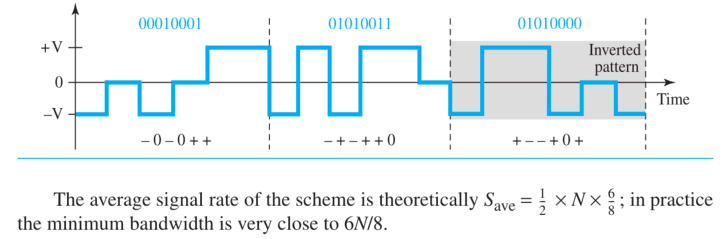

* **书印错了，最小带宽是$\frac{3}{8}N$**

#### 4.1.3 Block Coding

之前说过，有长连0的情况对于很多编码都会有影响。因此我们要一些技术来避免这种情况。其中一种就是**分组编码**。现在如果有m个bit，其中有长连0。那么我们通过一些手段，把它变成n个bit，使得**这n个bit中不出现很长的0序列**，就能更好地同步时钟了。


**这种方式我们也叫做mB/nB的方式(n > m)**。

比如4B/5B这种，就是先把原序列拆成4个一组，然后每一组都用一个5个bit的新组来替代，最后把这些新组拼到一起。使用了这种方式后，使用NRZ-I传输的情况就变成这样了：

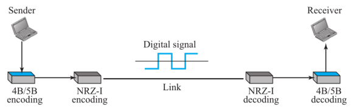

其中最重要的一个步骤：替代，到底是怎么替代的呢？肯定是有一种特定的映射规则。


通过表中我们能发现：在替代过之后的新序列中，**最多只会出现3个连着的0**(2个拼一起)。

> 但是这么操作的代价是什么呢？假设我们原来的数据率是$N_1=\frac{x(bit)}{t_1(s)}$，那么如今我们多加的bit数是$\frac{x}{4}$，所以使用的时间会提升为$t_2=\frac{\frac{5}{4}x}{N_1}$。因此我们要是想和原来花费一样的时间，就只能提高数据率，提升为：
> $$
> N_2=\frac{\frac{5}{4}x}{t_1}=\frac{5}{4}N_1
> $$
> 而将N1和N2分别带入到$S_{ave}=\frac{cN}{r}$中能得到：
> $$
> S_2=\frac{5}{4}S_1
> $$
> 所以我们的平均信号速率和最小带宽也因此提升了**原来**的25%。

接下来说一说这个表是咋来的。其实替代的n个bit我们是可以选择的。比如在4B/5B中，原来的码有2^4^ = 16种组合，而我们替代完之后有2^5^ = 32种可选。所以我们只需要**在32种组合种选出16种不会有长连0的情况**就可以了。

例：我们要的速度是1-Mbps，那么如果使用**4B/5B + NRZ-I**或者**Manchester**，最小带宽？

首先明确NRZ-I和Manchester的S~ave~：

* S~ave~(NRZ-I) = N/2
* S~ave~(Manchester) = N

然后就很简单了，你是先提升25%后再算；还是先算完再提升25%都行。

* $B_{min}(NRZ-I + 4B/5B)=\frac{5}{4} \times \frac{N}{2}=\frac{5}{4} \times \frac{1\ Mbps}{2}=625\ kHz$
* $B_{min}(Manchester)=N=1\ MHz$

然后谈一谈选择问题：其实**4B/5B + NRZ-I**是完全碾压**Manchester**的。因为前者的带宽小，而且也没有直流分量问题。前面我们说过，单独的NRZ-I有直流分量问题，是因为它在**长连0的时候容易出现非0电平的水平线**，这种线就会产生直流分量问题。而4B/5B这种技术基本消除了长连0的情况，所以它的直流分量是微乎其微的。

---

然后顺带说一下光纤中常用的8B/10B码：


#### 4.1.4 Scrambling

先来复习一下AMI码：


可以看到，它在长连0的时候一直不动，所以我们要让它动，就是靠**扰码**。

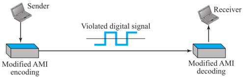

扰码分为**B8ZS**和**HDB3**。

首先来看一下B8ZS。第二个8表示我们要处理的是8个连着的0，既然是这样，那么原来的码一定是这样的：

```
1 | 0 0 0 0 0 0 0 0 | 1
```

那么它的波形一定是这样的：

|

注意AMI的波形规则：如果有波澜(出现1)，必须是“正反正反”的规则。也就是**距离最近的两个1的波形必定相反**。那么我们就能知道在这8个0前面的1要么是向上，要么是向下。

接下来介绍8BZS的替换方式：**将8个0替换成`0 0 0 VB0VB`**。其中，V表示**Violation**，即违反AMI的规则；B表示**Bipolar**，即顺从AMI的规则。所以以上的两种波形会被替换成如下的波形：


---

8BZS有一个很明显的问题：7连0咋办？7个0也不短了，所以我们还得有别的招儿才行。

HDB3就是另一种方法。直接看结果：

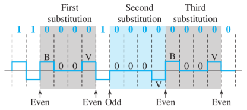

从码头开始数：遇到`0000`就开始替换。首先看从头到第一个`0000`处有多少个1(凸起)：

* **如果是奇数个，就把这个位置替换成`000V`**
* **如果是偶数个，就把这个位置替换成`B00V`**

然后再接着数，到下一个`0000`的时候，**看我上一次替换的`0000`到这里之间的1**(凸起)，还是使用上面的规则，一直到末尾为止。

为什么要这么做呢？我们来讨论一下：B和V的出现其实就是为了让系统能检测出来我的替换。我检测到这里是凸起，按照AMI的规则本来应该识别为1，但是因为我加了这些替换，导致我最终认为这是0而不是1。那么我这么认为的底气是什么？就是靠**总共的凸起的个数**。我们分析一下上面的规则就能发现：这么做之后不管怎么替换，**最后的凸起总数总会是偶数个**。偶数就是问题的关键。因为AMI的编码中规定每2个相邻的凸起必须相反，所以我们只要检测了偶数个码，就能够发现其中的蹊跷。

### 4.2 Analog-to-Digital Conversion

在4.1中，我们看到了将数字数据(也就是0和1)转换成数字信号，以便存储和发送。而我们的数据通常还有很多模拟数据，比如视频和音频。所以我们还要知道**怎么把模拟的信号$\longrightarrow$数字信号**。

#### 4.2.1 Pulse Code Modulation

传感器可以把模拟的数据变成模拟的信号。比如我们对着麦克风说话，我们的声波就会被其中的声音传感器转换成电磁信号，这就是一种模拟信号。而这种信号是连续的，我们很难用0和1去表示它。所以我们要将这个模拟的信号转变成数字信号。


我们看到，模拟信号进入PCM编码器后，出来的就是数字信号了。而PCM编码器中有这三个部分：

* Sampling: 采样，将模拟信号变成PAM信号。其实就是取离散的时间，**将原波形在横轴上变离散，而纵轴还是保持连续的**。所以**PAM信号也是模拟信号**。如果采样的手段符合**Nyquist采样定理**，可以做到无损采样，也就是完全可以相互转换，不会有任何损失。
* Quantizing: 量化，将纵轴也变成离散的。这样操作之后，所有的幅度就会被近似值取到最近的网格对应的值上。因此这种操作会对信号造成无法复原的硬伤，也一定会有损失。
* Encoding: 我们把量化后的表格放倒，用n个bit去表示每一个柱子的高度，最终就能得到整个文件的二进制形式了。其实8bit音乐就是使用了这样的技术。

> 对于采样的速率，我们有这样的要求。比如我们要对一段语音进行采样，已知这段语音的**最高频率**为4000 Hz，那么我们**采样的速率就要是它的2倍**，也就是每秒8000个样本。而如果给的是带宽的话，就要参考下图了：
>
> 

然后是量化和编码的例子：


我们能看到在这个例子中，我们画了8个格子。对于每个幅度，看它落在哪个格子里，然后给每个格子编上码就可以了。因为有8个格子，所以我们用3个bit正好能表示2^3^ = 8种状态。

我们能发现：画的格子越多，我们的误差就越小。而我们之前说过，信号的损失(**由于噪声，不是量化**)是可以用SNR来衡量的。而经过实验可以证明：**画的格子越多，SNR~dB~就越大，抗噪能力就越强**。而**我们画的格子越多，其实就是我们使用的编码的bit越多**。所以如果bit数是n~b~，我们能用数学证明：
$$
SNR_{dB}=6.02n_b+1.76\ dB
$$

> 比如我们想要让一个电话线路的抗噪能力高于40，那么我们采用的位数是多少？
> $$
> SNR_{dB}=6.02n_b+1.76\ dB=40\ \longrightarrow n=6.35
> $$
> 所以一般采用7或者8个bit。

还有一种情况：比如我们说话的时候，可以很小声。而这么小的声音，在量化的时候很可能被取成0，导致啥也听不到。所以我们又提出了**均匀量化**和**非均匀量化**的概念：


比如对数函数：在数值小的时候斜率高，在数值大的时候斜率低。这样就能做到**放大小信号，压缩大信号**，提升收音的整体质量。

最后，我们来说一下采样后的结果的bit rate。我们将模拟信号转换成了数字信号，而数字信号就是在传输bit，那么这个信号的bit rate是多少呢？很显然，这和我们量化的手段有关。我们采用了多少个bit去编码呢？bit越多，声音就越精细，那么相同时间内传输的信息就越多，bit rate就越高。

**如果我们采用了n~b~个bit去编码，那么编出来的波形的bit rate就是这样的：**
$$
Bit\ rate=Nyquist\ rate \times n_b
$$
其中的Nyquist rate就是上文提到的**采样速率**。比如我们要数字化人的语音，使用8bit编码，那么比特率就是这样计算的(人的语音通常包含0-4000 Hz)：
$$
Nyquist\ rate=2 \times f_{max}=2 \times 4000 = 8000\ (samples/s)\\
Bit\ rate=Nyquist\ rate \times n_b=8000 \times 8=64\ kbps
$$
**有了代换后的数据率，或许我们可以计算一下带宽的要求了**。算完的带宽我们假设是B~min~，那么有：
$$
B_{min}=S_{avg}=\frac{cN}{r}=\frac{c}{r} \times Nyquist\ rate \times n_b=\frac{c}{r} \times 2 \times f_{max} \times n_b
$$
而我们的f~max~如果是**在最低频率为0**的情况下，就是带宽。但是要注意这个带宽是**未采样时的带宽**，也就是**模拟信号的带宽**，记为B~ana~。这样再带入上式：
$$
B_{min}=\frac{c}{r} \times 2 \times B_{ana} \times n_b
$$
我们取c = 1/2，r = 1，可以得到如下结论：
$$
B_{min}=n_b \times B_{ana}
$$
因此我们可以说，**为了将人声的模拟信号变成数字信号存到计算机里，我们需要的带宽变成原来的n~b~倍**。

---

接下来看一下，我们怎么把PCM编成的数字信号恢复为模拟信号。

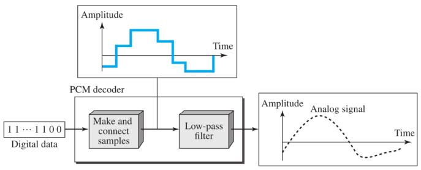

### 4.3 Transmission Modes

信号传输的过程，可以分为**并行**和**串行**。而串行又分为同步、异步、等时。

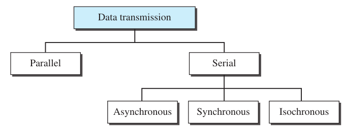

#### 4.3.1 Parallel Transmission

bit在计算机里虽然是最小的单位，但是我们几乎不研究它。我们考虑的一般都是字节和往上的单位。而传输的时候，通常也是按字节来传的。比如8个bit是1个byte，我们就把这8个一起传出去，那么自然就需要8根线了。

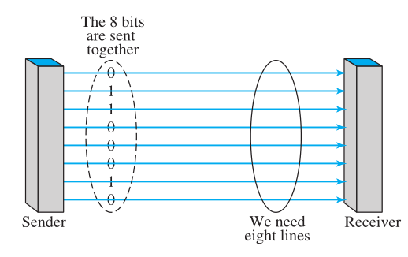

* n条线传n个bit

* 一起传，速度快(**吗？**)

  > 虽然看起来，一起传的话速度快。但是我们有很多东西是一眼看不到的。比如，如何让这8个bit同步到达？这个时候我们自然会想到在这8根线的基础上再加一根，用来做同步的时钟。而这8根线上的波形基本上一定是不一样的，而**经过傅里叶展开后它们的频率和速度都会有差异**，所以它们传输的速度都是不一样的。而我们又要保证同时到达，最终肯定是等着最慢的那一根到了之后才算搞定。同时，如果这些线之间离得太近，它们之间的信号也会有相互干扰，叫做**串扰**。介于以上原因，我们只有在芯片和板卡这种**传输距离很近**的线路中才会使用并行传输。**在考试的时候答快就完事儿了！**

* 缺点：成本高，线多

#### 4.3.2 Serial Transmission

也很简单，我们先把并着的一个字节拆开变成一个串，然后用一根线把这个串串发过去，在接收方把这个串串再合上就变回原来的一个字节了。


* 一个一个bit传

* 只要一根线

* 成本低

  > 我们再揭露一下一眼看不到的东西：串行实际上更快。我们之前介绍了很多带有**自同步**功能的编码，那么我们只要采用这种编码，这种传输方式就自带自同步功能了。并且因为只有一根线，所以不存在串扰问题，而且噪声对它的影响也更均衡和可控一些。我们可以在外面加一根屏蔽线就能解决。

##### 4.3.2.1 Asynchronous Transmission

在每个字节开始时发一个start bit，在每个字节结束后发一个或多个stop bit。所以这里的异步指的是**字节的异步(两个字节谁先到谁后到都行)**，里面的bit还是同步(必须按顺序一个一个到)的。

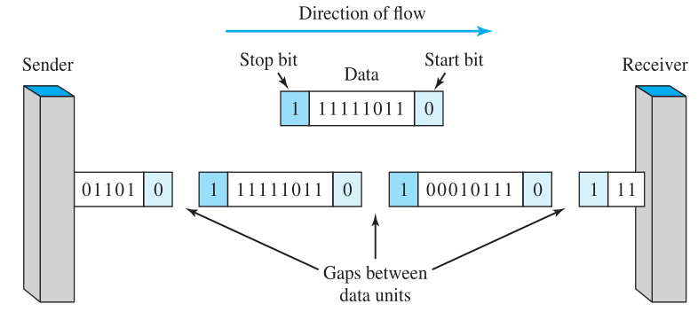

一般异步的编码都是NRZ-L。

##### 4.3.2.2 Synchronous Transmission

同步的传输就没有起始位和结束位了。那么我们咋知道哪8个bit是一个字节呢？交给接收方。它每数8bit就捆到一起。我们从这点就能看出来，**时钟在这种方式中很重要**。因为我们不能让接收方数错，所以传输的过程中一个bit是一个bit，必须得板正儿的。而时钟就是干这个活的，因此也叫做同步时钟。

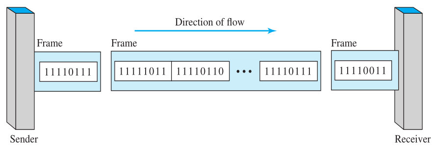

* 图中的frame并不存在，只是便于理解，本来就是一串01而已。

## 5. Analog Transmission

上一章我们在讲怎么用数字信号来传数据，下面就来讲怎么用模拟信号来传数据。

### 5.1 Digital-to-Analog Conversion

怎么用模拟信号来发送数字的数据呢？说这个之前先来说说为什么非得用模拟信号来传数字的数据。我们之前都是用数字信号来传，而数字信号有一个很明显的bug：**数字信号是一种基带信号**，也就是它最小频率一定是从0开始。而这种特性带来了一个问题。

我们在1.5.2中提到了Duplex，分为Half-Duplex(半双工)和Full-Duplex(全双工)。那么我们如果想要实现全双工的话，就要保证：**来和去的这两种信号的频率不能有交集**。这样才能保证两个方向互不干扰。但是由于数字信号的频率都是从0开始的，所以如果双方都用数字信号的话，必定产生交集。因此我们才会选择**用模拟(频带)信号来传输数字数据去实现全双工**。

然后再说怎么用模拟信号来发，使用的就是之前3.3.4.2中提到的**调制解调器**。

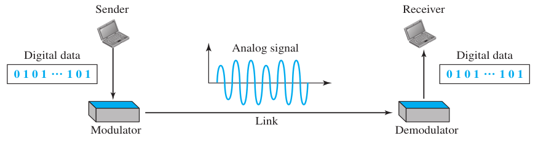

将数字数据转换成模拟信号有以下几种方法：

* **ASK** -> Amplitude shift keying
* **FSK** -> Frequency shift keying
* **PSK** -> Phase shift keying

其实对应的就是正弦波的三个参数：波峰，频率和相位。而我们将第一种和第三种结合起来就能够得到另一种方式：**QAM**(Quadrature amplitude modulation)。

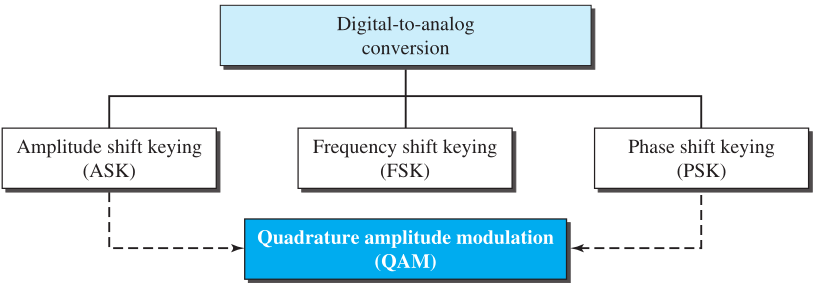

既然是数字数据和模拟信号的转换，肯定要涉及到数字信号和模拟信号之间的一些差异。我们在4.1.1中提到过数字传输的bit rate和信号传输的signal rate之间的关系：
$$
S=\frac{cN}{r}\ (baud)
$$
而我们紧接着就说，c的取值通常是$[\frac{1}{2},\ 1]$，上一章我们取的都是1/2，**这一章取的是1**。因此，该式可简化成：
$$
S=\frac{N}{r}
$$

> *An analog signal has a bit rate of 8000 bps and a baud rate of 1000 baud. How many data elements are carried by each signal element? How many signal elements do we need?*
>
> 根据$S=\frac{N}{r}$可以知道其中S = 1000，N = 8000，因此r = 8(bits / baud)
>
> 那么如果我们需要让一个信号元素携带8个bit，就要算出**8个bit能表示多少种状态**。很显然是2^8^ = 256种。而**每一种状态都需要唯一对应的"电平"**才可以，所以需要256个电平。

在上面的例子中，**"电平"这种说法是错误的**。因为我们现在讨论的是模拟信号，并不是数字信号，而模拟信号中不存在电平这种概念。题中问的也是"signal elements"，所以我们这里指的是不同正弦波的类型，其实可以简单地理解为**波的不同状态有256种。**另外，4.1.2.3中我们也提到了使用电平的不同组合来表示bit的各种状态。而对应到本节中就是：**使用波的不同状态来表示bit的不同状态**。

另一个重点是：不同的状态到底是什么？其实就是刚刚提到的三个正弦波的参数：Amplitude, Frequency, Phase。只要找到波中这些不同的地方，就能够组合成各种能够**互相区分**的正弦波型，自然就可以和`使用不同的电平`一样去表示这些不同的bit组合了。

#### 5.1.1 Amplitude Shift Keying

**Binary ASK**

首先看这东西是怎么表示0和1的：


我们在3.2.6提到过，如果是非周期的复杂波形，将它分解后的正弦波的周期是连续的，这里正好对应了这个结论。

上图中最惹人注目的就是带宽中间的那个f~c~。这个叫做**carrier frequency**，也就是**载波频率**。它实际上是带宽的中点，也就是最中间的频率。那么这个东西有什么用呢？其实它和我们的c的取值有关。为什么之前数字信号的时候c=1/2，而在模拟信号里就取1了呢？我们知道，数字信号的频率是从0开始的，那么**它会不会有负频率呢**？答案是有的，但是我们并不需要它，所以我们可以推测出来：**数字信号的f~c~ = 0**。在f~c~右边的叫做上边带；在f~c~左边的叫做下边带。在实际应用中，只需要两者取其一就可以了。**因此，如果至少有上边带和下边带之一的话，c = 1/2**。

通常上边带和下边带是相等的，在数字信号的时候，因为只有一半，所以c=1/2，而在模拟信号中因为都是正的，所以c=1。 而如果我们要**再多选一些呢**？这部分因素来源于**调制解调器**和**滤波器**，**我们把这部分因素==增量==统称为d**。而整个的影响因素$\frac{1}{case\ factor}=\frac{1}{c}=1+d$，因为d的取值是[0, 1]所以c的取值就是$[\frac{1}{2},\ 1]$了。

解释了c的取值和d的含义，接下来看一下带宽的计算，因为c = 1，r = 1，所以$S=\frac{cN}{r}=N$，而这里的最小带宽也不再是信号速率了，还记得我们之前说要实现全双工吗？既然是两个方向，那肯定是要把带宽给拆开，所以各自的部分之间只算自己的信号速率，而整个的带宽是**这两个信号速率所需要的带宽的和**：
$$
B_{min}=(1+d)S
$$
上式也可以这么理解，之前我们在4.1.1之所以说最小的带宽就是信号速率，是因为当时d的取值就是0，而如今我们要将这个由于调制解调器和滤波器的**因素分子增量**也算进去，所以最小带宽会比数字信号的最小带宽多了dS。

然后我们再讨论一下f~c~这个东西有什么用。其实它的作用是**携带信息**。因为它正处于中央，所以比较温和，最适合用来携带真正有用的信息。说白了，就是**用这个频率的一个正弦波去造出这整个的一个BASK复杂波**。那么怎么造呢？还记得我们之前4.1.2.1中没人用的波吗？用的就是它。

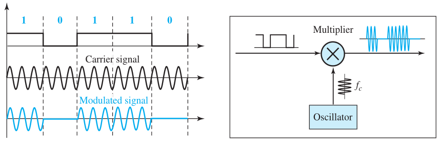

首先用Oscillator发射一个只含有f~c~频率的正弦波，然后再和我们的那个Unipolar一乘就行了。我们能发现，这个方波其实就是一个开关的作用，**在1的时候就把频带信号显示出来；在0的时候就把频带信号完全消掉**。

> *We have an available bandwidth of 100 kHz which spans from 200 to 300 kHz. What are the carrier frequency and the bit rate if we modulated our data by using ASK with d = 1?*
>
> 中点是250，也就是f~c~ = 250 kHz。带宽是100 kHz，而根据B = (1 + d)S能算出来S = 50 kbaud
>
> 所以N = 50 kbps
>
> d=1意味着误差最大，那么什么时候的误差最大呢？其实我们**选择的频率越多，需要解调的越多，误差就会越大**。因此d=1就代表我们选择了200-300所有的频率。也就是**上边带 + 下边带 = 双边带**。
>
> 这样操作的好处就是我们可以很好地利用这两边的带宽去实现**全双工**。
>
> 

#### 5.1.2 Frequency Shift Keying

通过上面的类比我们就能推测出来：ASK是通过两个峰值不一样的波形来区分0和1，那么FSK就一定是通过两个频率不一样的波形来区分0和1。那么如果峰值一样的话，频率不一样时就会产生**相同时间段内的波是稠密还是稀疏**的情况。


这里我们不深入讨论，只看怎么做题：

> *We need to send data 3 bits at a time at a bit rate of 3 Mbps. The carrier frequency is 10 MHz. Calculate the number of levels (different frequencies), the baud rate, and the bandwidth.* 
>
> 三个bit合起来表示一个状态，那么总共有2^3^ = 8种不同的状态，因此level的个数就是8。
>
> 然后通过N = 3 Mbps和公式$S=\frac{cN}{r}$能算出来S = 1 Mbaud，因为这里的r = 3就代表一个信号元素携带3个bit一次发出去。
>
> 之前我们讨论的都是只有一个连续的带宽，而在FSK中经常会有多个，比如这里就有8个不同的带宽。对于一个大带宽里的小带宽，可以这样计算：
> $$
> B_x=(1+d)S
> $$
> 而这里的S就是平均信号速率，而本题中d取0(因为上面的公式中c=1)，所以能算出来每一个小带宽都是1 MHz。所以从f~c~ = 10 MHz出发可以大致画出分布：
>
> 

#### 5.1.3 Phase Shift Keying

**Binary PSK**


#### 5.1.5 Quadrature Amplitude Modulation

我们怎么把相位和幅度都不同的正弦波区分开呢？使用的是星座图(Constellation Diagram)。

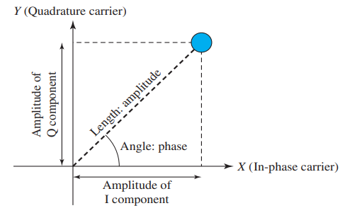

* 在星座图中，每一个点表示一个正弦波。
* 使用**极坐标**的方式来规定幅度和相位两个参数。
* 到原点的距离表示幅度，和x轴夹角表示相位。

那么我们就可以用星座图来画一下之前说过的ASK和PSK了：

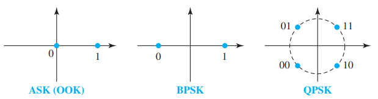

至于QAM的细分，就看图中有几个点，就是几-QAM。


## 6. Bandwidth Utilization

有时候我们的网线之类的，带宽是很富裕的，所以我们要很好地利用它去在一段时间内传更多的信息。

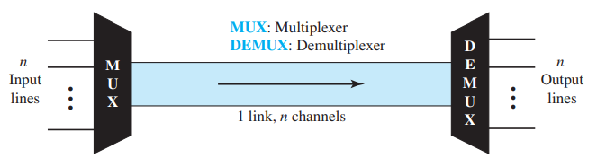

其实就是在之前介绍过的channel，而在本章我们要将一条channel拆成多条来实现并发传输。

如何更好地利用带宽？主要有以下的方式：


### 6.1 Frequency-Division Multiplexing

之前我们说过，使用模拟信号可以实现全双工，那么使用模拟信号也一定可以实现拆分宽带。


图中的3个channel分别位于不同的频段。比如f0-f1，f1-f2，f2-f3。那么使用ASK，FSK，PSK，QAM等技术就能够在这一个大channel里传输多个位于不同频断的信号，并且不会相互干扰了。

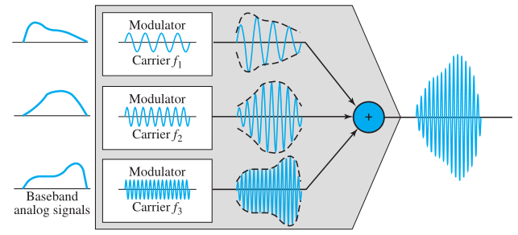

在混合的时候，就把这几种不同频段的波给加到一起去传输。


到达接收方的时候，使用滤波器把自己的那部分频段给过滤出来就好了。

另外有一个问题，就是这些不同频段的波的频率的交界处，因为非常相近，所以可能会产生串扰。那么我们为了更好地减小串扰，同时也为了滤波器能更精准地拆分它们，需要在相邻的两种波之间隔开一段频率。这部分频率叫做**防护频带**。

> *Five channels, each with a 100-kHz bandwidth, are to be multiplexed together. What is the mini mum bandwidth of the link if there is a need for a **guard band** of 10 kHz between the channels to prevent interference?*
>
> 我们需要在每两个挨着的波之间加上10 kHz的带宽用来做隔断，那么很容易画出图示：
>
> 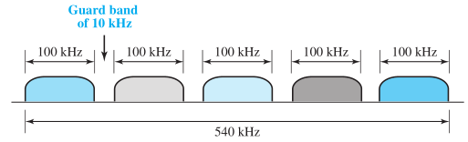
>
> ---
>
> *Four data channels (digital), each transmitting at 1 Mbps, use a satellite channel of 1 MHz. Design an appropriate configuration, using FDM.*
>
> 现在总共只有1 MHz的带宽，而我们要求传的速率是 1 Mbps。我们现在需要规定的，其实是r。因为我们不知道应该用什么方式去传数据，而且怎么表示我们也不知道。现在假设一下，如果我们只让每种状态的波去表示1个bit的话，根据$S=\frac{cN}{r}$能算出来，B = (1+d)S = 1 MHz。而我们一共才只有1 MHz，却要分成4个不同的channel，那么肯定是要用**更小的带宽去传更多的数据**。那么一定是要提高r才行。
>
> 既然要分成4个channel，那么我们能得到每个小channel的带宽是250 kHz。还是带回到$S=\frac{cN}{r}$中，能算出r = 4。那么我们就是要让**每种不同的状态去携带4个bit**。之前我们说过，在模拟信号的传输中，不同的状态其实就是ASK，FSK，PSK，QAM这几种。那么我们只需要用这些方法去将信号进行拆分和编码，找出合适的方式就可以了。首要的问题是：有多少种状态呢？既然有4个bit，那么不同的状态就是2^4^ = 16种。所以我们也要找一种能够区分16个不同状态的模拟信号编码方式(**16个不同的正弦波**)。其中一种就是16-QAM。
>
> 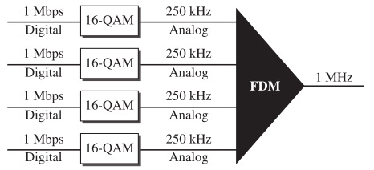
>
> *问题：这题的d是默认为0了吗？*

另外FDM可以不只有1层，可以不断往上叠加，叫做**Analog hierarchy**。


### 6.2 Wavelength-Division Multiplexing

WDM其实和FDM是一样的，只不过通常用在**光纤缆**中。因为光纤缆中信号的频率非常高，所以使用FDM会有很大的误差。我们转而使用另一个参数——波长来衡量不同的波。


因为光波的参数不像电磁波，它非常难调。我们现在能做到的也只是使用不同的光而已。所以这些不同的光最大的区别其实就是波长。而波长不同的光又恰好不会互相干扰，所以我们将它们加在一起就可以了。


### 6.3 Time-Division Multiplexing

我们计算机其实特别擅长按时间来实现复用。想想我们的多线程，从外面看确实是多个任务同时在进行，但是实际上是CPU先干一小会儿这个，再干一小会儿那个，而切换得越快，就看起来越像是同时发生的。将这个过程类比到传输中就是：多个信号同时进入，那我先传一个你的，再传一个他的，再传一个你的……


将这个过程再深入一下：

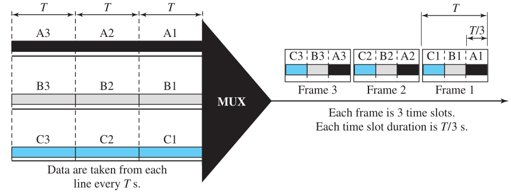

这里的A1A2A3之类的可以是一个bit、一个字符或者一个数据块等等，按着规定来即可。当所有人都轮完一遍之后形成的就是一个Frame，这种复用方式叫做**Synchronous time-division multiplexing**。如果我们设这个大channel的速度是x的话，就能发现，对于每一队单独的数据，它们只是平分这整个速度。所以真正传递某一条数据的速度还要除以队列的总数n。而对于每一个小的数据来讲，它的持续时间也平分了整个的T，变成了$\frac{T}{N}$。

那么这种方式是怎么实现的呢？看图


其中最重要的就是让这两个转的球球同步起来，这样才能正常发送和接收。

既然同步时钟那么重要，如果某个数据是空的该怎么办？TDM的解决思路就是：不管有没有数据，我都把你的那份时间给你。

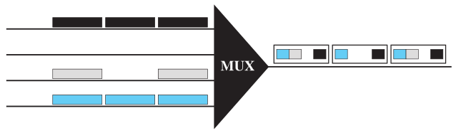

其他的知识点看图就理解了


> 

==考试会考的是==，这个分层级的TDM，就像FDM一样：


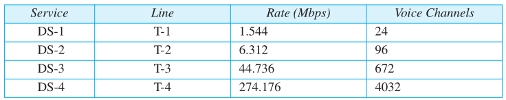

其中T-1这条channel的速度1.544 Mbps是怎么来的呢？我们用24 * 64 kbps得到的是1.536 Mbps，比实际的值要小。这又是为什么？其实就是因为上面提到的**Synchronization Pattern**。下面就来解释一下。

在这个标准中，每轮到一个人，这个人就发一个字节，也就是8bit。而24个人都轮到之后，就是24 * 8 = 192 bit。而在最后还要加一个标识符用来同步时钟，所以现在对于一个Frame，里面就会有193个bit。如果T-1总共能携带8000个frame的话，那么每个Frame都要多传1bit，因此如果我们还是要保证每个分支的速度是64 kbps的话，就要将T-1的速率再提升8000 bps = 8 kbps。因此再加上1.536 Mbps就是最终的结果了。

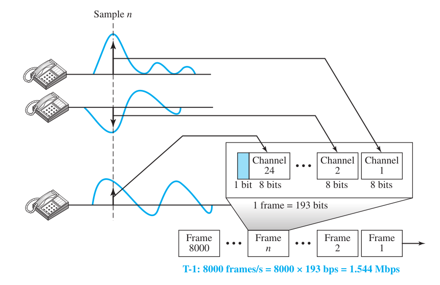

*问题：为什么T-1能携带8000个Frame?*

### 6.4 Spread Spectrum

扩频就是把带宽小的变大，这样数据率也就高了。

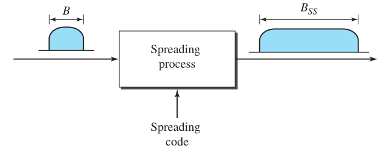

## 7. Transmission Media

之前提到过，在两个物理层之间还存在着一个Transmission Media，这才是真正传输物理意义上的信息的位置。


Transmission Media可以分为有线和无线的，其中又有更多分类。


**双绞线(Twisted-Pair Cable)**

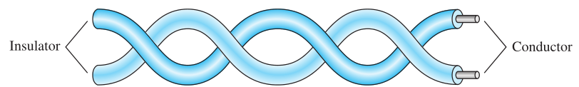

传的是**差分信号**，这样抗噪声能力强。就算有噪声，它对这两根线的影响也差不多，在接收方一减就能够把噪声减掉。

还可以在上面加上屏蔽罩：


---

**同轴电缆(Coaxial Cable)**

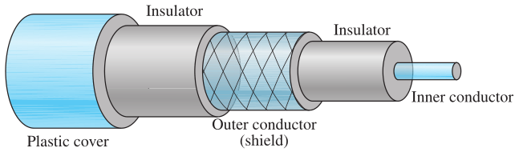

---

**光纤(Fiber-Optic Cable)**

光纤的原理其实就是**光的折射**：


因此只要我们找到这个**Critical Angle**，就能够在光缆中实现很多次的全反射，实现传输光波的功能。


**==接下来是考点：光纤传播模式的分类==**


只要我的入射角 > Critical Angle，就能够实现全反射。那么我们可以找多个这样的角，然后让它们同时传输。这种传输方式因为角度是离散的，所以叫做**阶跃折射率模式(Step index)**。


这种方式有个问题：如果入射角太大，光在中间里的那个空洞待着的时间太长还没碰到壁，就有可能会散出去，这样会有能量损失。

为了解决这种问题，人们想出了一个办法：把中间那个空当变成一个芯儿，是一个**多层**的芯儿。有多少层呢？**无数层**！其实是一种函数关系，比如半径和折射率成反比这种。这样光在中间传播的时候，**时时刻刻**都会发生折射，从而形成一条**平滑**的曲线。这样就解决了长时间不碰壁发生发散的问题。显然这样的光有无数个折射率，这种方式叫做**渐进折射率模式(Graded Index)**。

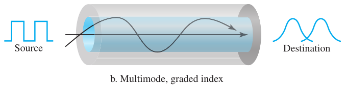

以上两种方式共同的问题是：多个光线在一起会互相干扰。因此我们不如从根本入手，让光更集中。把中间那个芯儿做得非常非常细，有多细呢？**和光子的直径一样细**！这样就只能有一束光通过，同时对光路的保护也最好，根本没有发散的可能。这就是**单模(Single Mode)**。


## 8. Switching

在1.9.2.2中介绍过Switched WAN，现在可以回忆一下。


而这种类型的网络也可以继续细分，这章就是分别去介绍它们。


### 8.1 Circuit-Switched Networks

过去在使用电话的时候，通常是很多个电话连接到一个交换机，这样它们之间就能够通过交换机建立起连接。这东西可以看做一个网格，里面好多窟窿。如果第i个人要联系第j个人，那么就把第i行第j列通上，这样他俩就连上了。而如今的交换机必然都是电子的。

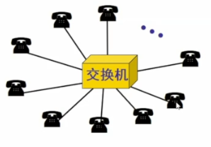

==**考点：**==如何实现这种交换呢？分为三个阶段：**Setup(建立连接)**, **Data-Transfer(通信)**和**Teardown(释放)**。在建立的阶段，需要预留资源(比如channel, switch buffer, processing time, switch ports)，这些资源在传输的时候随时都有可能会用到，所以一直得就绪，直到释放的时候。

这样的交换机在现在不可能只有一个。那么这样的一组交换机通过物理链路连接起来，就形成了**电路交换网络(Circuit-Switched Networks)。**而每条链路的带宽通常很宽，所以我们经常使用第6章**FDM**和**TDM**来进行复用。


上图中中间的结点就可以是交换机，正如1.9.2.2中所介绍的。而交换机连出来的分支之间都是互通的，只要区分**你要去哪个方向**就行。比如数据从A传到B的话，就是从A先到1号，然后去到4号再到3号(这只是其中一条路，其实还有很多)。而为什么从1号到的是4号而不是2号？就是交换机决定的方向。另外，交换机和交换机之间只有一条线叫做干线，因为它们之间并不需要多根线。

以上的这种网络我们叫它**电路交换网络**，这种网络是构建在物理层的。比如下面就是一个电路交换的例子：

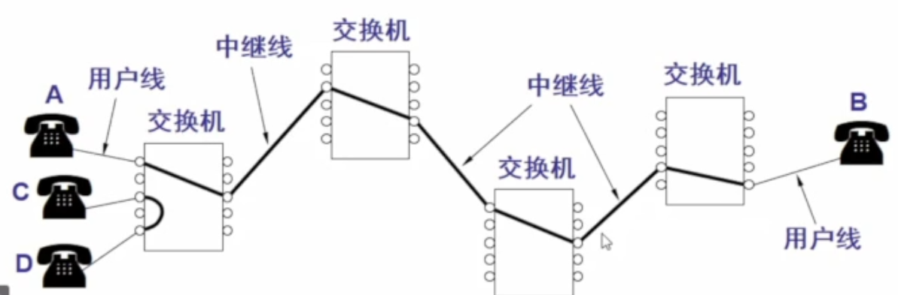

两边的叫做Local Switch；中间的叫做Backbone Switch。比如西电的电话`81891110`，其中的`8189`就是这个Local Switch的名字，后四位是这个有线电话的名字。另外，只有和电话连着的线(图中的细线)才是一直连着的，剩下的，比如图中**这些**根最长的粗线，只有在A和B通信的时候才会连上。

电路交换网络有个问题：比如你连上了但是你不说话，但是这个时候资源啥的都已经给你建好了，不说话是你的问题。所以这种网络都是按时间收费的。而计算机产生的数据通常都是：很短时间芜一下子给你整老大一坨，而又有时候很长时间都没有数据。所以这时候就不适合用电路交换网络来进行这样的通信。

### 8.2 Datagram Networks

在2.2.3就说过，网络层传输的是datagram。而这就是我们给这一大坨信息打成的包。而接下来我们要介绍的这种网络，就是针对这种包来构建的。

在Datagram Network中，所有的datagram都是**独一无二**的，即使它们属于同一个Message。比如看下面的例子：

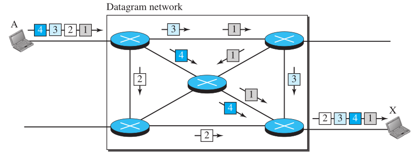

1234一起组成了一个message，每一个都是一个datagram。而在传输的时候，你以为它们会排成一个小火车呜呜跑过去？不是的，看图就能看出来，这四个datagram就像不认识一样自己走自己的，而到了目的地之后又排成一队。这样做的原因主要是，可能有些带宽不满足能一次把这4个都灌进去，从而导致速度很慢(尤其是你这条路要是常用的话，很可能此时此刻还有别人的datagram)。

那么这些datagram传到目的地后重新组织是谁来做的呢？答案是网络层的更上面的层的protocol来完成，它们同时还能完成其他的功能，比如如果某些datagram在传输的时候丢失了，它能负责找发送方再发一份。

另外的小细节：这图里的结点和电路式的不一样，因为这里通常是router而不是switch；两边的结点也不是电话而是计算机，计算机比电话牛逼的多，所以它能做出**打包**这种操作。

使用这种方式，这些中间结点就不用记那些电路式中预留的那些资源啥的。这样维护也更好维护，也更便宜。

**Routing Table**

在电路式交换网络中，建立资源的时候可以确定我要把东西发给谁，所以传的时候直接按规定传就行了。而在datagram network中并不会建立这些资源，那我咋知道传给谁呢？使用的就是routing table。假设我这个路由器收到一个datagram，在这个datagram的开头就是接收方的IP地址(在2.2.5介绍完应用层之后，紧接着就介绍了各个层的打包，其中就提到了网络层的头)。拿到了IP地址，紧接着路由器就会查这样一张表：


这样很显然就知道这个datagram接下来该走哪个端口了。这张表在路由器中时时刻刻都是在改变的，而电路式网络中也有这么一张表，只不过是一直不变的。另外一个点是，开头的Destination address在一个datagram传输的过程中始终不变。

