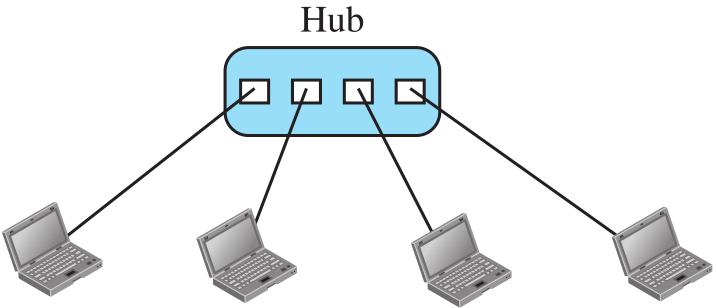
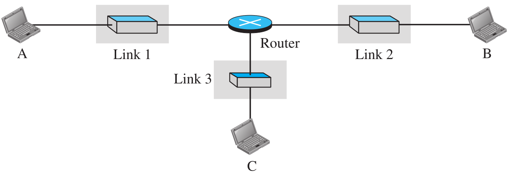
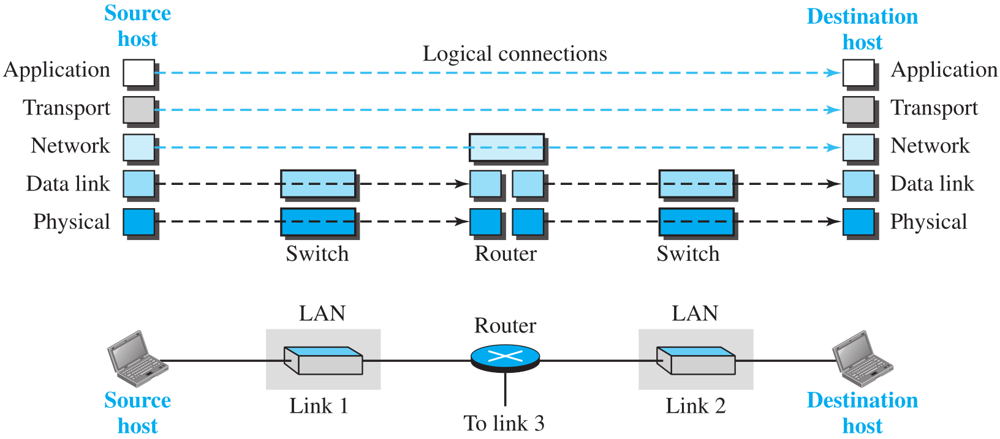

# 计网笔记

## 1. Introduction

### 1.1 Protocol

我们之间说的话，就叫做**协议**。我说的话你能听懂，我说的话牛听不懂。**两者之间的规约要相同，他们之间才能通信**。这个规约就叫做protocol

### 1.2 Telecommunication

远程通信就叫做Telecommunication，传的就是以任何格式表示的信息，也就是Data

### 1.3 Data Communications

两个设备之间的数据交换，需要通过一个媒介(比如电线)。然后这些所有的设备会组成一个Communication System。这个系统就是由一系列硬件(physical equipment)和软件(programs)组成的。这个系统想要有效，需要以下4个东西

* Delivery: 系统必须得把数据**传到对的目的地**。必须由那个期望收到信息的一方收到，并且只能是它
* Accuracy: 你传的Data不能损坏，损坏了就不能用了
* Timeliness: 传数据有时候要**及时(in a timely manner)**。比如视频聊天，你一拍到图像，录到声音就得赶紧传过去了，并且还得按顺序传，不然变成说的道理了。并且传的时候还不能有太大的延迟。这种传输就叫做**real-time transmission**。
* Jitter(抖动): 比如接收视频，每过30ms来一个视频包，那如果一些包有30-40ms的延迟，那这视频质量就会受影响，比如哪一块突然花一下。

### 1.4 Five components of data communication

既然是俩设备之间的通信，那除了他俩，还有啥呢?

* Transmission medium: 就是上面说的发送方和接收方之间的物理媒介。
* Protocol: 发送方要按照规范去发数据，比如Rule1, Rule2等，这些规范双方都是相同的，叫协议，也就是**规则的集合**
* Message: 发送的时候，把数据按照规则打包，打成的包就叫Message

### 1.5 Data flow

#### 1.5.1 Simplex

数据只能单向流动。意思就是说，这俩人一个只能发，另一个只能收。比如显示器，键盘就是这样。显示器只能接收图像信息，而键盘只能发送输入的字符。

#### 1.5.2 Duplex

##### 1.5.2.1 Half-Duplex

能双向流，但是却不能完全双向流。也就是说在一个时刻只能有一个方向。不能有一个时刻又往左又往右。比如对讲机。你说话的时候就不能听别人说；听别人说的时候你也不能说话。

##### 1.5.2.2 Full-Duplex

可以理解为把两个Half-Duplex的线捆起来(只是理解，真实情况还不一定是这样)。这样就随时想往哪儿就往哪儿。比如电话，就既能说话也能听见别人说话。

### 1.6 Network

什么是网络？数据结构里就学过！带权的有向图就是网。那这里的网络其实就是这个。只不过，其中的边在这里是Link，其中的结点在这里还是Node。它们的集合就是网络。Node可以是计算机，或者host, router；Link就是wired or wireless transmission media，比如cable或者空气。

### 1.7 Types of connections

#### 1.7.1 Point-to-Point

也就是经常见到的p2p。这个Link是被两个Node独享的

#### 1.7.2 Multipoint

很多个Node挂在一个Link上，这样能做到一个发，多个收。有一种广播的性质。这个Link也非常像Bus，由多个结点共享

### 1.8 Physical Topology

由上面两种连接方式，可以分出下面4种网络的拓扑结构

The term **physical topology** refers to <u>the way in which a network is laid out physically</u>. Two or more devices connect to a link; two or more links form a topology. The topology of a network is the geometric representation of the relationship of all the links and linking devices (usually called nodes) to one another. There are four basic topologies possible: mesh, star, bus, and ring.

#### 1.8.1 Mesh Topology

你看这里的每一个结点。除了它自己，它和其他所有的结点都有Link，并且每个Link都只有这俩独享，也就是p2p。简单的数学可以算出，如果有n个结点，那么Link的个数就是$\frac{n(n-1)}{2}$。当然，一切的前提是这里的Link是Duplex而不是Simplex。

Mesh的优缺点：

> A mesh offers several advantages over other network topologies.
>
> * First, the use of dedicated links guarantees that each connection can carry its own data load, thus eliminating the traffic problems that can occur when links must be **shared** by multiple devices. 
> * Second, a mesh topology is robust. **If one link becomes unusable, it does not incapacitate the entire system.** 
> * Third, there is the advantage of privacy or security. **When every message travels along a dedicated line, only the intended recipient sees it.** Physical boundaries prevent other users from gaining access to messages.
> *  Finally, point-to-point links make fault identification and fault isolation easy. Traffic can be routed to avoid links with suspected problems. This facility enables the network manager to discover the precise location of the fault and aids in finding its cause and solution.
>
> The main disadvantages of a mesh are related to the amount of cabling and the number of I/O ports required. 
>
> * First, because every device must be connected to every other device, installation and reconnection are difficult. 
> * Second, the sheer bulk of the wiring can be greater than the available space (in walls, ceilings, or floors) can accommodate. 
> * Finally, the hardware required to connect each link (I/O ports and cable) can be prohibitively expensive. For these reasons a mesh topology is usually implemented in a limited fashion, for example, as a backbone connecting the main computers of a hybrid network that can include several other topologies.

#### 1.8.2 Star Topology

这个Hub就像GitHub里的Hub，就是一个Central Controller。每一个结点都只和Hub有一个p2p连接。那么如果一个设备想和另一个设备通信，就不能像mesh一样直接来了，只能通过Hub来。

Star的优缺点

> Advantage:
>
> * A star topology is less expensive than a mesh topology. In a star, each device needs only one link and one I/O port to connect it to any number of others. This factor also makes it easy to install and reconfigure. Far less cabling needs to be housed, and additions, moves, and deletions involve only one connection: between that device and the hub.
> * Other advantages include robustness. If one link fails, only that link is affected. All other links remain active. This factor also lends itself to easy fault identification and fault isolation. As long as the hub is working, it can be used to monitor link problems and bypass defective links.
>
> Disadvantage:
>
> * One big disadvantage of a star topology is the dependency of the whole topology
>   on one single point, the hub. If the hub goes down, the whole system is dead. 
> * Although a star requires far less cable than a mesh, each node must be linked to a central hub. For this reason, often more cabling is required in a star than in some other topologies (such as ring or bus).

#### 1.8.3 Bus Topology

之前的都是p2p，现在来一个Multipoint，这也正对应了名字里的Bus。这里要注意的就是，因为是一个发，多个收，所以这种方式一定是Half-Duplex，而之前的Mesh和Star既可以是Half，也可以是Full。比如Star种的Hub如果也是个Bus，那就是Half；如果是Switch(交换机)，那就是Full。

*问题：那既然Star的Hub可以是Bus，那这不就和Bus Topology一模一样了吗？*

#### 1.8.4 Ring Topology

如果把这根线变成一个圈，就能用Simplex去模拟Duplex了。因为就算不能往另一边走，转一圈回来也能到。

### 1.9 Network Types

#### 1.9.1 Local Area Network

后面的三种: Star, Bus 和 Ring有一个共同的特点：结点和结点之间离得很近。Star的Hub可以放在一个公司里；Bus中的总线也能放在一个固定的地方；而Ring一个环也是一个有限大小的环。所以这三种统称为LAN(Local Area Network)。

过去的这种LAN，如果一个结点发包，其他所有结点都能收到。那怎么办呢？那个发包的目标就把包留下，其他不想要的就扔掉；**而现在普遍用交换机的这种方式**。先把包发到交换机里，由交换机来把包再传到目的地。这样可以减轻cable的使用率(之前所有人都用一根，那几乎这跟cable时时刻刻都在使用中)，并且可以让**很多个数据传送同时发生**，只要他们之间别犯冲就行。

#### 1.9.2 Wide Area Network

LAN连接的都是host，而WAN连接的都是像switch, router, modem(调制解调器)这样的设备。主要分为p2p类型和Switched类型。

##### 1.9.2.1 Point-to-Point WAN

像是之前的Mesh类型，它们每两个结点之间就是这种方式连接的。要注意的是，因为是WAN，所以这里Mesh中的结点就不能是电脑啥的了，要是交换机这种设备才行。

##### 1.9.2.2 Switched WAN

多个p2p类型的WAN结合起来，就变成了Switch类型的WAN，而这里的结点也要是交换机才可以(连名字都是交换机)。这种就是我们现在最常用的网络的类型。

Switched WAN的另一种表示:

ABC三个End System就可以是我们平常使用的手机，电脑之类的。而它们因为距离很远，如果需要通信的话，就需要一个很大的共享的网络，所以这些黄色的连起来就组成了Switched WAN。

End Node具有数据计算功能，能处理收到的信息，也能存储和发送信息。但是它不能自己去建立很远的连接，比如A就不可能不通过Switched WAN直接把信息发送给B。这些End Node组成的网络能产生和处理数据，我们叫它**资源子网(Resource Subnet)**。

中间的黄色结点叫做Relay Node / Middle Node。它们不能处理数据，但是可以接力，把我收到的数据传给下一个，那么这样一直传，知道目的地，就达到了远距离传送的目的。一般路由器，交换机之类的就是这种结点。那么这些Link和Node组成的专门用来接力和传送数据的网络我们叫它**通信子网(Communication Subnet)**。

而资源子网和通信子网就组成了我们的WAN。

##### 1.9.2.3 Internetwork

LAN和WAN其实现在根本看不到单独的，现在能看到的全是它们一个一个连接起来的形式。如果是两个或以上的LAN或者WAN连接起来，就形成了**互联网(Internetwork, or Internet)**。

接下来是2个Internet的例子。首先是两个办公室，每个办公室内部都有LAN，为了处理本办公室内部的通信，然后这俩办公室由要互相连接，所以用了一个p2p的WAN。

然后是一个很复杂的Internet，由4个WAN和3个LAN组成。

#### 1.9.3 The Internet

注意internet和Internet的区别。小写字母是上面讨论的；而大写字母是全世界最大的，将所有的小internet连接起来组成的唯一的Internet。下面就来分析以下这个全世界最大的网络。

* 首先最大的是**Backbones**，也就是整个互联网的骨架。它们是一些超大公司(比如Sprint, Verizon, AT&T, NTT)的网络，由Peering point来连接。
* 然后是**Provider network**。这些也是大公司，只不过它们只是转接来的，比如像移动，联通，微软，谷歌等。它们有的能直接从Backbones那边来货，也可能互相撺掇。
* 最后就是我们这些用户了，其实就是一级一级传下来的，最终这个网络服务的也是这些数量最多的终端用户。
* 另外，Backbones和Provider networks都是提供服务的，真正享受这些服务的并不是它们。所以这些也叫做**Internet Service Providers(ISP)**。而最大的Backbones叫**International ISPs**；小一点的地方的这些Provider networks叫做**National or regional ISPs**。

> network access point(NAP): A complex switching station that connects backbone networks.

## 2. Network Models

### 2.1 Protocol Layering

为什么要给协议分层？如果只有俩设备，那当然很简单，俩人遵守一套规则就可以了。但是如今的计算机实在是太多了，手机电脑平板机器人还有各种服务器和嵌入式计算机。如此多的设备想要管理它们之间的通信，就像要管理世界上这么多的人一样，需要分层的结构来进行管理。

首先说一个需要分层管理的例子。有两个人：Maria, Ann。她们离得很远，要用邮件来通信。并且在信传输的时候，万一被拦截了咋办？所以她俩想了个招：给它加密。在传输的过程中传的都是密文，谁也看不懂，然后拿到手之后再解密，就变成了明文。那么对于每个人来说，就很容易地分成了3层结构：收发信、加密和解密、传输信。

下面是书上给的Maria给Ann发信息的例子，很好看懂。

> ​		Let us assume that Maria sends the first letter to Ann. Maria talks to the machine at the third layer as though the machine is Ann and is listening to her. The third layer machine listens to what Maria says and creates the plaintext (a letter in English), which is passed to the second layer machine. The second layer machine takes the plaintext, encrypts it, and creates the ciphertext, which is passed to the first layer machine. The first layer machine, presumably a robot, takes the ciphertext, puts it in an envelope, adds the sender and receiver addresses, and mails it.
> ​		At Ann’s side, the first layer machine picks up the letter from Ann’s mail box, recognizing the letter from Maria by the sender address. The machine takes out the ciphertext from the envelope and delivers it to the second layer machine. The second layer machine decrypts the message, creates the plaintext, and passes the plaintext to the third-layer machine. The third layer machine takes the plaintext and reads it as though Maria is speaking.

由此，我们能总结出分层结构的好处:

* **Separate** the services from the implementation.

  > 各层之间独立，互不相干，我不用关心其他层是咋实现的，做好自己层的事儿就行(写MVVM架构的时候确实深有体会)。

* Another advantage of protocol layering, which cannot be seen in our simple examples but reveals itself when we discuss protocol layering in the Internet, is that communication does not always use only two end systems; there are intermediate systems that need only some layers, but not all layers. If we did not use protocol layering, we would have to make each intermediate system as complex as the end systems, which makes the whole system more expensive.

  > 如果你不分层的话，那么一些系统(比如中间的系统)就会变得非常臃肿，而分层的话就会让这个逻辑尽可能清晰一些。

### 2.2 TCP/IP

全称：Transmission Control Protocol / Internet Protocol。从名字就能看出来，它就是个协议。那么既然是协议，就是一套规则罢了。只不过这套规则是一个"采用上面所说的分层结构"的协议。每一层都能提供服务，也享受服务，享受的就是它下面那一层提供的。

> 左边是老版本，右边是新版本，这里只讨论新版的。

每一个设备都会包括几层这些协议。比如下面的例子中，电脑ABC会包括整个5层；而LAN中的交换机只包括物理层和Data Link层；路由器包括下三层。

那么A如果想要给B发消息，就是这样的：A要在**应用层**产生一个消息，然后一路向下传到A的物理层，再从物理层传到交换机中，经过一路传递到达B的**物理层**，再从B的物理层一路向上最终到达B的应用层，被使用B的用户所接收。

接下来讨论一下为什么它们分别要包括这些层。首先这几个电脑，是要被用户使用的，所以一定需要包括最上层的数据，那么自然需要到达应用层才行。那既然有了应用层，上面的层必定都要有，因为**有了儿子，父亲必定存在(过)**。

然后是比较特殊的路由器。从上面的图能看出来，它只有一层网络层，但是却有两组数据链路层和物理层。这里之所以是两组是因为这里我们画的是A和B通信，所以只是包含这两个交换机的Protocol。实际上，**路由器和几个其他种类的<u>Link</u>连接起来，就应该有几组数据链路层和物理层**。我们就拿上面的例子来说。A那个交换机给路由器发消息需要一组Protocol；而路由器拿到消息之后发送给B的那个交换机有需要另外一组Protocol。很显然**这俩交换机的Protocol是不太可能完全一样的**，所以路由器在这种情况下就需要包含两组Protocol。另外，如果再加上C的通信的话，显然路由器就要包含3组了。

最后是交换机，它们都在LAN中。和路由器不一样，它们虽然也连了两个设备(电脑和路由器)，但是它们之间通信的Protocol都是相同的，也就是说，不需要多组数据链路层和物理层。之所以路由器连接的Link不同，是因为这俩交换机处在不同的LAN中，就像上一段说的，这俩交换机的Protocol是不太可能完全一样的。

**Logical Connection**

这个概念其实不太好理解。我们先拿之前写信的例子来说。

对于Maria和Ann这俩人，我们可以说，她俩虽然距离得很远，但是借助下面这一大坨“工具”，他俩也能够通信。而如果我们往下扒一层，也就是只看Layer3这两个东西，它俩是俩机器，本来也是不能通信的，但是**它俩借助它俩下面的这一小坨“工具”，也能够实现通信**。这个通信，实际上就是传递信息。对于Maria和Ann来说，她俩借助下面的工具，传递的就是信，也就是Plaintext；而对于Layer3这俩机器，它俩也是传递信，那么还是Plaintext；而如果再往下扒一层，到了Layer2，就能发现，Layer2这俩机器也是在借助下面的工具传递数据，只不过这时传递的就不是Plaintext了，而是Chiphertext。由此我们能发现，在**Protocol Layering**的结构下，**每层的发出者和接收者都可以看作是一个假象的“用户”**，它们之间也存在Maria和Ann之间这样的联系——能发送和接受“**对应当前层的、相同的**”数据。这样的联系，就是Logical Connection。

接下来，我们来分析一下这个TCP/IP例子中的Logical Connection。

~~对于上面三层，它们之间传递的数据不会有任何改变~~；而下面的两层在传递的过程中，会被路由器改变，而不会被交换机改变。比如Data link层，Source host的数据从这里传出后，经过一系列工具，到达了Destination host的Data link层。但是这过程中在Router的Data link层断了一下。

然后是书上介绍的两个概念：end-to-end / hop-to-hop。上面三层是end-to-end的，而下面两层是hop-to-hop的。我们首先要明确一个概念：中间所有的这些连接，其实都是为了两个电脑能互相通信，所以两个电脑是最边缘的设备，叫做end，而hop可以是中间的设备。所以，上面三层从发出的end到接收的end之间数据都没有变过，所以是end-to-end；而下面两层end-to-end不好使了，因为在路由器那儿数据发生了改变，所以我们引入一个hop-to-hop。只不过这里的hop不能是交换机，因为它不改变数据，所以直接穿过去了。

*问题：这里Source host和Destination host拿到的是一样的object吗？不是经过了路由器的改变吗(为了适应不同的LAN，采用了不同的Protocol)？或者换一个问法，数据从Source host传下来，当到达网络层的时候，确实这时候数据是没变过的，但是当到达Data link层的时候，之后的传递过程中在路由器那儿发生了改变，也就是**从Source host的Data link层发出的数据和Destination host的Data link层接收的数据是不一样的**，那么又怎么保证这个接收的数据再向上传递的时候，和Source host那边又变回一致了？*

> 数据在两个网络层其实是一样的，没有改变，只不过这里路由器采用了两套不同的协议，真正要传的东西其实是一样的，只是额外附加传的东西会有不同(因为协议不同)。

> Identical objects in the TCP/IP protocol suite

虽然我们说两个host的网络层之间存在Logical Connection，但是**它们传递的数据是不一样的(对应上面的删除线)！**从上面的图也能看出来，这个Identical objects在网络层不是一段而是两段，因为路由器接到数据后会把传来的包切成很多片，但是在发送的时候，会发送更多片(为什么之后再说哦)。因此传递的数据确实是不一样的，只不过**真正要传的东西其实还是没有改变**。

接下来是**重点中的重点！**为什么这里是断开的？

是因为：**这俩玩意儿根本就不能通信！！！**协议不一样那咋通信？所以我们才需要断开。

**说完了TCP/IP协议，下面来看一看这个协议中的每一层具体都是干什么的。**

#### 2.2.1 Physical Layer

这是TCP/IP的最底层，但是这层其实还不是最底层的东西，它下面还藏着一层，叫Transmission media。这是为什么呢？我们从上面的图也能看出来，**物理层传递的信息就是bit**，而bit其实还是个人为抽象的东西，它还要在Transmission media继续被拆成电信号，才能真正传递。所以虽然是TCP/IP的最底层，它们之间的通信还是Logical上的通信。**而Transmission media就是连接两个物理层之间的东西**。

#### 2.2.2 Data-link Layer

简单记，**数据链路层就是通过link传递packet**。如今的网络连接非常复杂，所以信息的传递会有很多条道路。之前说过，这个道路其实就是Link，而**路由器的职责就是在这些道路中选择最好的最快的**。而选好了道路后，接下来的传递工作就是数据链路层做的。也就是之前说的hop-to-hop，这样的传递就是帧(frame)传递，就是**将数据打包成一帧一帧**。另外，数据链路层还会有一些其他的功能，比如数据检错和纠错功能，实现方式就是在数据**末尾**打上纠错码。如果给两个hop直接上物理的连接，就很有可能出现错误，所以**数据链路层让这个不可靠的连接变得可靠了**。同时，如果是像1.8.3中的Bus的那种形态，数据链路层还能处理冲突的问题。**总的来说，数据链路层的传递其实和物理层差不多，就是包装了一下而已**。

#### 2.2.3 Network Layer

首先，之前说过网络层的传递是end-to-end。更加详细点儿来说，是**host-to-host**。也就是从一个计算机传递到另一个计算机。那么在这个传递的过程中，可能会经过路由器，所以这些路由器也要包含网络层。而就像上面说的，**路由器的职责就是给每个包选择最好的路线**。网络层的职责就是**完成这种host-to-host的信息传递和根据可能的路径去运输这些packet**。所以网络层中传递的信息就是包(packet)，而传递的这个路径就叫做Path。

*问题：数据链路层和网络层都提到了路由器的职责，那么这个功能到底是包括在网络层还是包括在数据链路层？或者是这俩其实是不相同的功能，只不过有些类似而已？*

> 这里展示的就是从A到F，中间有三个Link，它们组成的就是一个Path。

网络层非常重要，其中一个原因是它包括了非常有名的协议——IP(Internet Protocol)。在这个协议中，数据被进一步包装成新的格式——**datagram**，也就是packet的进一步包装。IP地址也是在这一层中被创建和使用的，主要目的就是为了将数据从source传递到destination。比如一个路由器A想要把数据传给下一个路由器B，A就要拿到B的IP地址，然后按着地址去传递这个数据。IP其实很多功能都是没有的，比如不能控制流速(flow control)，不能纠错(error control)，不能处理服务冲突。所以如果软件需要这些功能，就只能依靠上面的Transport layer中的协议才行了。

网络层中还有另一种协议，叫做routing protocol。这东西其实还是和之前说的路由器的职责有关。为啥路由器能决定到底那条路线才是最佳的呢？靠的就是这个协议。这个协议能够创建出一个表格叫做**forwarding table**，它能帮助路由器来判断到底那条路线是最好的。routing protocol也分为两种，unicast和multicast，也就是一对一和一对多的两种。另外网络层中还有一些辅助协议，这些协议之后再说。

> **数据链路层和网络层的区别**
>
> * 作用不同：数据链路层实现具体的传输~（仅仅高于物理层而已）而网络层是实现网络功能。
> * 传输单元不同：（明显的不同）网络层是大名鼎鼎的IP包，DL层则是数据FRAME。
> * 协议不同：网络层就是IP协议，数据链路层协议则很多。HDLC和PPP等等。　网络中程序员多数考虑的是网络层。

#### 2.2.4 Transport Layer

首先，这里面有TCP。没错，就是**Transmission Control Protocol**!那既然这东西本身都在这层了，那这层就毫无疑问非常重要了(另外的IP在下面的网络层，所以这俩都挺重要)。到了传输层，思路就显得非常清晰了，其实就是**将数据从source host的应用层拿过来，然后传输层会使用它下面的"工具"来将数据发送到对方的应用层**。这个工具其实就是它下面的层给他提供的service，而由于传送使得双方的传输层也建立了一个Logical Connection。根据下面的定义我们也能看出来，**传输层完成的也是进程和进程之间的通信**。

TCP的作用：在**传输数据之前**，在双方的传输层之间建立一个Logical Connection。TCP中当然包括了之前说的网络层没有的那些东西，比如

* **flow control**: matching the **sending data rate** of the source host with the **receiving data rate** of the destination host to prevent overwhelming the destination.

  别发的那边一个劲儿发，收的那边根本来不及收，到时候直接给对面干崩溃了。

* **error control**: to guarantee that the segments arrive at the destination without error and resending the corrupted ones.

  这里的segment是指：发送方从source host的应用层拿到消息后，会给它包装成一个符合传输层的包，叫做segment或者user datagram(由不同的传输层协议决定，也就是TCP或者后面的UDP)

* **congestion control**: to reduce the loss of segments due to congestion in the network.

除了有TCP，还有另一个协议，叫做**UDP(User Datagram Protocol)**。它和TCP最大的区别，就是它是connectionless的，也就是它**不会**在数据传输之间在双方传输层间建立Logical Connection。它非常简单，传输的时候每一个user datagram都是独立的，比如一个视频，拆成无数小段，每一段都是个独立的user datagram，如果**前一个在传的过程中挂壁了，那我这个也照样传**。如果只有一个两个的这种情况，其实根本不会对视频画质有啥影响，但是多了的话，就会出现卡顿，花屏，音画不同步这些问题。

另外，还有一种新的协议叫**SCTP(Stream Control Transmission Protocol)**，这个之后再说。

#### 2.2.5 Application Layer

我们感知最强的其实就是这一层了。拿B站来举例子，我们手机上的B站其实是个客户端，那么客户端一定是一个**程序**(Program)，也一定是操作系统中的一个**进程**(Process)(Program和Process的区别见操作系统的笔记)。而在B站总部那边也一定有一个相应的程序，叫做服务端。我们从客户端发送请求，然后传递到服务端，服务端收到后把指定的视频拆成一小份一小份再传递回来，这就是我们点击了一个视频后所发生的事情中的一部分。**应用层的职责就是处理进程和进程之间的远距离通信**。

这里面的协议可都是耳熟能详。**HTTP**(Hypertext Transfer Protocol)用来接触互联网(Wide Web, or WWW)、还有收发电子邮件的SMTP(Simple Mail Transfer Protocol)、用来传文件的FTP(File Transfer Protocol)、用来远程连接的TELNET(Terminal Network)和**SSH**(Secure Shell)、用来管理互联网的SNMP(Simple Network Management Protocol)、还有将域名和IP地址映射成数据库以便获取对方网络IP的**DNS系统**(Domain Name System, 注意，DNS不是协议是系统，只不过它经常被其他协议使用)，还有IGMP(Internet Group Management Protocol)等等。

---

以上就是各个层的作用和它们之间的联系。接下来介绍两个在这些层次中穿插的概念，我们不止一次提到了"打包"和"拆包"这样的概念，那么数据究竟是怎么在传输过程中一次次被打包成对应层级的对象，又是怎么被接收方逐步提取出来，最终到达目的地的应用层的呢？靠的就是**Encapsulation**和**Decapsulation**。

先来回顾一下之前的那个例子。

在这个过程中，打包和解包的过程就是这样的。

> 注意：没有展示出交换机，因为交换机不会打包和解包数据。

**先来介绍source一方打包的过程**

1. 在应用层，数据就是原来的数据，这里记作Message，直接往下传就好。
2. 当传输层拿到Message后，因为要处理flow control, error control等东西，所以要在前面加上个东西，叫做**header**，用来管理这些东西。打好的包就像之前说的一样，叫做**segment(TCP)**或者**user datagram(UDP)**。
3. 网络层拿到后，自然是要加上和IP有关的东西了。首先就是source host和destination host的地址，然后还有一些进一步纠错的乱七八糟的东西。总之打完的包就叫做**datagram**，继续往下传。
4. 数据链路层会处理更加细节的东西。既然是hop-to-hop的，那么就自然要往上面添加host或者下一个hop(比如路由器)的数据链路层地址。然后打好的包就叫做**frame**，继续传到物理层。

**然后是路由器的解包和打包过程，因为路由器连了两个设备，所以要先解包再打包。**

1. 从source的物理层传到路由器的物理层，再传到路由器的数据链路层。首先，把这个frame解包，也就是把它添加的东西扒掉就行了，把剩下的发送给网络层。
2. 在网络层中，它会检查在datagram header中的source host和destination host的地址(之前说打包过程中放进去的就是这些)，然后创建forwarding table来选择最佳路线(也就是选择下一个hop，这个表格之前也 说过了)。这层中数据不会有任何增减，除非我发的时候发现太大了，需要裁成小块才行。然后这个datagram通常会原封不动返回给数据链路层。
3. 到了数据链路层，和之前一样，还是打包成frame传递给物理层

**最后是destination的解包过程。**

其实就是打包反过来，一层层扒。只不过**在解包的过程中要进行错误检查**，不然那些纠错码又是干啥用的呢!

**Addressing**

要传数据，就肯定要地址。在每一层之间都有地址，source address和destination address。这里物理层是个例外，因为物理层传的是bit，根本没法往里放地址，而精确的传递由数据链路层来搞定。

在应用层，地址就是名字，比如www.baidu.com或者spreadzhao@163.com等等。而到了传输层，地址就是**端口号**，不同的程序有不同的端口号，这样就能区分是哪个程序发出的请求。在网络层的地址其实就是**ip地址**，每一个设备都有独一无二的地址，根据这个地址就能精准确定是哪一个设备了。在数据链路层的地址有时候也叫做**MAC**地址，这是为了在LAN或者WAN中精准定位这个设备。这些地址之后都会涉及到。

### 2.3 The OSI Model

OSI: Open Systems Interconnection，是一个模型，由International Organization for Standardization(ISO)建立，一共7层。

和TCP对比一下就能看出来，它俩唯一的区别就是：把TCP的应用层拆成3个就变成了OSI层。
