# 操作系统笔记

## Process

### Definition

​	An abstraction of a running program

### Internal Structure

* Code Segment(Read-Only)
* Stack Segment
* Data Segment
* 分区：方便安全

### Address Space: 进程之间互不相干

* Kernel Space：系统内核
* User Space：应用程序
* Kernel Mode = Kernel Space + Kernel Privilege
* User Mode = User Space + User Privilege
* Kernel Mode和User Mode区别：<u>Kernel下代码可访问硬件</u>

### PCB - Process Control Block

* 开2个记事本，咋知道关的是哪一个 -> 通过PCB中的PID

### Program和Process区别

* Program 有 Code Segment, Data Segment, Address Space, **没有 PCB, Stack Segment**

### Stack Segment

​		比如 a() 调用 b() 再调用 c(), c() 里有变量t1, t2, t3, b() 里有y1, y2, y3, 则**c() 最后执行，最先执行完毕，t1, t2, t3 最先被分配，最先被释放，正好使用stack管理。**下面是一个例子：

 ```c
 #include <stdio.h>
 #include <string.h>
 int f(char* p){
     long low;	//long在c中是8byte
     long str;
     long top;
     
     low = 1;
     top = 3;
     strncpy((char*)(&str), p, 16);	//现在拷贝16byte
     return 1;
 }
 
 //main会覆盖top还是low呢？
 int main(){
     char mstr[16];
     printf("size of long %ld\n", sizeof(long));
     strncpy(mstr, "12345678abcdefgh", 16);
     f(mstr);
 }
 ```

​		在上面的例子中，我们首先需要了解英特尔的CPU架构：

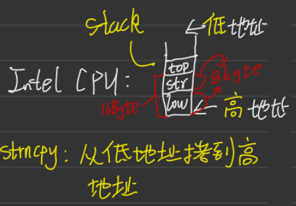

由于是从低地址拷贝到高地址，因此拷贝的16byte会将low覆盖。

### Process Model

​		一会儿切一个Process在CPU的一个核上

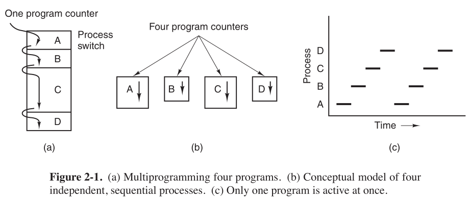

### Process State

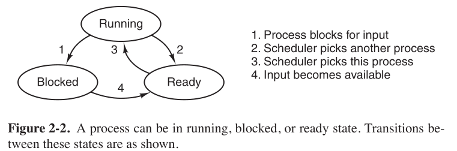

#### Process Creation

> **ps tree, 由 systemd(1号)生成其他进程**

##### Four time for creation

* System Initialization

  > 通过1号Process生成其他Process参与初始化界面等

* Execution of a process creation system call by a running process

  > 用系统调用通过一个运行的Process生成另一个Process, **fork()**

* A user request to create a new process

  > 比如./haha

* Initiation of a batch job (批处理任务)

  > 比如bash

##### Implementation-Creation: fork, exec

* Fork

  > Code
  >
  > ```c
  >   #include <unistd.h>
  >   #include <stdio.h>
  >   int main(){
  >       pid_t pid;
  >       /* 子进程拿到的pid是0 */
  >       pid = fork();
  >       /* 父进程拿到的pid是子进程的，>0 */
  >       
  >       //子进程会走这里
  >       if(pid == 0){
  >           while(1){
  >               sleep(1);
  >               printf("Kylin\n");
  >           }
  >       }
  >       //父进程会走这里
  >       if(pid > 0){
  >           while(1){
  >               sleep(1);
  >               printf("My Favorite\n");
  >           }
  >       }
  >   }
  > ```
  >
  > Result
  >
  > 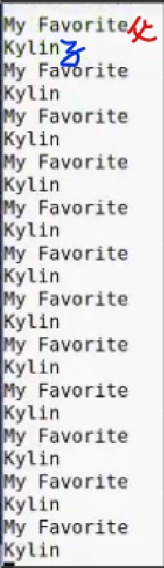|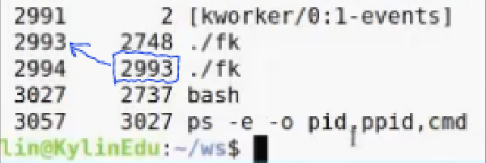
  >
  > **注意：子进程从fork返回处开始执行**
  >
  > *可能的疑问：子进程的PID是0是不是因为从返回处开始执行，导致没有初始化呢？*
  >
  > Another example
  >
  > ```c
  > #include <unistd.h>
  > #include <stdio.h>
  > int main(){
  >    	pid_t pid;
  >    	pid = fork();
  >     
  >        if(pid == 0){
  >            sleep(1);
  >            printf("Kylin\n");
  >        }
  >     
  >        sleep(1);
  >        printf("My Favorite\n");
  > }
  > ```
  >
  > * Question: 该程序会打印几次Kylin，几次My Favorite？
  > * Ans: 1, 2(父进程不会走==0，只会打My Favorite，子进程即打Kylin，也打My Favorite)

* Execl

  > **不会生成Process，在子进程中使用，用于替换代码，用新的，和父进程不一样的**
  >
  > Code
  >
  > ```c
  > #include <unistd.h>
  > #include <stdio.h>
  > int main(){
  >     pid_t pid;
  >     pid = fork();
  >     
  >     if(pid == 0){
  >         /*
  >         	子进程会执行"ls -l"命令，不会打
  >         	haha，因为execl就是子进程的尽头
  >         */
  >         execl("/bin/ls", "-l", 0);
  >         printf("haha\n");
  >     }
  >     
  >     /* 父进程pid > 0，不断打出hehe */
  >     while(1){
  >         sleep(1);
  >         printf("hehe\n");
  >     }
  > }
  > ```
  >
  > Result
  >
  > 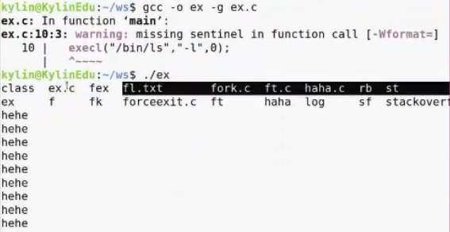

#### Process Termination

时机

* Normal exit (voluntary) **老死**

* Error exit (voluntary) **病死， 打开程序发现打不开，有个返回码**

* Fatal error (involuntary) **事故死， 非法访问，被OS干掉**

* Killed by another process (involuntary) **谋杀**

  >Fatal Error
  >
  >```c
  >#include <unistd.h>
  >#include <stdio.h>
  >int main(){
  >        char* p;
  >        p = 0x0;
  >        *p = 'a';
  >        while(1){
  >            sleep(1);
  >            printf("haha\n");
  >        }
  >}
  >```
  >
  >Result
  >
  >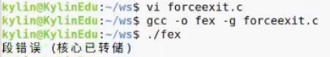
  >
  >Reason
  >
  >* OS强制退出，因为访问了不让访问的0x0

  >Kill Process
  >
  >`kill -9 <pid> //-9表示杀掉，kill只是发指令`
  >
  >现在有一个进程是3539号
  >
  >* 当`kill -9 3539`后的状态
  >
  >  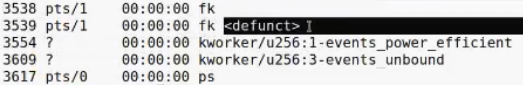
  >
  >* 与此同时，看到3539变为僵尸态
  >
  >  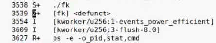
  >
  >现在有俩进程，3700的父进程是3699
  >
  >* 若`kill -9 3699`(也就是把孩子他爸干掉)会
  >
  >  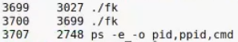
  >
  >* 与此同时，发现这个孩子被1号进程接管
  >
  >  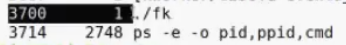

##### Process Termination Implementation

* 尸检时

  > 释放Code Segment, Data Segment, Stack Segment

* 尸检完

  > 释放PCB(**Z+这种状态就在PCB里**)

* Address Space

  > 会释放Page Table

* PCB里的内容

  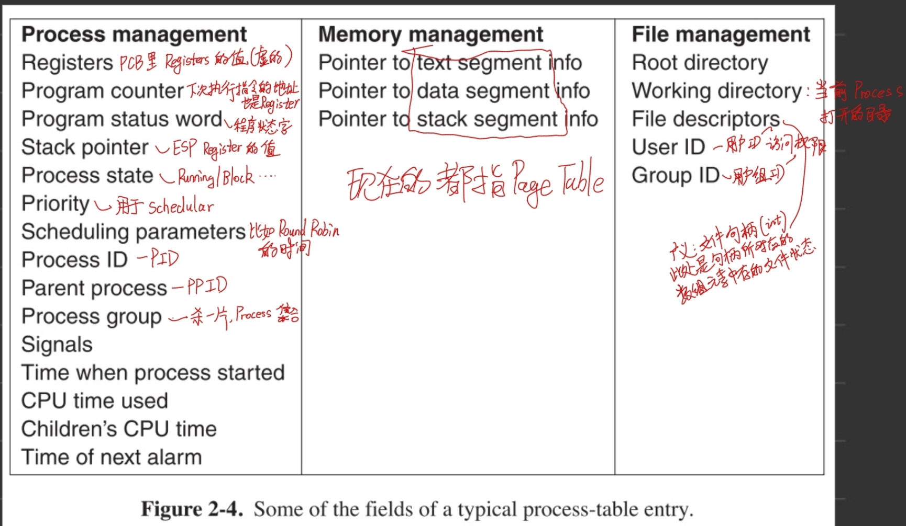

### Process Model Implementation

#### Process Switching

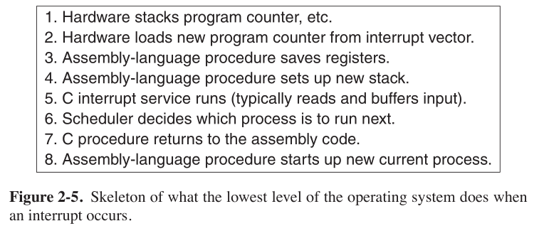

## Thread

### An example

```c
#include <stdio.h>
#include <pthread.h>

int a;

void* th(void* p){
    int i = 0;
    while(1){
        a = 1; i++;
        sleep(1);
        if(i <= 5){
            printf("haha\n");
        }
    }
}

int main(){
    int i = 0;
    a = 0;
    pthread_t myth;
    pthread_create(&myth, NULL, th, NULL);
    while(1){
        i++; sleep(1);
        if(i <= 5) printf("a = %d, hehe\n", a);
    }
}
```

Result

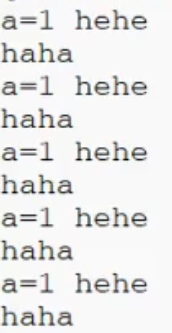

### Definition

>进程中正在执行的代码片段，其可以与其他片段并发执行
>
>**<u>一个Process的不同Thread不共享Stack</u>**

### Thread Model

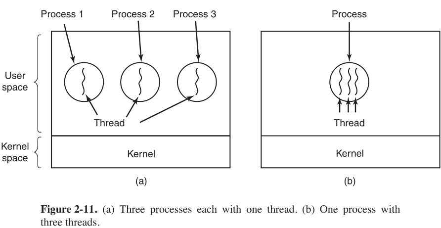

### Why Thread?

1. 在一个application里有多个活动，其中一些会block，这时把app分成几个能并行的顺序线程，模型会更简单
2. Thread比Process更容易创建/消除
3. 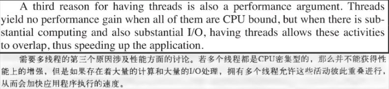
4. Finally, threads are useful on systems with multiple CPUs, where real parallelism is possible.

### Implementation of  thread model

* TCB(Thread Control Block)

  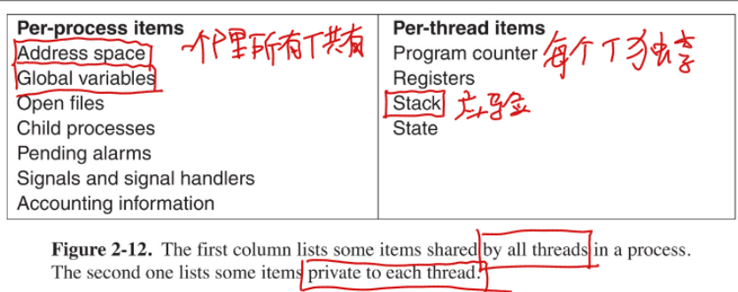

* Three Implementation Way

  1. In User Space

     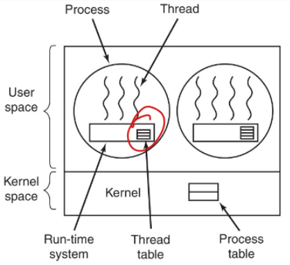

     >优点
     >
     >* 可在不支持Thread的OS上实现
     >* 线程切换快，不用陷入内核
     >* 允许每个Thread有自己的Scheduling Algorithm
     >* 有较好的可扩展性
     >
     >问题：如何实现系统调用
     >
     >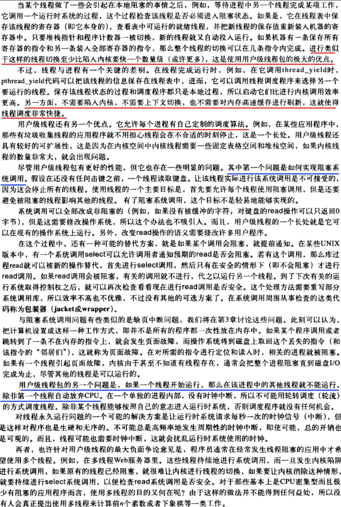

  2. In Kernel Space

     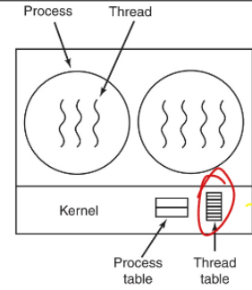

     >* 创建Thread要用系统调用，进入Kernel Space
     >
     >* Process Table保存每个Process的状态等
     >
     >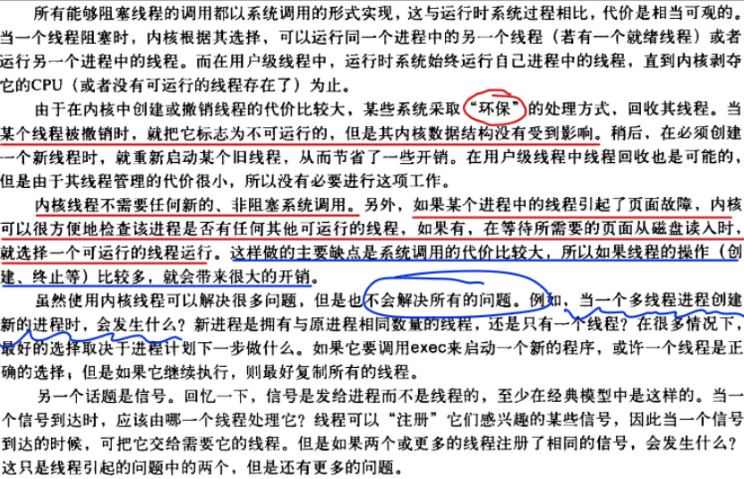

  3. Hybrid

     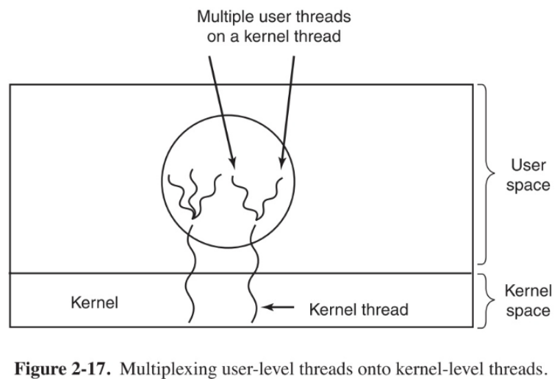

     >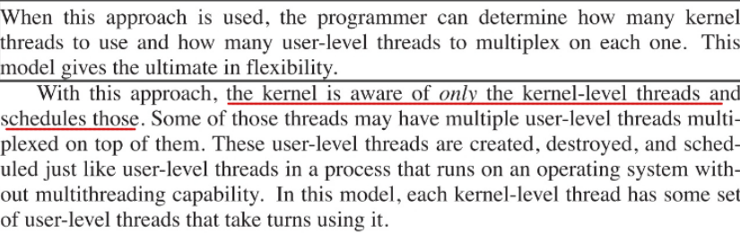

### POSIX Thread

* IEEE定义的线程包：pthread

  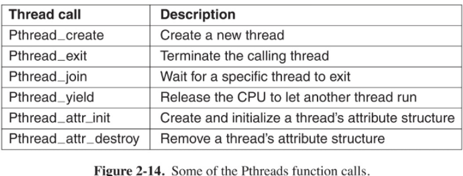

* Why POSIX?

  > 可移植，通用

### Pop-Up Thread

* Definition, Advantage

  >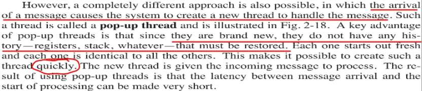
  >
  >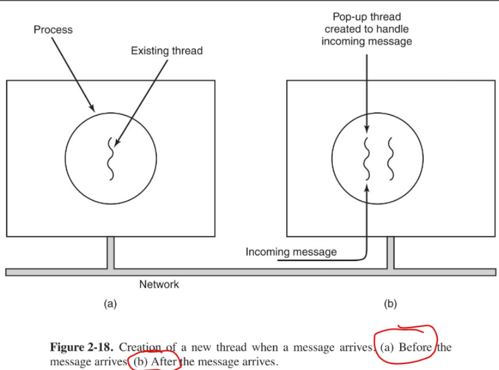

* Why Pop-Up Thread?

  >One reason: remove block
  >
  >传统：将Process或Thread阻塞在一个receive系统调用上，等待message，而Pop-Up Thread在message来时才创建，remove了block

## IPC(Inter Process Communication)

### Race Conditions

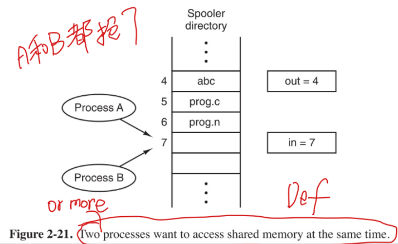

### Critical Region

>**The part of the program where the shared memory is accessed is called the critical region**

### How to avoid race conditions?

* Mutual Exclusion(十字路口)

  >Avoid two processes access critical region at the same time

* **Implementation**

  * **需要满足以下几个时机**

    1. No two processes may be simutaneously inside their critical regions

       >**不同时在critical region**

    2. No assumptions may be made about speeds of the number of CPUs

       >**要是假设了，移植性不好。因为CPU很快，在快的机子上好使，在慢的上就不行**
       >
       >*一个十字路口，一辆车超快，一辆车超慢，那快的wu一下就过去了，根本不会有race condition，但是对于慢的机子，这俩车有多快就不一定了*

    3. No process running outside its critical region may block other processes

       >**不能在critical region里sleep(占着茅坑不拉屎)**

    4. No process should have to wait forever to enter its critical region

       >**不能饿死**

  * Proposals for achieving mutual exclusion

    * Disabling interrupts

      >**关掉中断，CPU不处理中断处理，不执行Scheduling，其他Process都别想运行**
      >
      >*<u>不好，对CPU数量假设了，若有多个CPU，关了中断也没用，其它CPU上的Process还会运行</u>*

    * Lock variables

      1. Strict Alternation

         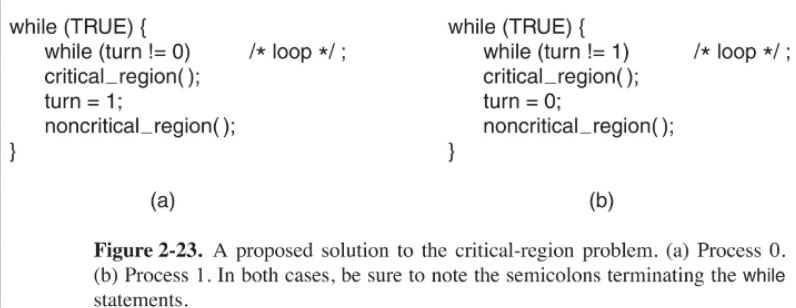

         >**缺点：2个Process/Thread的顺序是固定的，TURN有个初值，则一定是某一个人先来**

      2. Peterson's solution

         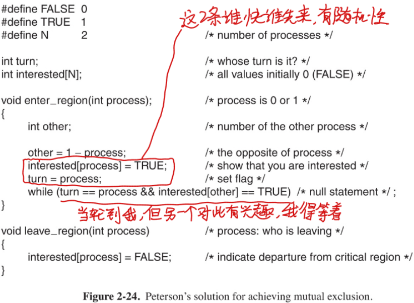

      3. 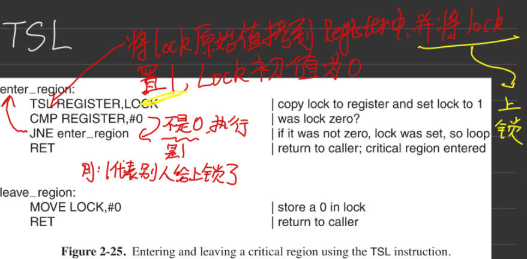

      4. Another TSL - XCHG(Intel)

         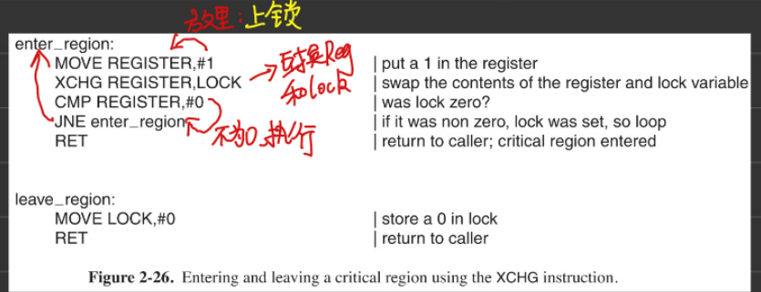

         >**Exercise：gcc用C语言嵌入汇编语言**

    * TSL Busy Waiting缺点

      * 反复查锁，浪费CPU时间
      * Cause Priority inversion problem

  * 改进：发现别人上锁了，歇一会 -> Sleep and Wakeup

    * Implementation - with Producer Consumer

      ```c
      #define N 100	/*number of slots in the buffer*/
      int count = 0;	/*number of items in the buffer*/
      
      void producer(void){
          int item;
          while (TRUE) { 	/*repeat forever*/
              item = produce item( ); 			/*generate next item*/
              if (count == N) sleep(); 			/*if buffer is full, go to sleep*/
              inser t item(item); 				/*put item in buffer*/
              count = count + 1; 					/*increment count of items in buffer*/
              if (count == 1) wakeup(consumer); 	/*was buffer empty?*/
      	}
      }
      
      void consumer(void)
      {
          int item;
          while (TRUE) { 							/*repeat forever*/
              if (count == 0) sleep(); 			/*if buffer is empty, got to sleep*/
              item = remove item(); 				/*take item out of buffer*/
              count = count − 1; 					/*decrement count of items in buffer*/
              if (count == N − 1) wakeup(producer); /*was buffer full?*/
              consume item(item); 				/*pr int item*/
          }
      }
      ```

      >  **问题：若comsumer先来，count == 0，<u>正要sleep但还没sleep的时候</u>，Process切换到producer，最后wakeup，但这时consumer还没睡呢，导致<u>信号丢失</u>。之后，consumer睡了，producer把仓库填满后也睡了，永远睡下去**

    * 改进 - Semaphore

      ```c
      #define N 100							/*number of slots in the buffer*/
      typedef int semaphore; 					/*semaphores are a special kind of int*/
      semaphore mutex = 1;					 /*controls access to critical region*/
      semaphore empty = N; 					/*counts empty buffer slots*/
      semaphore full = 0; 					/*counts full buffer slots*/
      
      void producer(void){
          int item;
          while (TRUE) { 						/*TRUE is the constant 1*/
              item = produce item( ); 		/*generate something to put in buffer*/
              down(&empty); 					/*decrement empty count*/
              down(&mutex); 					/*enter critical region*/
              inser t item(item); 			/*put new item in buffer*/
              up(&mutex); 					/*leave critical region*/
              up(&full); 						/*increment count of full slots*/
          }
      }
      
      void consumer(void)
      {
          int item;
          while (TRUE) { /*infinite loop*/
              down(&full); 					/*decrement full count*/
              down(&mutex); 					/*enter critical region*/
              item = remove item( ); 			/*take item from buffer*/
              up(&mutex); 					/*leave critical region*/
              up(&empty); 					/*increment count of empty slots*/
              consume item(item); 			/*do something with the item*/
          }
      }
      ```

      >**down：-1，若减完>0,继续；=0，继续，但不能再down了;<0，把自己放进睡眠队列**

      **Semaphore - System Call**

      >Code
      >
  >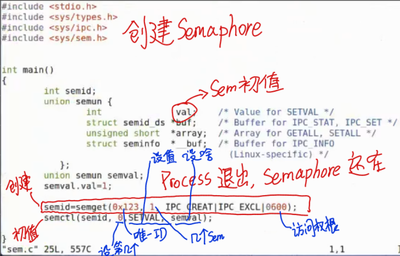
      >
      >Result
      >
      >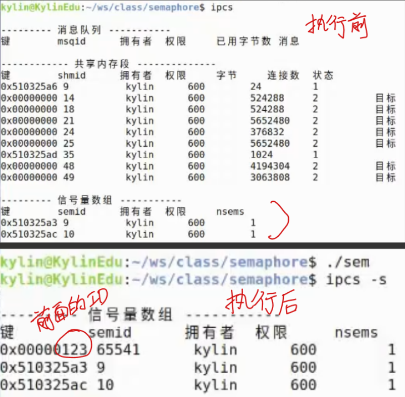

  2个Process和Semaphore
  
  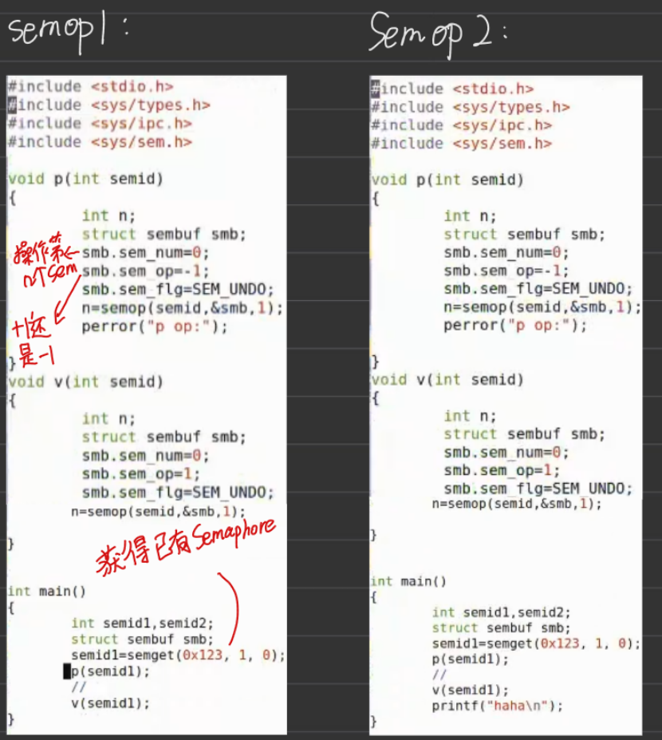
  
  使用GDB调试
  
  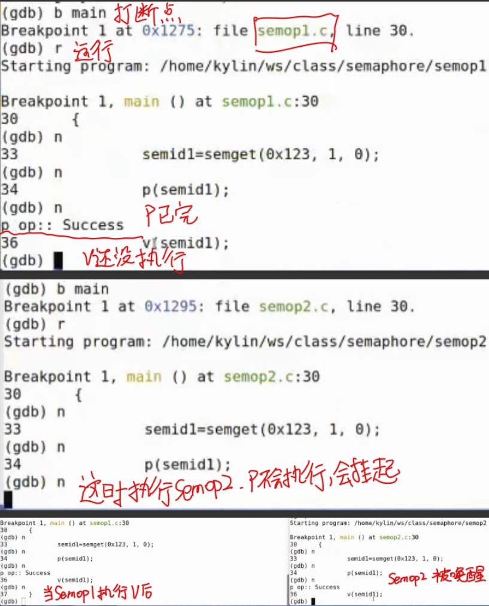

    * Semaphore Disadvantage
    
      >**实现在Kernel Space**，生成和消除代价高
    
  * Mutex: Simplified Semaphore

    >**实现在User Space**

    Pthread Calls

    | Thread call           | Description                 |
    | --------------------- | --------------------------- |
    | Pthread_mutex_init    | Create a mutex              |
    | Pthread_mutex_destroy | Destroy an existion mutex   |
    | Pthread_mutex_lock    | Acquire a lock or **block** |
    | Pthread_mutex_trylock | Acquire a lock or **fail**  |
    | Pthread_mutex_unlock  | Release a lock              |

    Example

    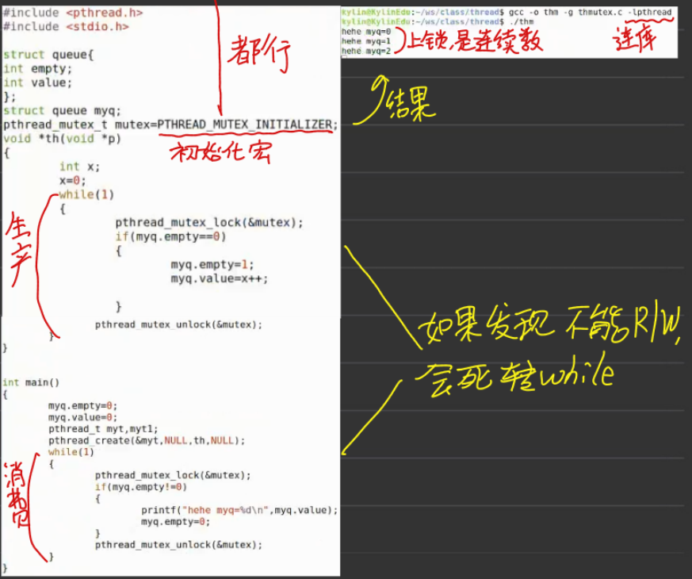

  * Mutex, Semaphore区别

    * 量级
    * **Mutex进程完了就没了，除非塞到Share Memory**

  * Mutex Implementation in ASM

    ```assembly
    mutex lock:
        TSL REGISTER,MUTEX 				 ; copy mutex to register and set mutex to 1
        CMP REGISTER,#0 				 ; was mutex zero?
        JZE ok 							; if it was zero, mutex was unlocked, so return
        CALL thread yield 				 ; mutex is busy; schedule another thread
        JMP mutex lock 					 ; try again
    ok: RET 							; return to caller; critical region entered
    mutex unlock:
        MOVE MUTEX,#0 					 ; store a 0 in mutex
        RET 							; return to caller
    ```

  * Mutex Other: Conditional Variables

    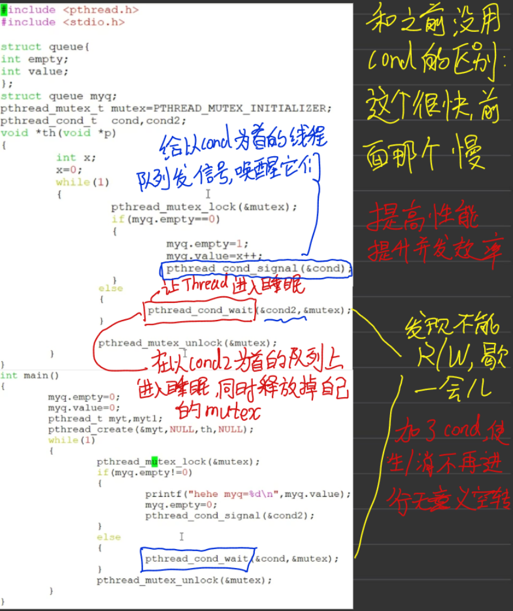

    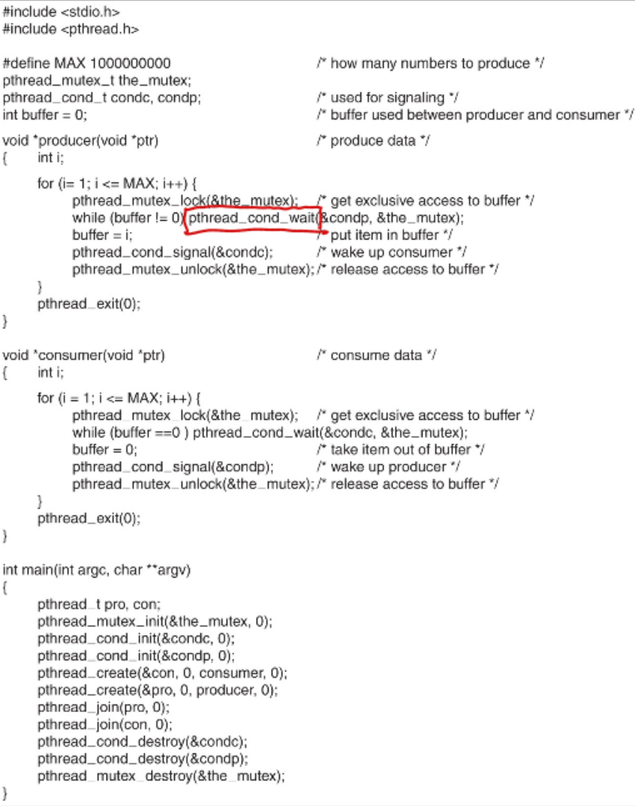

  * Monitor

    >**Semaphore problem: easy to <u>deadlock</u>**
    >
    >What is Dead lock?
    >
    >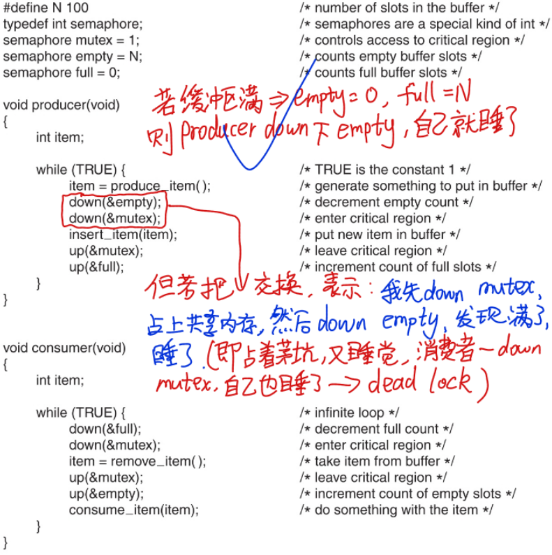
    >
    >结论：
    >
    >​	**使用Semaphore要小心**

    Solution: High level abstraction

    >A monitor is **a collection of procedures, variables, and data structures** that are all **grouped together** in a special kind of module or package. Processes may call the procedures in a monitor whenever they want to, but they **can't directly access the monitor's internal data structures** from procedures declared outside the monitor.

    **Monitor Important Feature**

    > Only one process can be active *in a monitor* at any instant.

    Example - Pascal语言

    ```pascal
    monitor example
    	integer i;
    	condition c;
    	
    	procedure producer();
    	.
    	.
    	.
    	end;
    	
    	procedure consumer();
    	.
    	end;
    end monitor;
    ```

    Monitor - Pseudo Pascal

    ```pascal
    monitor ProducerConsumer
        condition full, empty;
        integer count;
        
        procedure insert(item: integer);
        begin
            if count = N then wait(full);
            insert item(item);
            count := count + 1;
            if count = 1 then signal(empty)
        end;
        
        function remove: integer;
        begin
            if count = 0 then wait(empty);
            remove = remove item;
            count := count − 1;
            if count = N − 1 then signal(full)
        end;
        
        count := 0;
    end monitor;
    
    procedure producer;
    begin
        while true do
        begin
            item = produce item;
            ProducerConsumer.insert(item)
        end
    end;
    
    procedure consumer;
    begin
        while true do
        begin
            item = ProducerConsumer.remove;
            consume item(item)
    	end
    end;
    ```

    Monitor - Java(synchronized)

    ```java
    public class ProducerConsumer {
        static final int N = 100; 						// constant giving the buffer size
        static producer p = new producer( ); 			 // instantiate a new producer thread
        static consumer c = new consumer( );			 // instantiate a new consumer thread
        static our monitor mon = new our monitor( );	  // instantiate a new monitor
        
        public static void main(String args[]) {
            p.start(); 									// start the producer thread
            c.start(); 									// start the consumer thread
        }
        
        static class producer extends Thread {
            public void run() {						// run method contains the thread code
                int item;
                while (true) { 						// producer loop
                    item = produce_item();
                    mon.insert(item);
                }
            }
            private int produce_item() { ... } 		// actually produce
        }
        
        static class consumer extends Thread {
            public void run() {					//run method contains the thread code
                int item;
                while (true) { 							// consumer loop
                    item = mon.remove();
                    consume_item (item);
                }
            }
            private void consume_item(int item) { ... }	// actually consume
        }
        
        static class our monitor { 						// this is a monitor
            private int buffer[] = new int[N];
            private int count = 0, lo = 0, hi = 0; 		 // counters and indices
            public synchronized void insert(int val) {
                if (count == N) go to sleep( ); 	 // if the buffer is full, go to sleep
                buffer [hi] = val; 					// inser t an item into the buffer
                hi = (hi + 1) % N; 					// slot to place next item in
                count = count + 1; 					// one more item in the buffer now
                if (count == 1) notify();			 // if consumer was sleeping, wake it up
        	}
            
            public synchronized int remove() {
                int val;
                if (count == 0) go to sleep(); 		// if the buffer is empty, go to sleep
                val = buffer [lo]; 					// fetch an item from the buffer
                lo = (lo + 1) % N; 					// slot to fetch next item from
                count = count − 1;					 // one few items in the buffer
                if (count == N − 1) notify(); 		// if producer was sleeping, wake it up
                return val;
            }
            private void go_to_sleep( ) { 
                try{wait( );} catch(Interr uptedException exc) {};}
            }
    }
    ```

  * Message Passing

    Monitor Disadvantage

    >Monitor之间也需要互斥，因为管程也是一个编程语言概念，**编译器必须要识别管程并用某种方式对其互斥进行安排**。但实际中，**如何让编译器知道哪些过程属于管程，哪些不属于？**
    >
    >如果一个分布式系统具有多个CPU，并且每个CPU拥有自己的私有内存，他们通过一个局域网相连，那么，这些原语将失效。这里的结论是：Semaphore太低级了，而管程在少数几种编程语言之外又无法使用，并且，这些原语均未提供机器间的信息交换方法，所以还需要其他的方法——Message Passing
    >
    >即，Monitor，Semaphore, Mutex解决的也都是一台电脑内部的Process, Thread互斥，没解决多台电脑合作时的互斥

    Message Passing System Call

    * 像Semaphore而不像Monitor，是系统调用而不是语言成分

      > Message Passing使用两条原语来实现**进程**间通信
      >
      > ```c
      > send(destination, &message);
      > receive(source, &message);
      > ```

    * Example

      ```c
      #define N 100							/*number of slots in the buffer*/
      void producer(void)
      {
          int item;
          message m; 							/*message buffer*/
          while (TRUE) {
              item = produce item( );			 /*generate something to put in buffer*/
              receive(consumer, &m); 			 /*wait for an empty to arrive*/
              build message(&m, item); 		 /*constr uct a message to send*/
              send(consumer, &m);				 /*send item to consumer*/
          }
      }
      void consumer(void)
      {
          int item, i;
          message m;
          for (i = 0; i < N; i++) send(producer, &m); 	  /*send N empties*/
          while (TRUE) {
              receive(producer, &m); 						/*get message containing item*/
              item = extract item(&m); 					/*extract item from message*/
              send(producer, &m); 						/*send back empty reply*/
              consume item(item); 						/*do something with the item*/
          }
      }
      ```

  * Barriers

    用于一组Process同步

    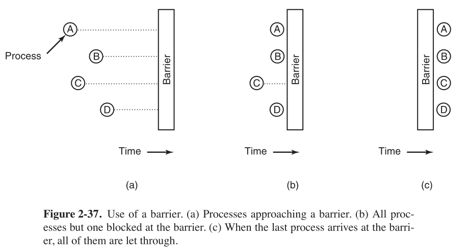

## Scheduling

* 用于所有Process之间(之前的IPC是两个或几个Process之间)

### Problem

* **一些Process已经就绪，哪个该放到CPU上跑呢？**
* **调度为何不是时时刻刻发生，而是有间隔的发生？**

### When to Schedule?

* Process creation
* Process exit
* Process blocks on I/O
* I/O interrupt (**比如网络包到了，会发一个中断，运行接包的Process**)

### Scheduling Algorithm

>Category
>
>1. Preemptive vs Non-Preemptive
>
>2. Batch
>
>>批处理任务执行的好，就是
>>
>>* Throughput(吞吐量) -> Max
>>* Turnaround time -> Min
>>* CPU utilization(利用率) -> Max
>
>3. Interactive
>
>4. Real time
>
>Ps
>
>* Throughput - the number of processes that complete their execution per time unit
>* Turnaround time - the interval from submission to completion
>* Waiting time - amount of time a process has been waiting in the ready queue
>* Response time - amount of time it takes from when a request was submitted unitl the first response is produced, not output (for time-sharing environment)

#### FCFS Example

| Process | Burst Time |
| ------- | ---------- |
| P1      | 24         |
| P2      | 3          |
| P3      | 3          |

Arrive order: P1, P2, P3

解决思路：画Gannt Chart

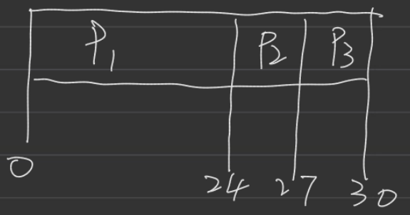

Turnaround time for

> P1 = 24; P2 = 27; P3 = 30

Average turnaround time

> (24 + 27 + 30) / 3 = 27

#### SJF Example(Non Preemptive)

| Process | Arrival Time | Burst Time |
| ------- | ------------ | ---------- |
| P1      | 0.0          | 7          |
| P2      | 2.0          | 4          |
| P3      | 4.0          | 1          |
| P4      | 5.0          | 4          |

* 因为P1先到，到的时候P2, P3, P4还没来，所以先P1
* P1完事，此时，P2, P3, P4都来了，选最短的P3先来

Gannt Chart

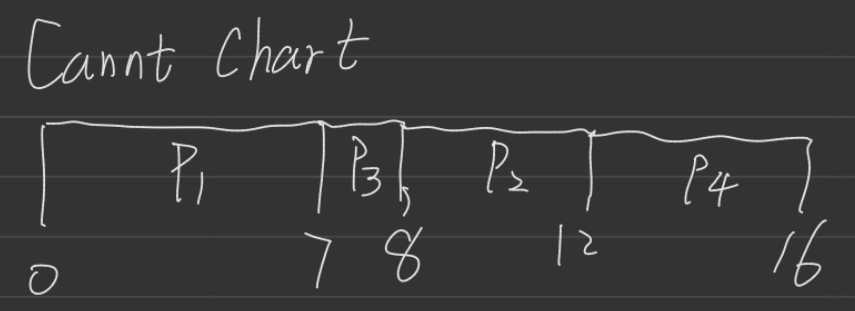

Average turnaround time

>[(7 - 0) + (8 - 4) + (12 - 2) + (16 - 5)] / 4 = 8

#### SJF Example(Preemptive)

| Process | Arrival Time | Burst Time |
| ------- | ------------ | ---------- |
| P1      | 0.0          | 7          |
| P2      | 2.0          | 4          |
| P3      | 4.0          | 1          |
| P4      | 5.0          | 4          |

* P1先来，2s后，P2来了，P1还剩5s，但是P2只用4s，所以先P2
* P2运行2s后，P3又来了，此时P1->5s, P2->2s, P3->1s, 所以P3
* 1s后，P3完事，P4来，此时P2->2s, P1->5s, P4->4s，所以先P2, 后P4，最后P1

Gannt Chart

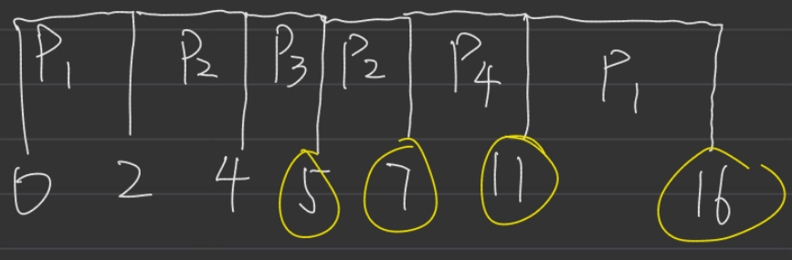

Average turnaround time

>[(16 - 0) + (7 - 2) + (5 - 4) + (11 - 5) / 4]  = 7

### Interactive System Scheduling

#### Round Robin

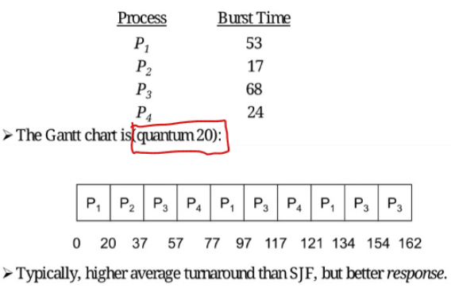

#### Priority Scheduling

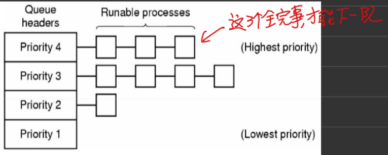

#### Multiple Queue

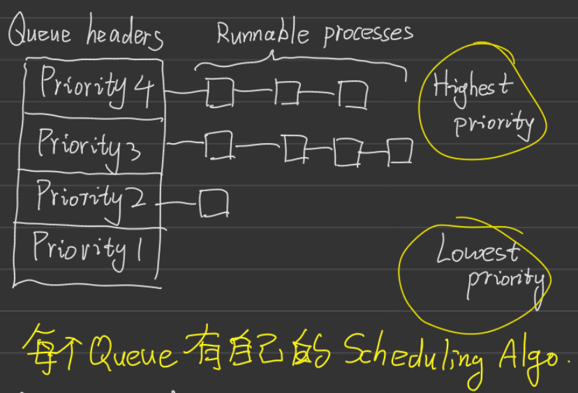

#### Guaranteed Scheduling

若Process已经Ready，保证10s内能运行1s

> He gives you a "promise" and make sure he will keep it.
>
> * Example
>   * Promise: n processes in system, each will get 1/n CPU time
>   * Resource Reservation Scheduling Algorithms

**应用：花多少米，得多少时间**

#### Lottery Scheduling

* Give processes lottery tickets for various system resources, such as CPU time
* Whenever a scheduling decision has to be made, a lottery ticket is chosen at random, and **the process holding that ticket gets the resource**

#### Fair-Share Scheduling(FSS)

* 可以看做Guaranteed Scheduling的特例
* A和B交一样钱，但是A有10000000个Process，B就1个，则CPU全被A给抢了，那么就要保证A和B不管有几个Process，CPU时间都要平分

#### Real-Time Scheduling

* Hard Real-Time：必须在时限前搞定(**飞机计算，否则飞机炸**)
* Soft Real-Time：可以通融(**网络视频，卡了还行**)

### Schedulable

>可调度序列
>
>There's existed one scheduling sequence that make **every process** meet their deadline

### Policy Versus Mechanism

Separate the scheduling mechanism from the scheduling policy

* Key Idea: User can decide which scheduling algorithm is to use

* Scheduling algorithm is parameterized in some way, but the parameters can be filled in by user processes

  > **Exercise: 把Thread绑到CPU的一个核上(Linux)**

### Thread Scheduling

| Implementation in: | Kernel Space | User Space                      |
| ------------------ | ------------ | ------------------------------- |
| Cost               | Big          | Small                           |
| Other              | /            | 可实现应用特定Scheduler，效果好 |

## Classical IPC Problems

### Dining Philosophers Problem

* 哲学家：吃/思考
* 吃需要2个fork
* 一次拿一个fork
* 解决问题，还要防止deadlock

A wrong solution - may cause deadlock

```c
#define N 5 								/*number of philosophers*/
void philosopher(int i) 					 /*i: philosopher number, from 0 to 4*/
{
    while (TRUE) {
        think(); 							/*philosopher is thinking*/
        take fork(i); 						/*take left for k*/
        take fork((i+1) % N); 				 /*take right for k; % is modulo operator*/
        eat(); 								/*yum-yum, spaghetti*/
        put fork(i); 						/*put left for k back on the table*/
        put fork((i+1) % N); 				 /*put right for k back on the table*/
    }
}
```

**如果5个人都拿左边的fork，全部sleep -> deadlock**

解决：引入中控

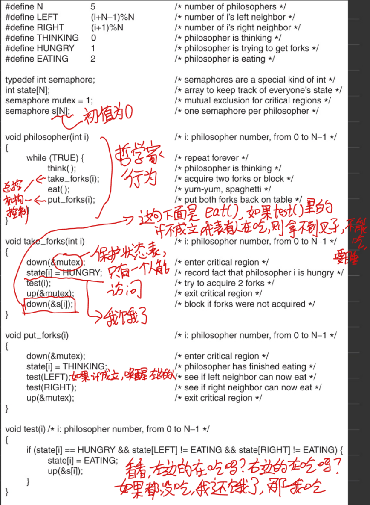

> IPC Design
>
> * Prevent deadlock
> * 尽量多并发

### Readers and writers Problem

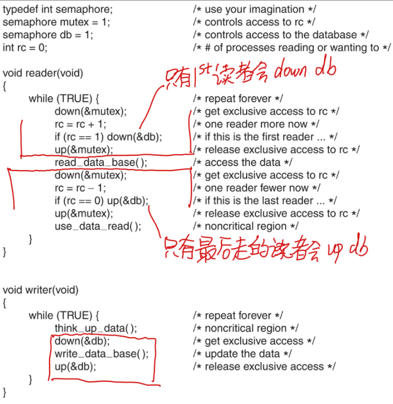

**如果有读者，那么读者随便进，写者不能进，因为后来的读者，rc != 1，不会走down(&db)这句话**

### Sleeping Barber

* 理发店里有一位理发师、一把理发椅和n把供等候理发的顾客坐的椅子
* 如果没有顾客，理发师便在理发椅上睡觉
* 一个顾客到来时，它必须叫醒理发师
* 如果理发师正在理发时又有顾客来到，则如果有空椅子可坐，就坐下来等待，否则就离开

```c
#define CHAIRS 5               /* # chairs for waiting customers */
typedef int semaphore;         /* use your imagination */
semaphore customers = 0;       /* # of customers waiting for service */
semaphore barbers = 0;         /* # of barbers waiting for customers */
semaphore mutex = 1;           /* for mutual exclusion */

//critical region
int waiting = 0;               /* customers are waiting (not being cut) */
 
void barber(void){
    white (TRUE) {
        /**
        * 没有顾客，睡觉；
        * 有顾客，down完还要接着剪
        */
        down(&customers);      /* go to sleep if # of customers is 0 */
        
        /* 若能执行到这儿，waiting肯定被加了 */
        down(&mutex);          /* acquire access to 'waiting' */
        waiting = waiting − 1; /* decrement count of waiting customers */
        up(&barbers);          /* one barber is now ready to cut hair */
        up(&mutex);            /* release 'waiting' */
        
        cut_hair();            /* cut hair (outside critical region) */
    }
}
 
void customer(void){
    down(&mutex);              /* enter critical region */
    if (waiting < CHAIRS) {    /* if there are no free chairs, leave */
        
        //抢椅子
        waiting = waiting + 1; /* increment count of waiting customers */
        
        up(&customers);        /* wake up barber if necessary */
        up(&mutex);            /* release access to 'waiting' */
        down(&barbers);        /* go to sleep if # of free barbers is 0 */
        get_haircut();         /* be seated and be serviced */
    } else {
        //椅子满，走人
        up(&mutex);            /* shop is full; do not wait */
    }
}
```

### Driver and  Seller

原则

* IPC -> 同步，互斥，同步互斥
* 同步：semaphore初值为0，需要等别人的进程要p操作，被别人等的进程要v操作
* 互斥：semaphore初值为进程数量

```c
//司机和售票员问题
Semaphore driver = 0, door = 0;

/*
 司机的活动：启动车辆，正常行车，到站停车
 售票员的活动：关车门，售票，开车门
 	注意：当发车时间到，售票员关门后司机才能开车，售票员开始售票；
 	到站时，司机停车后，售票员才能打开车门
*/
Driver(){
    /* 要等售票员关门后才能开车，等别人 */
    P(drive);
    
    Drive();
    CarMove();
    Stop();
    
    /* 停车后允许售票员开门 */
    V(door);
}

Ticket_Seller(){
    DoorClose();
    
    /* 关门后允许司机开车 */
    V(drive);
    SellTicket();
    
    /* 要等司机停车后才能开门，等别人 */
    P(door);
    DoorOpen();
}
```

## Memory Management

### MM Overview

#### **What will happen if no Memory Abstraction?**

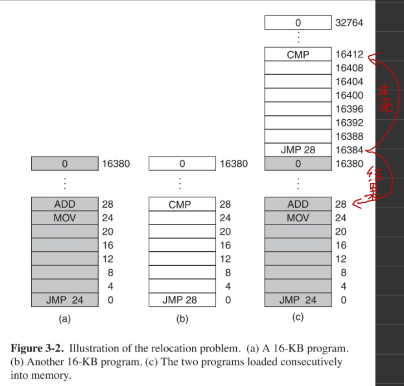

#### **How to solve?**

Propose an Abstract Concept - **Address Space**

> **Each process have its own space, whose address starts at  0**

Implementation: Use **Static relocation(静态重定位)**

> 若一个Process装在16384号上，则该程序的每一个程序地址加上16384，则1号就是16385
>
> **Static relocation Problem**
>
> 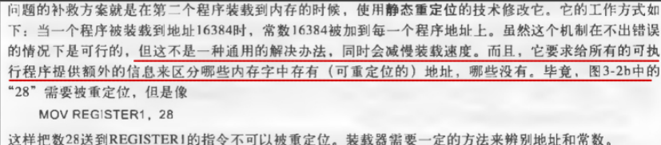

#### **Memory Abstraction**

Solution of Static relocation Problem -> **Dynamic**

How to implement address space?

> **Base register + Limit register**

**Base and Limit Registers**

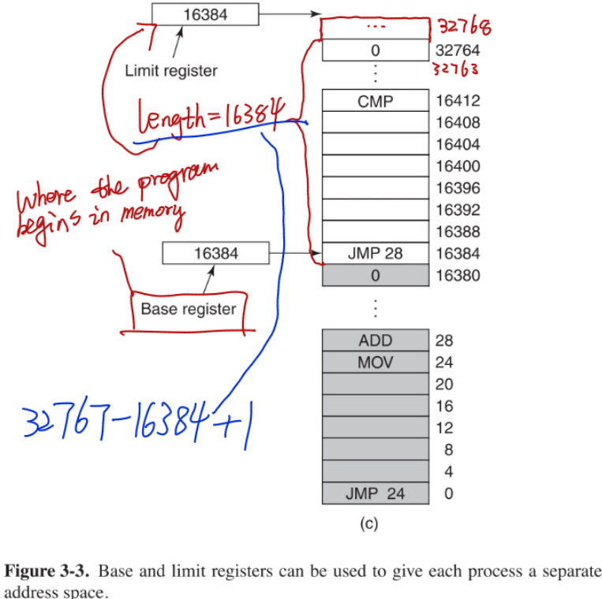

Proplems all solved?

* No!!!
  * <u>What to do if we **have not enough memory when running multiple programs?**</u>

Use Swap

> Swap
>
> *Bringing in each process in its entirety, running it for a while, then putting it back on the disk*

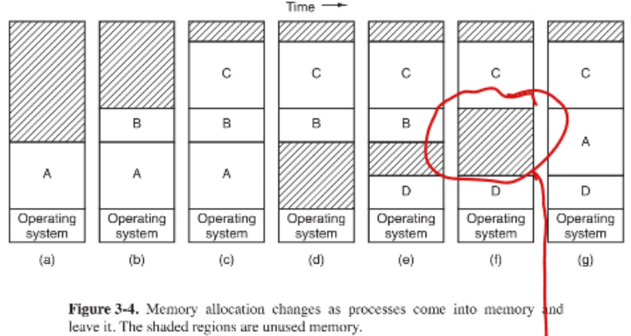

Swap Problem

产生空洞(hole, Fragment, 即上图中的阴影)，消掉要把所有Process向下移动(downward)，称为Memory Compaction(内存紧缩)，但是这样做会**浪费CPU时间**

Another Problem

* Dynamic relocation Problem

  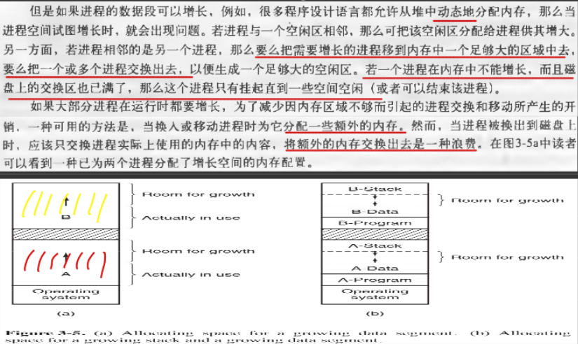

#### Free Space Management(**Dynamic**)

* bit map & list

  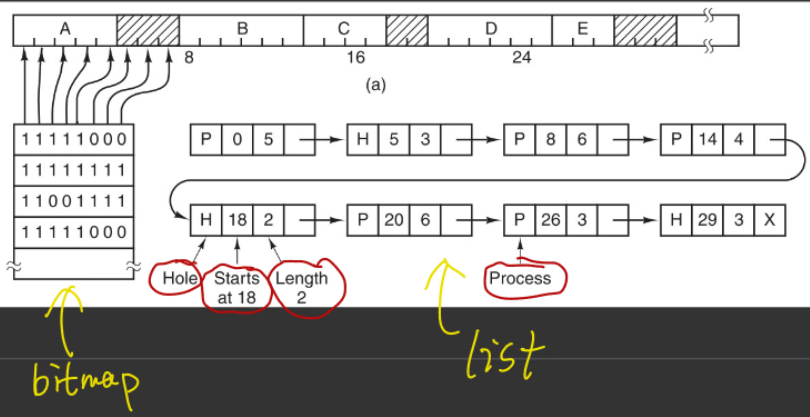

* 对于list的升级：List Management

  当X结束时，更改List

  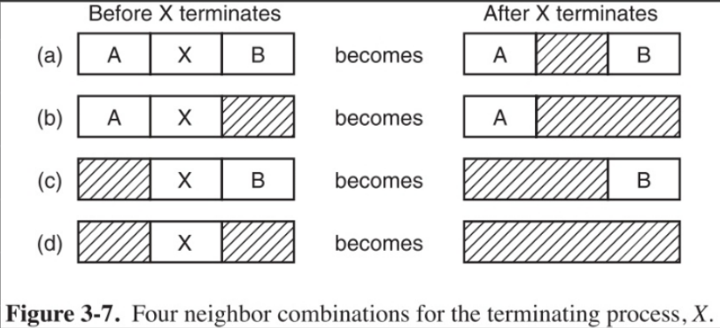

* Four methods to insert A new Process

  1. First Fit: 找第一个合适的洞
  2. Next Fit: **slightly worse than First Fit**
  3. Best Fit: **比First Fit慢，比First Fit和Next Fit浪费内存，产生大量小空闲区**
  4. Worst Fit: 选最大的洞

  >As an example of first fit and best fit, consider example forward again. If a block of size 2 is needed, first fit will allocate the hole at 5, but best fit will allocate the hole at 18

### Virtual Memory

Problem

* If program is too large, bigger than main memory, what will happen?
* Swap --- Address in program may need modification when swapping

How to solve this Problem?

* **Virtual Memory?**

  > * Each program has **its own address space**, which is broken up into chunks called pages.
  > * Pages can be swapped out

MMU

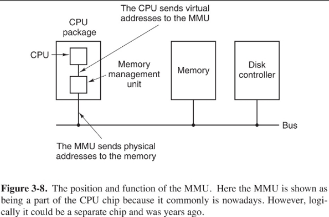

An Example

> 2个Process，都定义变量a，一个a是1，一个a是2，打印a的地址，发现地址相同，但是值明明不同
>
> -> **Virtual Address**

Why introduce Virtual Address?

1. 把进程地址空间分离，防止程序之间地址被共用或恶意攻击
2. 内存效率原来很低，会大量swap，现在swap就少了
3. 原来swap回来的Process的地址总是变

#### **Paging**

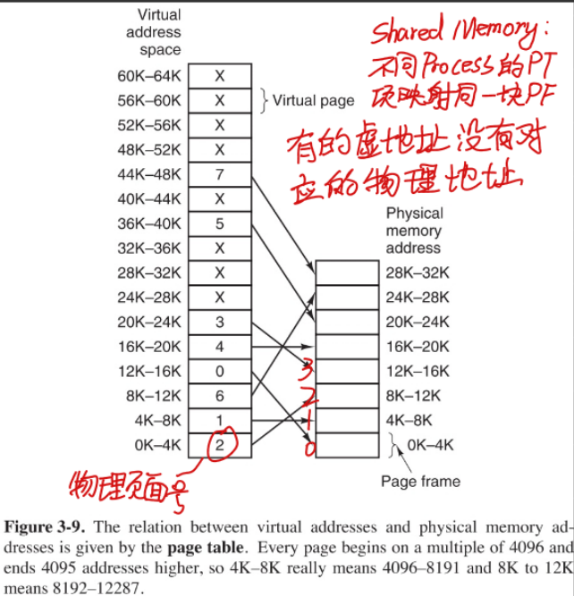

#### **Virtual Address Translation**

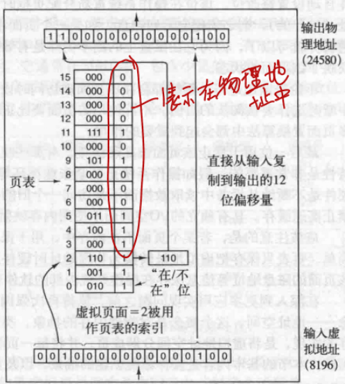

假设虚拟地址64KB，物理地址32KB，4KB一个Page，则虚拟16Page，物理8Page

* 要翻译：0010 0000 0000 0100 (16bit)

  1. 除以4KB -> 2^12B并向下取整：

     > **也就是去掉末尾12位，只留前4位**
     >
     > 0010 -> VPage号，也就是2号VPage
     >
     > 其中的PPage：110 -> 6号

  2. 算虚拟地址的位置与虚拟页面(起始位置)的偏移量：

     > 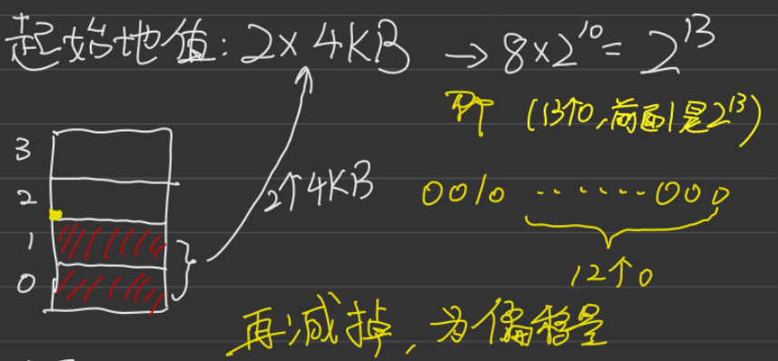
     >
     > 则最终物理地址：<u>110</u> <u>0000 0000 0100</u>
     >
     > ​							   ^              ^
     >
     > ​						  PPage6    偏移量

**Page Table Entry**

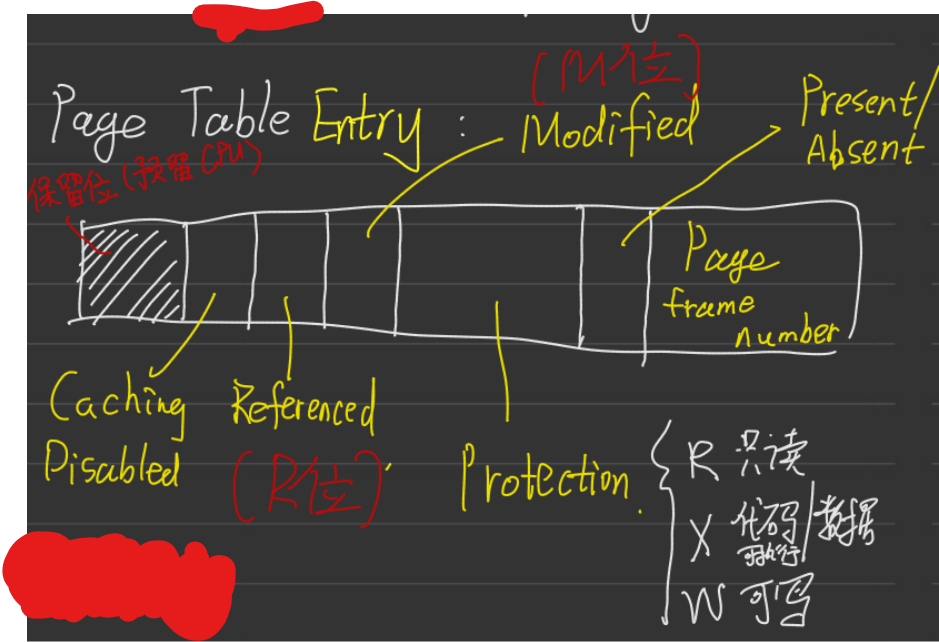

加速分页

* TLB：转换检测缓冲区(Translation Lookaside Buffer)

  > 计算机的一个小型硬件设备，**将虚拟地址直接映射到物理地址，<u>而不必再访问页表</u>**，这种设备成为转换检测缓冲区(Translation Lookaside Buffer, TLB)，又称相联存储器(associate memory)，或快表，**通常在MMU中**，包含少量的表项
  >
  > 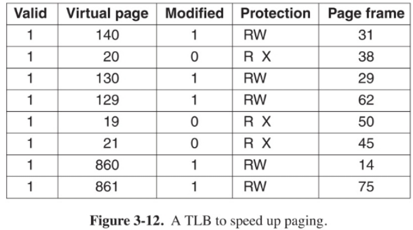

Multilevel Page Tables

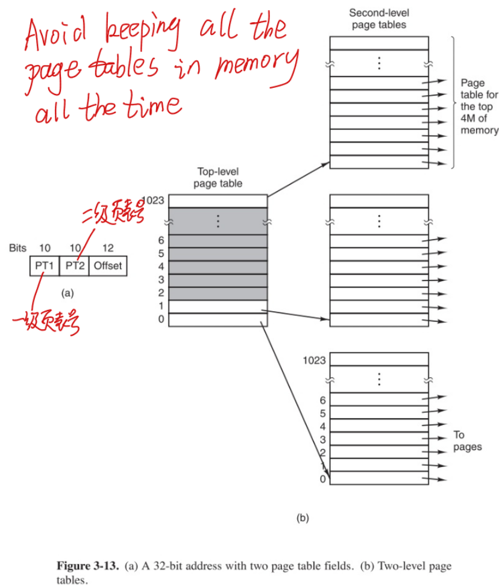

Inverted Table

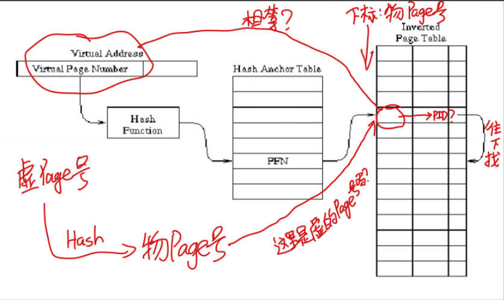

> 区别
>
> * 普通Page Table每一个Process一张
> * Inverted Table全局就一张

#### Page Replacement Algorithms

Page Fault: 缺页中断(**Abscent位**)

* Optimal Page Replacement

  > 替换最久才会用到的Page，则Page Fault最少，抖动最小

  Ex: 内存访问序列：0 1 3 2 2 5 3 4 2 1，3个物理Page，计算Page Fault数

  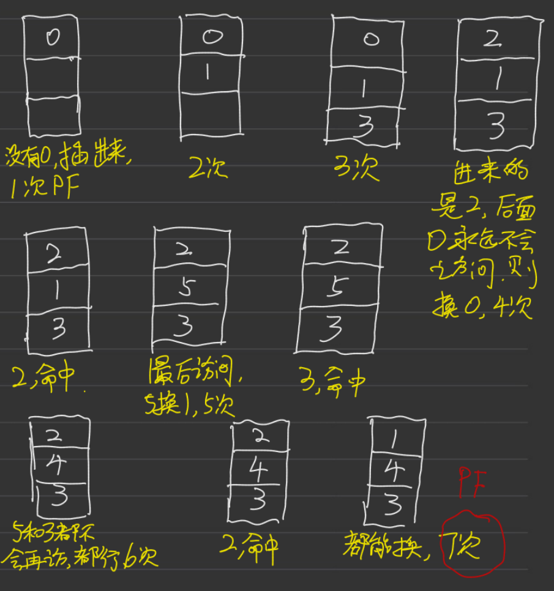

  PS：**这里的页面号都是虚拟的！！！**

  缺点：不可实现

* Least Recently Used(LRU)

  Ex: 内存访问序列：0 1 3 2 2 5 3 4 2 1，3个物理Page，计算Page Fault数

  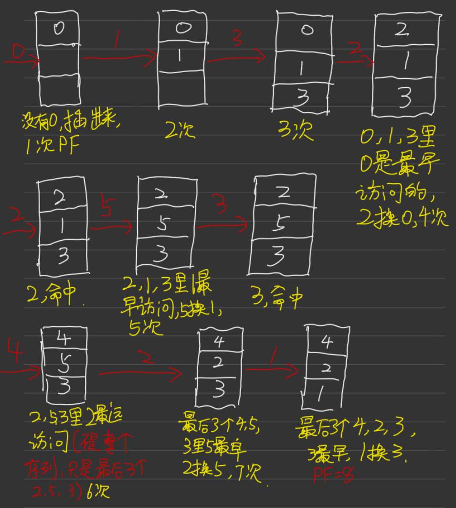

  LRU另一种图解

  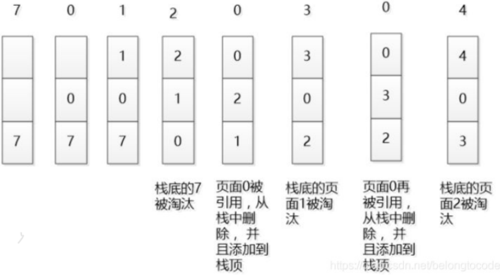

  使用硬件模拟LRU

  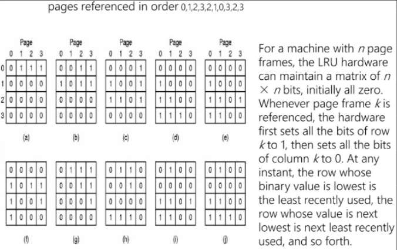

  硬件模拟缺点：管理成本巨大，Matrix太大

  近似LRU: NFU(Not Frequently Used)

  > 要个计数器，每个时钟中断，扫描所有Page，查每一个Page的R位，把R位值(0或1)加到计数器上，每次替换计数最少的

  NFU缺点

  * 在2个时钟中断之间，某个Page可能已经被访问多次
  * **It never forgets anything**

  NFU改进：Let it forget!

  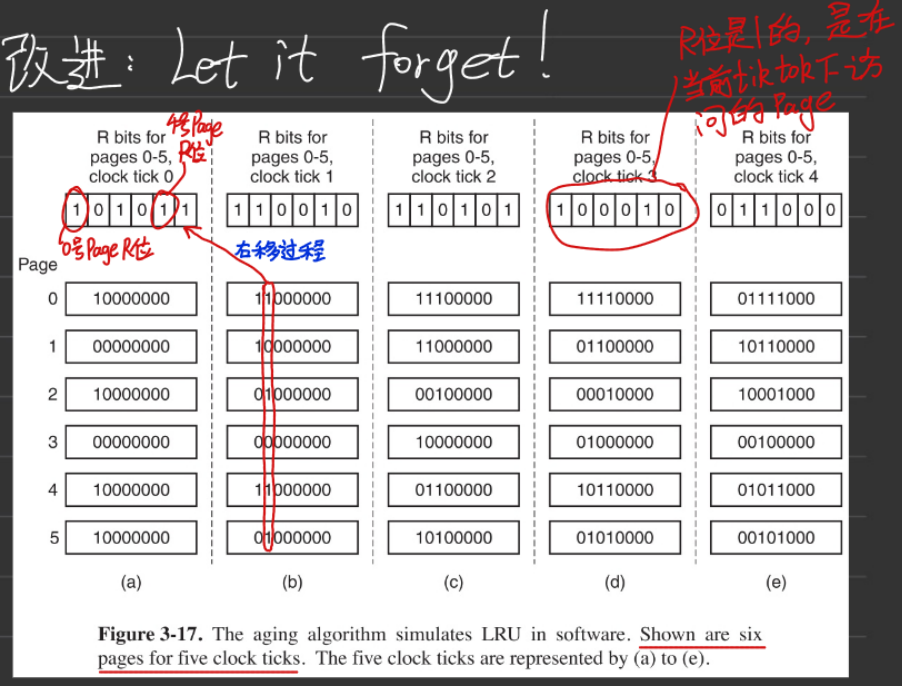

* NRU(Not Recently Used)

  * 使用R位和M位

  * 定期清零R位：最近没被访问过

  * M位不清零：假设1个Page要被换出去，**M位是0，表示<u>从磁盘加载进来后再也没改动过</u>，因此只需要释放掉再加新的；若是1，<u>则应先刷到磁盘上保存修改</u>**，然后才能换新的Page，这时候M位才能清零

  * 经过以上操作，所有Page被分为4类

    1. R = 0, M = 0 -> Not refferenced, not modified

    2. R = 0, M = 1 -> Not refferenced, modified

    3. R = 1, M = 0 -> Refferenced, not modified

    4. R = 1, M = 1 -> Refferenced, modified

       **从上到下，<u>被替换</u>优先级降低**

* Clock Page Replacement

  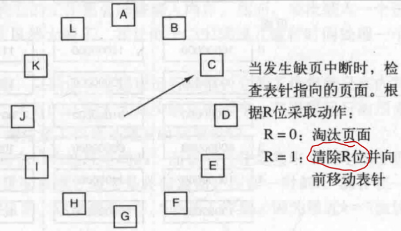

  > 为什么R位要Clear?
  >
  > 如果不Clear，那早晚所有的Page都会满

* Working Set Page Replacement

  Working Set：干什么事，访问的Page基本是固定的

  思想：替换那些**不是我干这件事儿时**访问的Page

  但是，OS不知道你经常访问哪些Page

  推测

  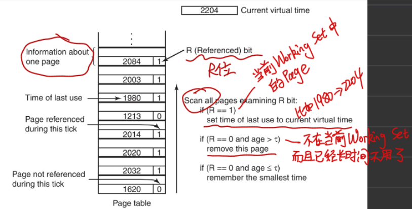

* WSClock = Clock + Working Set

  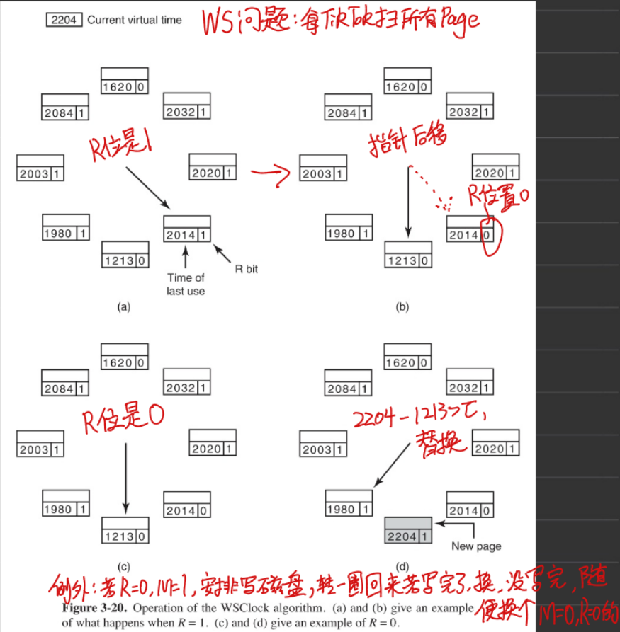

* FIFO(First in First out)

  想象一个Stack，栈**底**的是最早访问的，替换它

  Disadvantage：随着内存增加，Page Fault数不降反生(**命中率低**)

* 改进FIFO: Second Chance

  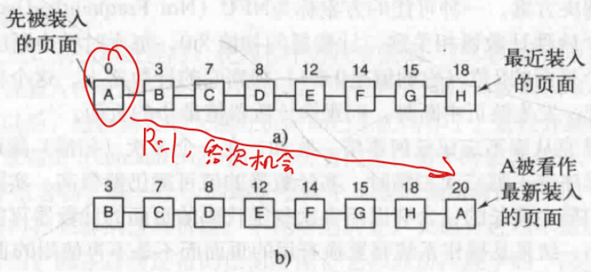

  > 栈底的元素的R位如果是
  >
  > * 0：拍死，换出去
  > * 1：再给次机会，放到栈顶

### Design Issues

#### Local & Global

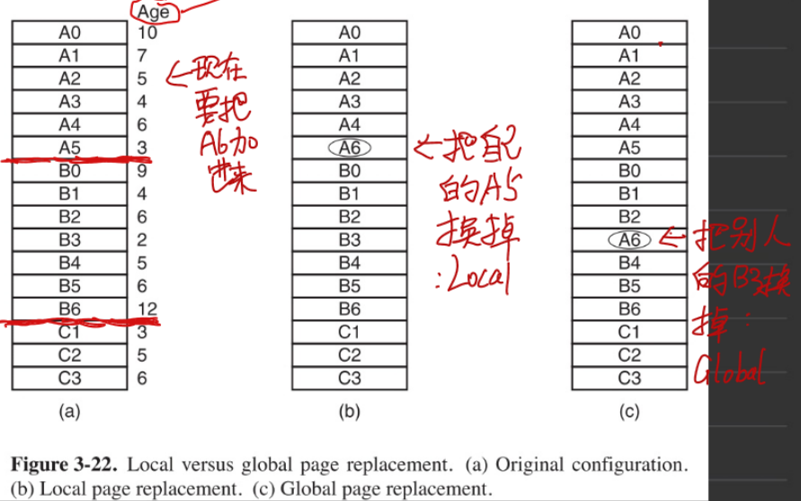

> **Age: 上次访问的时刻，越小表示越久没用了**

#### Page Fault Frequency(PFF)

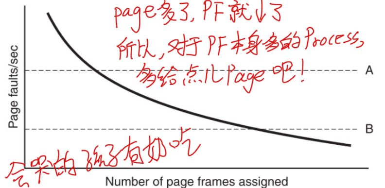

> Page Fault越多，Page分配越多
>
> **前提(Precondition)：当前Process的Working Set不超过Memory Size，不然也没法儿多分Page，对吧！**
>
> 多分的Page肯定不是自己的，所以PFF建立在Global Replacement上

#### Thrashing

一个Page刚被换出去，又要被访问，就又被换回来，然后又出去又回来……

Solution：加内存！

但是，要是没米捏？

* Reduce number of processes competing for memory

  > **原来5个Process同时，现在3个……**

* Swap one or more to disk, divide up pages they held

* Clean Policy：加速，降Page Fault

  > Page Fault数是命中率的指标 —— Spread Zhao

  不要等内存脏页满了才将脏页刷到磁盘上

  > **比如，保证任何时可都有10%free pages**

* **Page Size**

  当Page Size大了，Page Table就小，更好管理，但太大，一个Page Table浪费得多了

  为进程分配最优Page Size

  * s: 进程平均大小
  * p: 一个Page大小
  * 则s/p：一个Process要几个Page
  * **e：一个Page Table Entry大小**
  * 则se/p：一个Process**在内存中实现的大小**
  * p/2：在最后一个Page通常占不满

  则Overhead(开销) = se/p + p/2

  > **比如s = 10KB，一个Page4KB，e为4B，那么se/p + p/2 = 8B + 2KB，有必要？**
  >
  > 上面的疑惑，主要是因为s并不是10KB，是经过好多测量得出来的
  >
  > **se/p近似为Page Table大小**，p/2这个开销虽然是在Virtual Address Space中的浪费，但是**每个虚拟地址还是映射一个实际的物理地址啊**！比如s还是10KB，但Page若分成1个GB，那仅用1个Page Table Entry(4B)就能表示这10KB的程序，但是，**那些剩下的Page Table中的地方，还映射着物理地址，并且永远也不会被用到**
  >
  > 因此，Overhead可以写成
  >
  > Overhead = Page Table大小 + 浪费的虚拟地址的个数
  >
  > ​				 = Page Table大小 + 浪费的**物理**地址的个数
  >
  > ​				 =          se/p           +			   p/2
  >
  > p/2的计算：
  >
  > 一个Page有P个地址，从全空到全满，有P+1种情况，则等概率分布，期望
  >
  > E = [1 / (p + 1)] * (0 + 1 + ... + p) = p/2
  >
  > *问题：为什么se/p不判一下s/p的余数是否为0*

  之后，将Overhead两边对p求导，求出p(optimise) = 根号下2se

  **当s = 1MB，e = 8B时，算出p = 4KB**

#### Increase Address Space

如果内存足够大，Single address Space就够了

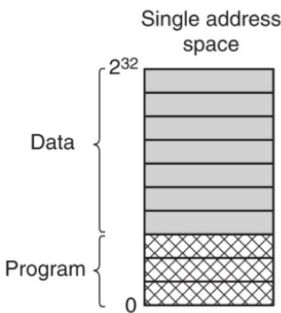

但是不够咋办？

比如16位机子上，分成了Ispace，Dspace

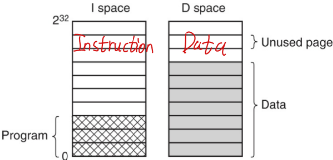

这样，一个Process有2个Page Table，分别在要翻译的时候对应自己的，这样变向扩大了内存(**运用Dynamic relocation**)

#### Shared Memory

* Create: shmget

  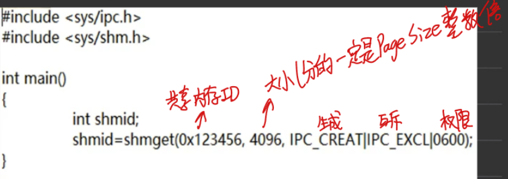

  > 查看：**ipcs**

* Write: shmat(Shared Memory Attach)

  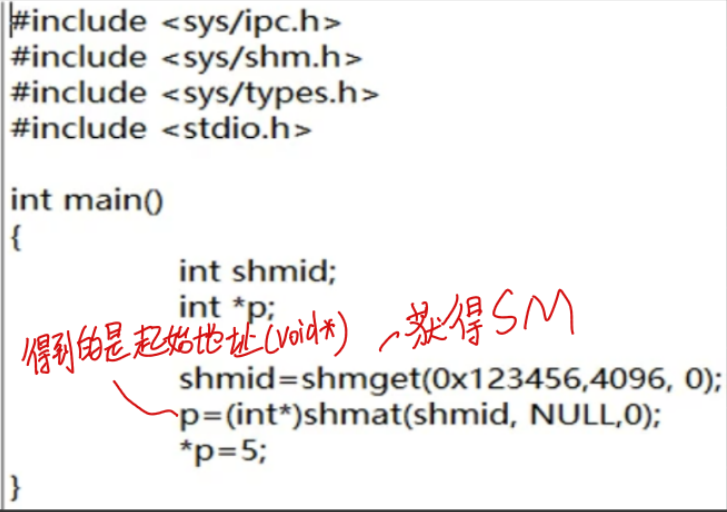

* Read

  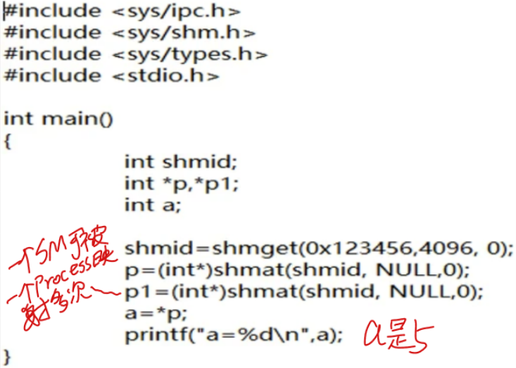

#### Shared Library

* Shared Memory -> Data Share
* Shared Library -> Code Share

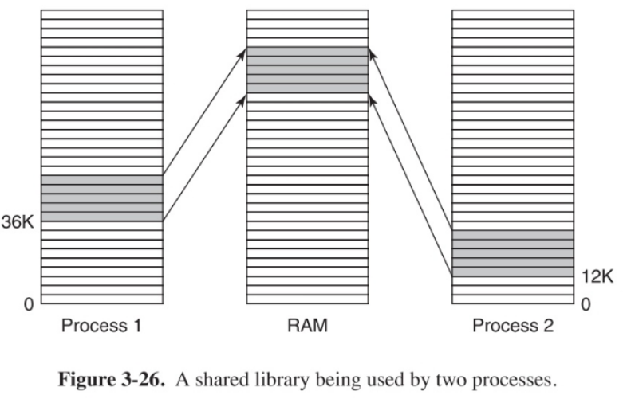

**注：编译时，库里的应是<u>相对地址</u>**

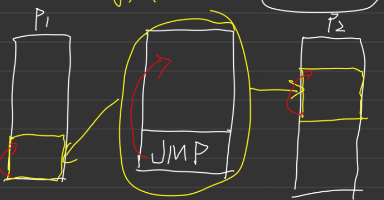

> **Exercise: c + gcc -> Shared Library**

#### Mapped Files

> Mapped files provide an alternative model for I/O. Instead of doing reads and writes, the file can be accessed as a big character array in memory. In some situations, programmers find this model more convenient.

Advantage

* 不用调函数，指针更灵活
* 不用为每个Process创建Buffer

普通访问File

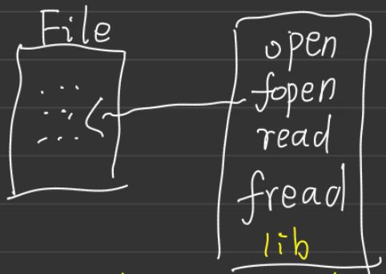

> 不能像指针一样在File中来回跳

使用Mapped File

```c
#include "stdio.h"
#include "unistd.h"
#include <sys/types.h>
#include <sys/stat.h>
#include <fcntl.h>
#include <sys/mman.h>
#include <string.h>

int main()
{
	int fd;
	void *p;
	fd=open("haha",O_CREAT|O_RDWR,0666);
    /**
    * NULL：一段连续地址空间
    * 5：文件大小5B
    * MAP_SHARED：可共享
    */
	p=mmap(NULL,5,PROT_WRITE|PROT_READ,MAP_SHARED,fd,0);
    /* 指针访问 */
	strncpy((char*)p,"hehe\n",5);
	munmap(p,5);
	close(fd);
}

```

补充：open函数

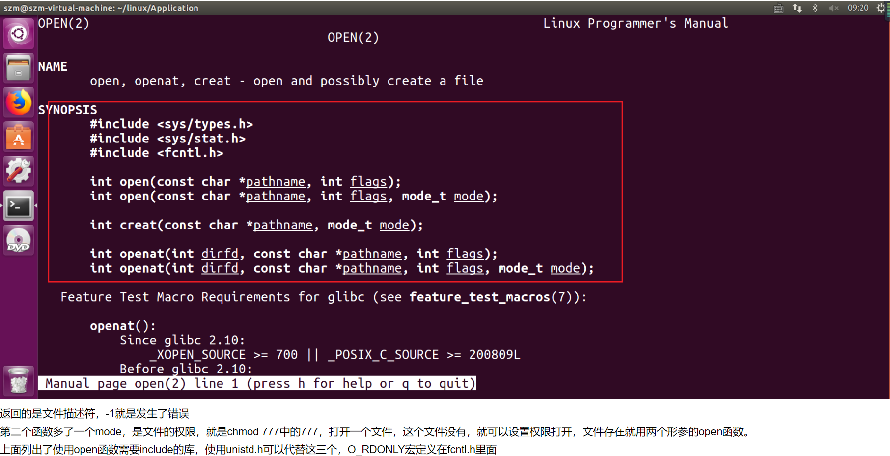

运行mmap

> 运行之前，首先创建一个haha文件，并使用命令：
> 	truncate -s 5 haha
> 将其长度改为5，否则会出错，错误名busy bus。

#### Virtual Memory Interface

**Linux: /proc**，看Memory Manage info

proc特点：不留在磁盘上，动态生成

### Implementation Issues

#### Time for paging

1. Process Creation

   > * **Determine Program Size**
   >
   > * **Create Page Table**
   >
   > * 怎么知道程序的大小？
   >
   >   元信息，编译器通过编译后含在程序里(elf)

2. Process execution

   > * **MMU reset for new process**
   > * **TLB flushed**

3. Page Fault

   > * **Determine virtual address causing fault**
   > * **Swap target page out, needed page in**

4. Terminate

   > * **Release Page Table, Pages**

#### RISC and CISC

* RISC: Reduced Instruction Set Computers，每条Ins等长
* CISC: Complex Instruction Set Computers，每条Ins不等长

复杂指令集计算机(CISC)

长期来，计算机性能的提高往往是通过增加硬件的复杂性来获得．随着集成电路技术．特别是VLSI（超大规模集成电路）技术的迅速发展，为了软件编程方便和提高程序的运行速度，硬件工程师采用的办法是不断增加可实现复杂功能的指令和多种灵活的编址方式．甚至某些指令可支持高级语言语句归类后的复杂操作．至使硬件越来越复杂，造价也相应提高．为实现复杂操作，微处理器除向程序员提供类似各种寄存器和机器指令功能外．还通过存于只读存贮器(ROM)中的微程序来实现其极强的功能 ，傲处理在分析每一条指令之后执行一系列初级指令运算来完成所需的功能，这种设计的型式被称为复杂指令集计算机(Complex
Instruction Set Computer-CISC)结构．一般CISC计算机所含的指令数目至少300条以上，有的甚至超过500条．

精简指令集计算机(RISC)

采用复杂指令系统的计算机有着较强的处理高级语言的能力．这对提高计算机的性能是有益的．当计算机的设计沿着这条道路发展时．有些人没有随波逐流．他们回过头去看一看过去走过的道路，开始怀疑这种传统的做法：IBM公司没在纽约Yorktown的JhomasI.Wason研究中心于1975年组织力量研究指令系统的合理性问题．因为当时已感到，日趋庞杂的指令系统不但不易实现．而且还可能降低系统性能．1979年以帕特逊教授为首的一批科学家也开始在美国加册大学伯克莱分校开展这一研究．结果表明，CISC存在许多缺点．**首先．在这种计算机中．各种指令的使用率相差悬殊：一个典型程序的运算过程所使用的80％指令．只占一个处理器指令系统的20％．**事实上最频繁使用的指令是取、存和加这些最简单的指令．这样-来，长期致力于复杂指令系统的设计，实际上是在设计一种难得在实践中用得上的指令系统的处理器．同时．复杂的指令系统必然带来结构的复杂性．这不但增加了设计的时间与成本还容易造成设计失误．此外．尽管VLSI技术现在已达到很高的水平，但也很难把CISC的全部硬件做在一个芯片上，这也妨碍单片计算机的发展．在CISC中，许多复杂指令需要极复杂的操作，这类指令多数是某种高级语言的直接翻版，因而通用性差．由于采用二级的微码执行方式，它也降低那些被频繁调用的简单指令系统的运行速度．因而．针对CISC的这些弊病．帕特逊等人提出了精简指令的设想即指令系统应当只包含那些使用频率很高的少量指令．并提供一些必要的指令以支持操作系统和高级语言．按照这个原则发展而成的计算机被称为精简指令集计算机(Reduced Instruction Set Computer-RISC)结构．简称RISC．

CISC与RISC的区别

我们经常谈论有关"PC"与"Macintosh"的话题，但是又有多少人知道以Intel公司X86为核心的PC系列正是基于CISC体系结构，而 Apple公司的Macintosh则是基于RISC体系结构，CISC与RISC到底有何区别？-

- **从硬件角度来看CISC处理的是不等长指令集，它必须对不等长指令进行分割，因此在执行单一指令的时候需要进行较多的处理工作。而RISC执行的是等长精简指令集，CPU在执行指令的时候速度较快且性能稳定。因此在并行处理方面RISC明显优于CISC，RISC可同时执行多条指令，它可将一条指令分割成若干个进程或线程，交由多个处理器同时执行。由于RISC执行的是精简指令集，所以它的制造工艺简单且成本低廉。**
- 从软件角度来看，CISC运行的则是我们所熟识的DOS、Windows操作系统。而且它拥有大量的应用程序。因为全世界有65%以上的软件厂商都理为基于CISC体系结构的PC及其兼容机服务的，象赫赫有名的Microsoft就是其中的一家。而RISC在此方面却显得有些势单力薄。虽然在RISC上也可运行DOS、Windows，但是需要一个翻译过程，所以运行速度要慢许多。
- 目前CISC与RISC正在逐步走向融合，Pentium Pro、Nx586、K5就是一个最明显的例子，它们的内核都是基于RISC体系结构的。他们接受CISC指令后将其分解分类成RISC指令以便在遇一时间内能够执行多条指令。由此可见，下一代的CPU将融合CISC与RISC两种技术，从软件与硬件方面看二者会取长补短。
- 复杂指令集CPU内部为将较复杂的指令译码，也就是指令较长，分成几个微指令去执行，正是如此开发程序比较容易（指令多的缘故），但是由于指令复杂，执行工作效率较差，处理数据速度较慢，PC 中 Pentium的结构都为CISC CPU。
- RISC是精简指令集CPU，指令位数较短，内部还有快速处理指令的电路，使得指令的译码与数据的处理较快，所以执行效率比CISC高，不过，必须经过编译程序的处理，才能发挥它的效率，我所知道的IBM的 Power PC为RISC CPU的结构，CISCO 的CPU也是RISC的结构。
- 咱们经常见到的PC中的CPU，Pentium-Pro（P6）、Pentium-II,Cyrix的M1、M2、AMD的K5、K6实际上是改进了的CISC，也可以说是结合了CISC和RISC的部分优点。
- RISC与CISC的主要特征对比
  比较内容 CISC RISC
  指令系统 复杂，庞大 简单，精简
  指令数目 一般大于200 一般小于100
  指令格式 一般大于4 一般小于4
  寻址方式 一般大于4 一般小于4
  指令字长 不固定 等长
  可访存指令 不加限制 只有LOAD/STORE指令
  各种指令使用频率 相差很大 相差不大
  各种指令执行时间 相差很大 绝大多数在一个周期内完成
  优化编译实现 很难 较容易
  程序源代码长度 较短 较长
  控制器实现方式 绝大多数为微程序控制 绝大多数为硬布线控制
  软件系统开发时间 较短 较长

#### Instruction Backup

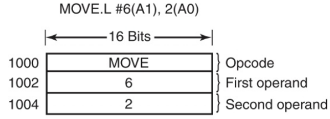

**前面说的CISC会有以下问题：**


假设MOVE和6在一个Page，2在下一个Page。当发现2是Abscent，就会产生一个**Page Fault**，**返回地址是2的地址。**这样就会先把MOV 6存在CPU的某个位置，等2进来后再拼一起，放到Instruction流水线上执行

**但是普通中断不这样**

比如在TSL处产生了一个普通中断，要等TSL完成后，普通中断程序运行，**其返回值是TSL的下一条**，也就是说，**普通中断不管TSL成功与否**

#### Paging With I/O

* Locking Pages in Memory

  如果一个Page中的程序在等I/O传来数据(比如buf[]在等数)，但Data还没来，程序被交换了，变成了别人的形状，这时候就要产生Page Fault把原来的程序写回来，很耗时。同时Data也肯恩被后来者覆盖，因此需要Lock一下Page，不让换出去

  > *问题：Lock之后会有啥问题？*
  >
  > 恶意Lock，把所有的Virtual Page都锁上，即它映射的所有Page Frame都锁上了，别人的地方就小了

* Backing Store

  Page被换出去，存在磁盘的哪儿？ -> Disk中的swap area

  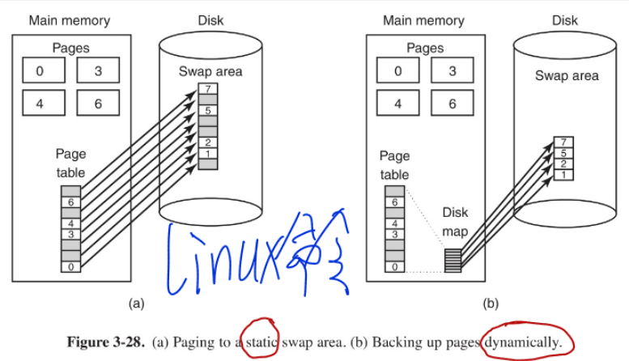

  > Windows: C:\pagefile.sys, swapfile.sys就是
  >
  > **Exercise：Linux生成交换文件**

#### Separation of Policy and Mechanism

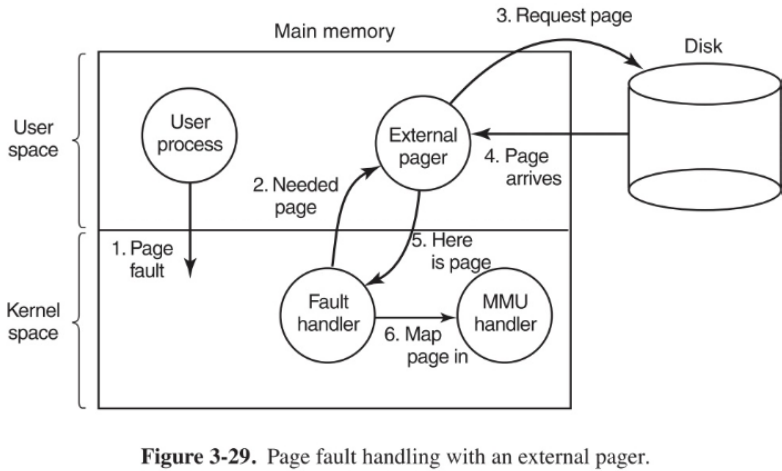

#### Segmentation

> *什么是段？*
>
> **一个区域，里面的地址是连续的**

Why Segmentation?

让程序和数据有分离独立的空间，利于共享和保护

Segentation已弃用 -> 改用Page

为什么CS，DS还在？向前兼容

**那么，Segmentation，Page共存咋办？**

MULTICS：多级翻译

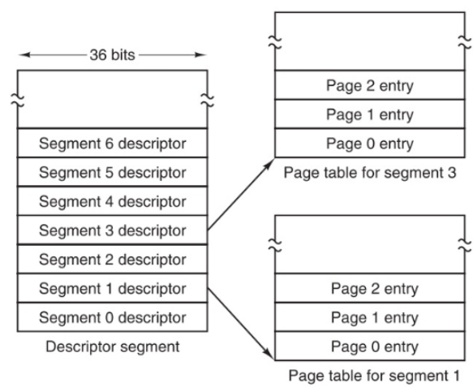

* 一个Virtual Address还是表示成：SG + offset

* VA -> IA --Page Table--> PA

* IA咋实现？

  以前，CS，DS存的都是基地址，现在不存了，改存一个编号：Selector, Descriptor

  还有一张Segment Table

  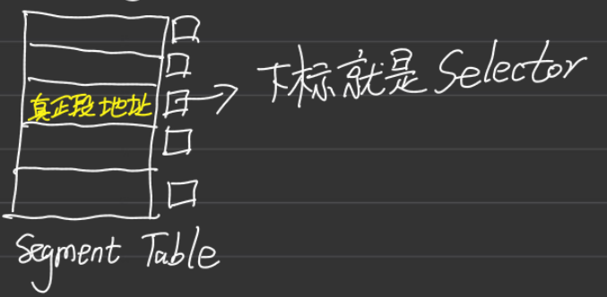

  > 注意：得到的IA也是虚地址

**RISC-V和ARM的区别**
	ARM 架构和 RISC-V 架构都源自 1980 年代的精简指令计算机 RISC。两者最大的不同就在于其推崇的大道至简的技术风格和彻底开放的模式。
	ARM 是一种封闭的指令集架构，众多只用 ARM 架构的厂商，只能根据自身需求，调整产品频率和功耗，不得改变原有设计，经过几十年的发展演变，CPU 架构变得极为复杂和冗繁，ARM 架构文档长达数千页，指令数目复杂，版本众多，彼此之间既不兼容，也不支持模块化，并且存在着高昂的专利和架构授权问题。
	反观 RISC-V，在设计之初，就定位为是一种完全开源的架构，规避了计算机体系几十年发展的弯路，架构文档只有二百多页，基本指令数目仅 40 多条，同时一套指令集支持所有架构，模块化使得用户可根据需求自由定制，配置不同的指令子集。

## File System

### File System Overview

File System = File + **File Management**

Why File System?

* How do you find information?

* How do you keep one user from reading another user's data?(安全)

* How do you know which blocks are free?

* Others?

  容灾性(xp非法关机)，文件缓存(提高文件命中率，访问速度)，实时性

### Files

#### File Naming

Why file naming

* Help you identify the information you need, i.e, help you speedup searching process

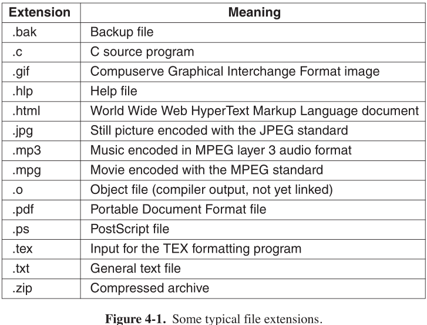

Example: regedit on Windows

> 注册表是windows操作系统中的一个核心数据库，其中存放着各种参数，直接控制着windows的启动、硬件驱动程序的装载以及一些windows应用程序的运行，从而在整个系统中起着核心作用。这些作用包括了软、硬件的相关配置和状态信息，比如注册表中保存有应用程序和资源管理器外壳的初始条件、首选项和卸载数据等，联网计算机的整个系统的设置和各种许可，**文件扩展名与应用程序的关联**，硬件部件的描述、状态和属性，性能记录和其他底层的系统状态信息，以及其他数据等。
>
> 具体来说，在启动Windows时，Registry会对照已有硬件配置数据，检测新的硬件信息；系统内核从Registry中选取信息，包括要装入什么设备驱动程序，以及依什么次序装入，内核传送回它自身的信息，例如版权号等；同时设备驱动程序也向Registry传送数据，并从Registry接收装入和配置参数，一个好的设备驱动程序会告诉Registry它在使用什么系统资源，例如硬件中断或DMA通道等，另外，设备驱动程序还要报告所发现的配置数据；为应用程序或硬件的运行提供增加新的配置数据的服务。配合ini文件兼容16位Windows应用程序，当安装—个基于Windows 3.x的应用程序时，应用程序的安装程序Setup像在windows中—样创建它自己的INI文件或在win.ini和system.ini文件中创建入口；同时windows还提供了大量其他接口，允许用户修改系统配置数据，例如控制面板、设置程序等。
>
> 如果注册表受到了破坏，轻则使windows的启动过程出现异常，重则可能会导致整个windows系统的完全瘫痪。因此正确地认识、使用，特别是及时备份以及有问题恢复注册表对windows用户来说就显得非常重要。

#### File Types

* Regular file
* Device file
  * block device file
  * character device file
* Directory file
* Linux Examples

Most important: exe and archive

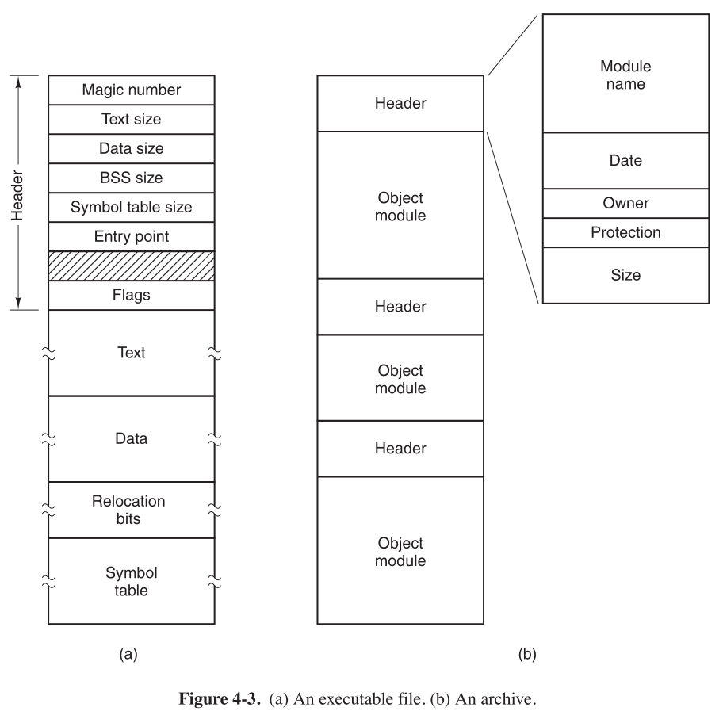

> **Magic number: 标识符，表示程序是可执行的**
>
> archive: 库，档案
>
> *问题：为什么有的程序就几行，却把整个库都链上了？*

File Access

* Sequential access -> 只能顺序访问

  管道文件，设备文件

* Random access -> 能顺序，也能随机

  很常见，比如用c随便开一个文件，可以用fseek调转，随便跳